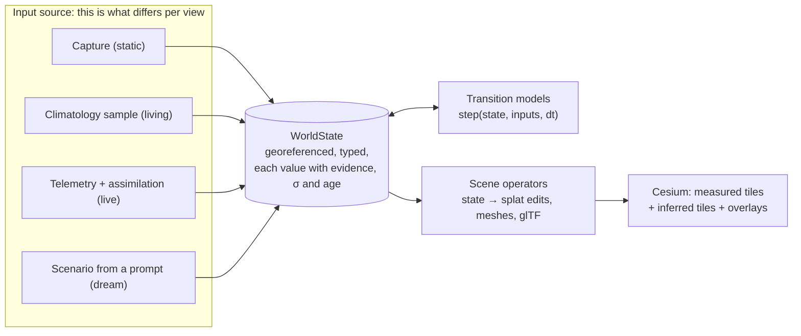

# The living engine: one world state, four views

Design, written 2026-09-30 on branch `living-models`. It turns [LIVING_MODELS.md](LIVING_MODELS.md)
into architectures that can be built and tested. Nothing here is built yet unless a table
says it exists. Constants marked _initial_ are starting values that a named test replaces.

## 1. One engine

All four views run on the same engine. Only the source of its inputs differs.



| View       | Clock                                                  | Inputs                                                | Correction from sensors | Label the user sees                  |
| ---------- | ------------------------------------------------------ | ----------------------------------------------------- | ----------------------- | ------------------------------------ |
| **Static** | frozen at capture time                                 | none                                                  | —                       | Measured / Inferred                  |
| **Living** | runs forever from now                                  | a sample of the site's typical weather for the season | none                    | Simulated (evidence rung per object) |
| **Live**   | now                                                    | telemetry                                             | **yes** (assimilation)  | Observed · estimated · _n_ s old     |
| **Dream**  | a fork of the live (or captured) state into the future | the user's scenario: actions plus forcing             | none after the fork     | Scenario                             |

**What does the simulating.** A set of small **transition models**. Each is a domain model with
known inputs and outputs, a validity envelope and an evidence label. A video world model cannot
be the simulator today, for three reasons:

- its state is pixels, so it can't answer "how many m² were mowed?" or be checked against a
  sensor;
- nothing keeps its output consistent with the enduring measured scene;
- each query costs minutes of an H100.

World models still get three slots:

1. a **learned transition model**: a state-space model trained on our own time series for
   dynamics we have no physics for, such as regrowth or soil moisture;
2. an **appearance** pass (Cosmos-Transfer clips);
3. a **teacher** of parameters (§4).

When 3D, state-conditioned world models mature, one can replace a transition model behind the
same interface, and it must pass the same tests.

## 2. The contracts

### WorldState (v1)

```ts
interface WorldState {
  t: JulianDateIso; // simulation time
  site: { captures: AssetRef[]; footprint: Polygon; dem: TerrainRef };
  instances: Instance[]; // every non-static thing in the capture
  fields: {
    wind: Estimate<{ speedMps: number; bearingDeg: number; turbulenceI: number }>;
    rainMmH?: Estimate<number>;
    zones: Record<ZoneId, { grassHeightM?: Estimate<number>; soilMoisture?: Estimate<number> }>;
    basins: Record<BasinId, { waterLevelM: Estimate<number> }>;
  };
  agents: Agent[]; // robots, vehicles: pose, velocity, task
  events: WorldEvent[]; // mowed polygon, plant toppled, object removed / added
}
interface Estimate<T> {
  value: T;
  sigma: T | null;
  ageS: number;
  evidence: Evidence;
}
type Evidence =
  | "measured"
  | "observed"
  | "estimated"
  | "fitted"
  | "simulated"
  | "inferred"
  | "scenario";
interface Instance {
  id: string;
  class: "tree" | "shrub" | "snag" | "grass" | "water" | "rigid" | "static";
  binding: PlantBindingRef; // existing plants.json
  program: MotionProgram; // §4
}
```

`Instance`, the binding and the tree/shrub/snag classes already exist (`scene_plants.py`,
`plantBinding.ts`). Zones and agents map onto mission control's `Zone` and `Machine`.

### Transition model

```ts
interface TransitionModel {
  id: string;
  evidence: "physical" | "fitted" | "rule" | "learned";
  reads: StatePath[];
  writes: StatePath[];
  validity: Envelope; // the input ranges its tests cover
  step(state: WorldState, inputs: Inputs, dtS: number, seed: number): WorldState; // pure
}
```

The engine refuses to step a model outside its envelope. It writes a `WorldEvent` of kind
`out-of-envelope` and the UI shows "not simulated beyond this point"; the model never
extrapolates silently.

| Model              | Writes                                | Kind              | Runs           | Status                                      |
| ------------------ | ------------------------------------- | ----------------- | -------------- | ------------------------------------------- |
| `wind-field`       | wind at any point (EN 1991-1-4)       | physical          | browser        | **exists** (`turbulence.ts`)                |
| `plant-modal`      | per-joint transforms                  | physical+fitted   | browser, GPU   | **exists** (`living.ts`)                    |
| `agent-kinematic`  | agent pose on the DEM                 | physical          | browser/server | new                                         |
| `mission-executor` | agent task; swept-polygon events      | rule              | server         | new, on the existing planner and `rates.ts` |
| `grass-state`      | grass height per zone (cut, regrowth) | rule, then fitted | server         | new                                         |
| `water-bathtub`    | basin level → flooded extent          | physical          | server         | new                                         |
| `water-flow`       | surface flow map                      | fitted            | browser        | new                                         |
| `learned-dynamics` | e.g. regrowth, soil moisture          | learned           | server         | the world model slot, later                 |

### Scene operators (state → pixels)

Pure functions of state. They never write canonical bytes; they drive the existing deformer
and overlays.

| Operator    | From                   | Acts on                         | How                                                   |
| ----------- | ---------------------- | ------------------------------- | ----------------------------------------------------- |
| `deform`    | plant program          | plant splats                    | existing GPU skinning                                 |
| `cut`       | zone grass height      | grass splats inside the polygon | scale z to height, keep base, colour from a cut table |
| `topple`    | a `toppled` event      | one plant instance              | rigid rotation about its base                         |
| `hide/add`  | removed / added events | an instance or a tile           | opacity 0 / new tile                                  |
| `water`     | level, flow            | water mesh                      | extent from DEM contour; flow-map CustomShader        |
| `agent`     | agent pose             | glTF                            | `SampledPositionProperty`                             |
| `staleness` | σ, age                 | HUD, markers                    | ring of radius σ; "_n_ min old"; greys out when stale |

## 3. Static: where and how much to infer

Static uses two separate operations, each with its own rule.

**Fill** adds Gaussians where the capture has fewer than 3 supporting views. All of these
must hold:

1. inside the capture footprint (beyond it the globe's terrain and tiles are the truth);
2. within `d_max` of measured surface (_initial_ 2 m; set by test S2);
3. an allowed class: ground, trunk or stem, rock, building face. Never small objects, signs,
   equipment, people, or open frontier;
4. site budget: inferred ≤ 15 % of Gaussians (_initial_).

**Enhance** adds detail where the measured ground sample distance (GSD) is coarser than the
view needs. It **never replaces** measured Gaussians. It is a separate detail layer, allowed
only for vegetation and ground texture, and **off by default**, so a surveyor who zooms in
sees the real resolution unless they ask for more.

Both land in an `inferred` tileset with per-Gaussian confidence (support count × seed
agreement). "Show evidence" tints it; the Inspector always reports the percentage.

**Pipeline:**

```
support  →  target cams  →  Cosmos-Predict2.5 repaint (3 seeds)  →  Fixer
         →  gate (depth-warp agreement)  →  gsplat distil, measured frozen
         →  inferred tileset
```

`support` counts the views per Gaussian. `target cams` are aimed at low-support regions,
within 2 m and 30° of a real camera. Fill-versus-enhance is chosen per region by the rules
above.

**How much is decided by measurement, not taste.** Tests S2 and S5 plot quality on held-out
real views against distance from support (fill) and against scale factor (enhance). Each
cutoff is set where the generative result stops beating the null baseline.

## 4. Living: what parameters, per object, per scenario

The idea that makes it robust: **object properties are learned once; scenarios are inputs.**
A tree's frequency and damping don't change with the weather. The forcing does, and physics
carries the forcing into motion. One parameter set therefore covers every wind speed and season
inside the envelope.

| Family                        | Object parameters (≤ ~10)                                                                                                                        | Default with no learning                                    | Scenario inputs → effect                                                                                               | Learnable from generated video                       | Needs real video + anemometer                     |
| ----------------------------- | ------------------------------------------------------------------------------------------------------------------------------------------------ | ----------------------------------------------------------- | ---------------------------------------------------------------------------------------------------------------------- | ---------------------------------------------------- | ------------------------------------------------- |
| **Plant** (tree, shrub, snag) | whole-plant `f0`; limb law `f = a·L^b`; damping ζ (tree, limb); drag gain `g` (rad at 10 m/s); flutter amplitude and leaf size; coherence length | allometric from the rig (**exists**)                        | wind U → deflection ∝ U², spectrum per EN; bearing; leaf-off → limb f × 2.5, ζ × 0.45, no flutter (**in the sidecar**) | limb/trunk frequency ratios, flutter band, coherence | absolute `g`, `f0` check (ζ from literature only) |
| **Grass / reeds** (field)     | wavelength λ; wave speed factor c/U; bend per U²; stiffness height                                                                               | procedural defaults                                         | wind U and bearing                                                                                                     | λ, c/U from optical flow                             | bend amplitude                                    |
| **Stream**                    | flow direction field; surface speed per discharge; ripple spectrum                                                                               | flow along the thalweg (the channel's lowest line), 0.3 m/s | discharge or level → speed scale (rule)                                                                                | direction field, ripple look                         | surface speed (float test)                        |
| **Pond / lake**               | wind-wave spectrum with fetch                                                                                                                    | calm                                                        | wind U, bearing                                                                                                        | —                                                    | —                                                 |
| **Rigid articulated**         | 1–3 modes or joint limits (flag, gate, turbine)                                                                                                  | still                                                       | wind or telemetry                                                                                                      | mode frequency                                       | —                                                 |
| **Agents**                    | not learned from motion video: from telemetry and the planner                                                                                    | —                                                           | —                                                                                                                      | —                                                    | —                                                 |
| **Static**                    | none. This is most of every capture                                                                                                              | pinned bit-exact (**exists**)                               | —                                                                                                                      | —                                                    | —                                                 |

**Where learning happens (hierarchical, so nothing is custom per object):**

1. **Class priors**: parameters per class and size band, fitted once over many clips (generated
   and real) and shared by every site.
2. **Object refinement**: only where there is evidence of this object, a real clip or a
   Teacher A run on it.

A new site with no video works on class priors alone.

**Out of envelope.** Storms above the tested wind (branch breakage, lodging) and phenomena with
no family (a flapping tarp, animals) are not guessed. They stay still and are flagged. The
escape hatch is a learned per-object deformation field (AniGS-style), which is behind the same
interface and passes the same tests. None has commercial code today.

**Why parameters instead of generating motion directly:**

|                            | Parameters                       | Generated motion (4D / video) |
| -------------------------- | -------------------------------- | ----------------------------- |
| Size                       | ~25 KB per tileset               | MB to GB per object-minute    |
| Control by scenario        | exact (U, bearing, season)       | only through prompts          |
| Beyond the training window | extrapolates (Wind on Trees)     | loops or drifts               |
| Testable                   | against spectra and real footage | per-pixel only                |
| Coverage                   | the families above               | anything                      |

## 5. Live render, concretely

Live render is **the living view with its knobs set by sensors instead of by a typical-weather
sample.** No pixels are generated. Two loops run:

**Fast loop (1–10 Hz to the browser, 60 fps render).** Each state field has a small estimator.
A Kalman filter with a constant-velocity model for agents and a random walk for wind and
levels:

- interpolates between readings (GPS at 1 Hz becomes smooth at 60 fps);
- spreads a point reading over the site (one station's wind drives every tree via
  `wind-field`);
- predicts through dropouts while σ grows, then falls back to the forecast or climatology.

**Slow loop (minutes).** Robot and drone frames are compared with a render of the baseline from
the same pose. A persistent residual in one tile creates an event, for example "grass in zone B
lower than baseline". The event drives a scene operator immediately, labelled _observed_, and
queues a gsplat re-train of **only that tile**. That re-train becomes the new _measured_ tile,
dated.

**Example, 10 minutes of a mowing robot:**

| Time      | Arrives                                     | State change                  | What you see                                     |
| --------- | ------------------------------------------- | ----------------------------- | ------------------------------------------------ |
| 12:00:00  | station: 4.1 m/s W                          | wind 4.1 ± 0.3, age 0         | trees sway gently eastward                       |
| 12:00:00– | R1 GPS at 1 Hz                              | pose predicted between fixes  | robot moves smoothly; σ ring 5 cm (RTK)          |
| 12:03:10  | R1 camera frame: residual in the grass band | event `mowed` (swath polygon) | grass behind R1 drops to deck height, "observed" |
| 12:05:00  | station stops reporting                     | wind age grows, σ widens      | wind badge "estimated · 2 min old"               |
| 12:15:00  | still silent                                | fall back to forecast         | badge "forecast"; trees keep moving              |
| 18:00     | end of day                                  | re-train of the changed tiles | the mowed zone becomes _measured_, dated today   |

## 6. Dream mode, concretely

**Prompt:** "Mow zone B at 3 cm with R1 tomorrow morning."

1. **Claude turns the prompt into a typed Scenario.** This is structured output, like the
   existing plan drafts:
   `{fork: "live@now", actions: [{agent: "R1", task: "mow", zone: "B", deckM: 0.03, start: "…T08:00"}], forcing: {wind: "forecast"}}`.
   Anything with no model ("an earthquake") gets back "can't simulate: no model for X". It is
   never invented.
2. **`mission-executor`** takes the planner's coverage path and moves R1 via `agent-kinematic`
   over the DEM, at speeds from the work log's learned rates (`rates.ts`). It emits swept
   polygons as the implement's width passes.
3. **`grass-state`** sets height in the swept polygons. **`wind-field`/`plant-modal`** run on
   the forecast.
4. The **time slider** plays it through the same operators as live render. Same seed gives the
   same bytes. The answer panel reads state: "2.3 ha, 3 h 40 min, finishes 11:40".
5. Optionally, **Cosmos-Transfer2.5** renders a photoreal clip from RGB, depth and segmentation
   renders of that state. It is labelled _generated video_ and takes about 5 minutes.

Other first scenarios: a storm at 20 m/s (the `wind-field` forcing; above the envelope →
flagged), and a pond rising 0.5 m (`water-bathtub`).

## 7. Test plan

Fixtures: `synthetic-tree`, `synthetic-yard` (ground truth), `minnetonka-tree` (real, drone
tiers), Fort Clatsop (real park), Blackrock Mesa (mission control demo). Two are new: a
**synthetic telemetry log** (generated, deterministic) and a **field capture** (synchronized
clips, anemometer, float test; LIVING_WORLD §8).

### Static

| ID  | Scenario                                                                                           | Pass                                                                                                                                | Needs            |
| --- | -------------------------------------------------------------------------------------------------- | ----------------------------------------------------------------------------------------------------------------------------------- | ---------------- |
| S1  | Minnetonka with its low under-canopy tier held out; fill                                           | LPIPS on low-support pixels of held-out views beats no-fill and a naive inpaint; measured ΔPSNR ≥ −0.1 dB; measured bytes identical | GPU (Brev/Modal) |
| S2  | S1 at `d_max` = 0.5, 1, 2, 4 m                                                                     | produces the curve; `d_max` = the largest distance still beating the baseline                                                       | GPU              |
| S3  | Canary: a planted measured object the prior would "correct"                                        | it neither moves nor vanishes                                                                                                       | GPU              |
| S4  | Edge of the footprint                                                                              | zero inferred Gaussians outside the footprint                                                                                       | CPU              |
| S5  | Enhance: train on ½- and ¼-resolution frames, enhance, compare with full-resolution held-out views | produces the curve; enhance ships only where it wins                                                                                | GPU              |

### Living

| ID  | Scenario                                                                                                         | Pass                                                                                                                  | Needs               |
| --- | ---------------------------------------------------------------------------------------------------------------- | --------------------------------------------------------------------------------------------------------------------- | ------------------- |
| L1  | **Parameter recovery:** render video of `synthetic-tree` from our own model with known parameters; track and fit | `f0` and limb frequencies within ±10 %, flutter band within ±20 %; ζ reported as unrecoverable (expected)             | CPU (+ tracker GPU) |
| L2  | Teacher A on Minnetonka: Wan / Cosmos clips → `fitted-generated`                                                 | beats a random-parameter control on held-out clips; blind test prefers it over `allometric`                           | GPU, viewers        |
| L3  | **Cross-wind:** real clips and an anemometer at two wind states; fit at one, predict the other                   | per-limb displacement spectrum (PSD) distance beats the static, looped-clip and allometric controls                   | field capture       |
| L4  | Fort Clatsop, class priors only                                                                                  | every plant class gets a program; ≤ 4 ms/frame of main thread for 200 plants (today 11–15 ms, so move it to a worker) | CPU                 |
| L5  | Stream clip → flow field                                                                                         | surface speed within ±20 % of the float test                                                                          | field capture       |

### Live

| ID  | Scenario                                                                                         | Pass                                                                                                             | Needs |
| --- | ------------------------------------------------------------------------------------------------ | ---------------------------------------------------------------------------------------------------------------- | ----- |
| V1  | Replay the synthetic telemetry log (station at 0.1 Hz, R1 GPS at 1 Hz, 30 min) on Blackrock Mesa | robot within its σ of GPS truth at every frame; the wind the shader uses equals the filter output; deterministic | CPU   |
| V2  | Station dropout of 15 min in the same log                                                        | σ grows monotonically; badge moves live → estimated → forecast at the set ages                                   | CPU   |
| V3  | `synthetic-yard` with one shrub removed in "new" rendered frames                                 | only the tiles holding that shrub are flagged; re-train changes only those tiles                                 | GPU   |
| V4  | Telemetry → pixels latency                                                                       | p95 < 500 ms                                                                                                     | CPU   |

### Dream

| ID  | Scenario                                                          | Pass                                                                                                                            | Needs      |
| --- | ----------------------------------------------------------------- | ------------------------------------------------------------------------------------------------------------------------------- | ---------- |
| D1  | "Mow zone B at 3 cm with R1" on `synthetic-yard` + Blackrock Mesa | the path follows the planner; swept area = path × implement width (±2 %); grass outside B bit-identical; same seed → same bytes | CPU        |
| D2  | "Storm, 20 m/s from the west, 1 h"                                | deflection follows U² up to the envelope; above it, `out-of-envelope` is raised and shown                                       | CPU        |
| D3  | "Pond +0.5 m"                                                     | flooded extent equals the DEM contour; volume matches the analytic stage-volume value                                           | CPU        |
| D4  | 25 prompts (15 supported, 10 not)                                 | valid Scenario JSON for all 15 supported; an explicit refusal naming the missing model for all 10                               | Claude API |
| D5  | Cosmos-Transfer clip of D1                                        | segmentation IoU of generated frames against the control ≥ 0.8; labelled generated                                              | GPU        |

## 8. Build order

1. **Engine core** (CPU): the `WorldState` and `TransitionModel` contracts in `packages/world`;
   the synthetic telemetry log; `agent-kinematic`; the `agent` and `staleness` operators; wind
   from the estimator. Tests V1, V2, V4.
2. **Dream on the same core**: Scenario schema + Claude drafting, `mission-executor`,
   `grass-state`, the `cut` operator, the time slider. Tests D1, D2, D4.
3. **Static on GPU**: support counting, fill, gates. Tests S1–S4, then S5.
4. **Living fitting harness**: L1 (no generative model needed), then L2. L3 and L5 when the
   field capture exists. L4 alongside.
