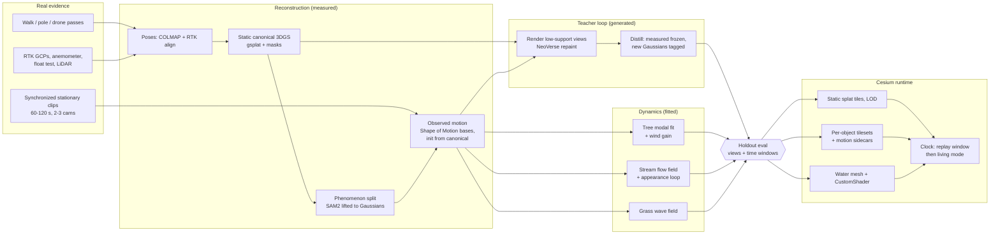
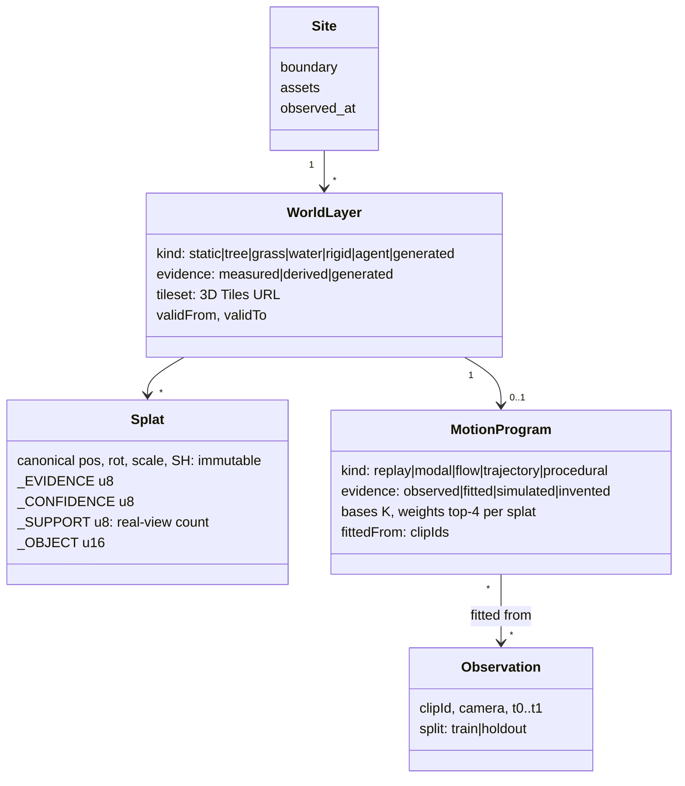
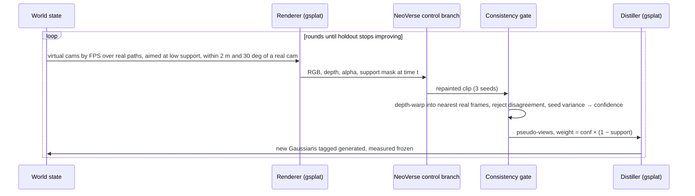
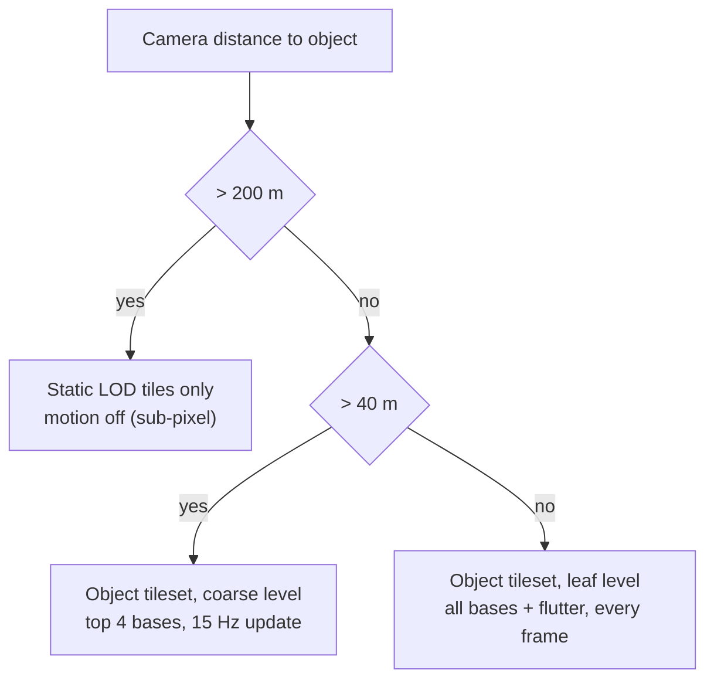
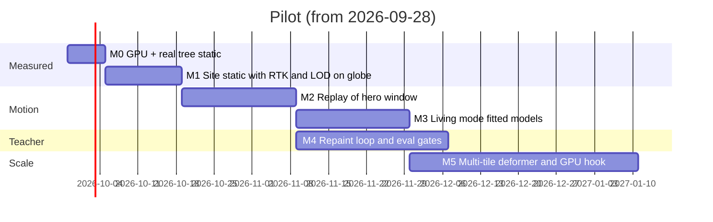

# The Living World — architecture for a measured, animated 4D map

Research architecture, written 2026-09-23. Every external claim below was fetched on that date;
anything not confirmed is marked **UNVERIFIED**. Estimates are marked _estimate_. Nothing here has
been built yet. It extends [LIVING_SURVEY.md](LIVING_SURVEY.md), the
[pipeline](../tools/pipeline/README.md) and [ADR 0006](DECISIONS/0006-splat-texture-rewrite.md).
The component matrix is also available as data in
[`living-world/components.json`](living-world/components.json).

## 1. The answer

**Do not build one big 4DGS.** Build a **layered world state**. At its base is a measured,
georeferenced **static Gaussian layer**. On top of it sit small **dynamic layers**, one kind per
phenomenon. Each dynamic layer binds a set of the static layer's own Gaussians to a compact
**motion program**:

- **replay**: SE(3) motion bases recorded from the footage;
- **fitted modal model**: oscillators fitted to that footage and driven by a synthetic wind;
- **flow field**, **trajectory** or **procedural** programs for water, vehicles and grass.

Real frames supervise everything. A video model (NeoVerse's Wan 2.1 control branch, the only
runnable one) serves as an **offline teacher**. It repaints only regions no real camera supports.
Its pseudo-views are confidence-weighted, and they are distilled into a **separate "generated"
layer** while measured Gaussians stay frozen. A later real capture of the same region deletes the
generated content. At runtime, Cesium streams the static layer as ordinary splat 3D Tiles with
LOD. Each animated object streams as its own small tileset plus a motion sidecar, evaluated by the
repo's existing canonical-never-written deformer. **Replay** plays the recorded bases on the
Cesium clock. **Living** mode drives the fitted models forever, from the same canonical bytes.

World from Motion and 4DGS-Fixer are the right _designs_, but neither has code. Copy their loop and
do not wait for them. Physics engines (PhysGaussian, PIDG, PhysFlow) are the wrong tool for
site-scale wind. Fit cheap modal and flow models to measurements instead.

## 2. Component matrix

In the table, **Run today** means the code and weights are public and fetched here. **Ship** means
the licence allows commercial use. The full matrix, with GPU and notes for 41 entries, is in
[`components.json`](living-world/components.json).

| Component                                         | Run today           | Licence (ship?)                                     | Hardware                           | Role here                                                | Verdict                      |
| ------------------------------------------------- | ------------------- | --------------------------------------------------- | ---------------------------------- | -------------------------------------------------------- | ---------------------------- |
| World from Motion (2607.01202)                    | no code             | planned academic (no)                               | re-opt 40 min/400 fr on 1×A100     | loop design                                              | **copy the loop**            |
| 4DGS-Fixer (2609.21176)                           | no code             | depends on non-commercial MVSAnywhere               | "expensive"                        | dense init + iterative pseudo-supervision                | **copy the recipe**          |
| NeoVerse (CVPR 26)                                | **yes**, ckpt on HF | Apache; reconstructor is Tencent-licensed (?)       | 38–74 GB peak; 336×560, 81 fr      | renderer-conditioned repaint teacher                     | **adopt** (video model only) |
| 4DGS-WAM (2608.25956)                             | no code             | —                                                   | small                              | static reuse + per-object SE(3)                          | concept only                 |
| GenMOJO (CVPR 25)                                 | yes                 | MIT + Inria GS licence (no)                         | n/s                                | occluded multi-object 4D                                 | later (people)               |
| PhysGaussian (CVPR 24)                            | yes                 | no LICENSE; Inria GS (no)                           | n/s                                | MPM on Gaussians                                         | avoid for wind               |
| PhysFlow (CVPR 25)                                | yes                 | BSD-3 (yes)                                         | n/s                                | LLM/video material inference                             | watch                        |
| PIDG (AAAI 26)                                    | yes                 | no LICENSE; Inria rasterizer fork (no)              | n/s                                | physics-informed deformation                             | research baseline            |
| Cesium splat LOD + 1.145                          | **yes**             | Apache; ion tiling paid                             | WebGL2                             | static delivery                                          | **adopt**                    |
| gsplat                                            | **yes**             | Apache (yes)                                        | 1 GPU                              | static layer + distillation                              | **adopt** (repo's `train`)   |
| Shape of Motion (ICCV 25)                         | **yes**             | MIT, on gsplat (yes)                                | UNVERIFIED                         | observed motion as SE(3) bases                           | **adopt**                    |
| MegaSaM / MapAnything-apache / DA3 (Apache sizes) | **yes**             | Apache (yes)                                        | ≤140 GB for 2k views (MapAnything) | depth, poses and dense init priors                       | **adopt**                    |
| Wan 2.1 / 2.2                                     | **yes**             | Apache (yes)                                        | 40–80 GB class                     | base video prior                                         | **adopt**                    |
| Difix3D+                                          | yes                 | NVIDIA non-commercial (no)                          | 1 GPU                              | static artifact fixer                                    | A/B baseline only            |
| GEN3C                                             | yes                 | Apache code; NVIDIA OML weights (yes, get sign-off) | ~43 GB offloaded                   | alternative teacher                                      | alternative                  |
| SAM 2.1, TAPIR, SpotLessSplats, COLMAP            | **yes**             | Apache / BSD (yes)                                  | modest                             | masks, tracks, transients, poses                         | **adopt**                    |
| CoTracker3, MVSAnywhere                           | yes                 | non-commercial (no)                                 | —                                  | —                                                        | avoid                        |
| Wind on Trees (2609.17810)                        | no code             | —                                                   | —                                  | oscillator prior beats learned deformation out of window | **adopt the principle**      |
| DynamicTree (2510.22213)                          | README: code TODO   | —                                                   | —                                  | modal tree motion                                        | watch                        |
| splat-transform, SPZ, Spark                       | **yes**             | MIT (yes)                                           | CPU / WebGL2                       | LOD builder reference, compression, motion prior art     | adopt / reference            |

**Licence traps to design around:**

- the Inria gaussian-splatting code, which is research-only. PhysGaussian and GenMOJO bundle
  it, and PIDG, 4DGaussians and Deformable-3DGS use rasterizer forks of it (check each fork's
  licence);
- NeoVerse's bundled reconstructor, which derives from HunyuanWorld-Mirror. That licence excludes
  the EU, UK and South Korea and names distillation outputs as derivatives;
- the large Depth Anything 3 sizes and MapAnything's default weights, which are CC-BY-NC.

The recommended core (gsplat, Shape of Motion, SAM2, TAPIR, MapAnything-apache, Wan, and the
NeoVerse control branch fed by our own renders) stays Apache/MIT.

## 3. World-state data model

**Per primitive, two axes.** _Geometry evidence_ is `measured` (supported by ≥ 3 real training
views with low residual), `derived` (reasoned from geometry: ground fill, rig radii) or `generated`
(created by pseudo-views). _Motion evidence_ is `observed` (replay reconstructed from footage),
`fitted` (model parameters estimated from footage), `simulated` (a fitted model driven beyond the
window) or `invented` (constants, as the whole Living Survey is today). The per-splat values travel
as extra PLY columns and as glTF application-specific (`_`-prefixed) vertex attributes. The deformer
reads them from the sidecar. Whether Cesium's splat loader tolerates extra attributes is
UNVERIFIED, so test it in week 1.

**Supersession rules.** These are enforced by mechanism, as the repo already does for canonical
positions:

1. **Generated content lives in its own tileset.** It is never merged into measured tiles, so the
   viewer can hide it, tint it or label it, and nothing downstream can mistake it for a survey.
2. **Measured Gaussians are frozen during generative distillation.** A pseudo-view's loss is masked
   to pixels whose ray hits Gaussians with `_SUPPORT < 3`. This is the "generated never overrides
   measured" invariant.
3. **Real beats generated, always.** When a new capture's support covers a generated Gaussian,
   that Gaussian is deleted rather than blended. Coverage is visibility from the new real cameras.
4. **Newer measured beats older measured** only within the new capture's footprint and
   `validFrom`. The older asset keeps `validTo`, which uses the temporal columns `assets` already
   has.
5. **Observed motion beats fitted motion inside its window.** Replay is ground truth for
   `t0..t1`, and the fitted model is only ever an extrapolation.

**Mapping onto this repo:**

| Concept                                                                     | Where it lands                                                                                                                |
| --------------------------------------------------------------------------- | ----------------------------------------------------------------------------------------------------------------------------- |
| Code honesty (verified/unproven/stub)                                       | unchanged; every new impl starts as a stub with `_lands_in(...)`                                                              |
| Data honesty (Measured/Derived/Invented/Simulated/Fixture in LIVING_SURVEY) | add **Generated**, **Observed motion**, **Fitted**                                                                            |
| `manifest.json`                                                             | new `world` block: layers, evidence histogram, holdout metrics, `motionEvidence` per object                                   |
| `rig.json` (`MotionRig`)                                                    | v2 → `motion.json` + `motion.bin`: soft top-4 weights, K bases, replay tracks, fitted modal params; keeps `canonicalChecksum` |
| `renderConfig.rigUrl`                                                       | becomes `renderConfig.motionUrl`, still a catalog claim, never probed                                                         |
| `georef.json`                                                               | add `method: rtk_gcp`, checkpoint RMSE as `uncertaintyM` (not the fit residual)                                               |
| Inspector / badge                                                           | Geometry row gains "x % generated"; Motion row says Observed (replay) or Simulated (living)                                   |

## 4. Pipeline as recipe stages

A new recipe, `living-site`, stays a linear list, as the README requires. The generative loop
iterates _inside_ one stage.

| Stage id               | impl (new unless noted)                              | Consumes → produces                                                            | Status                                                            |
| ---------------------- | ---------------------------------------------------- | ------------------------------------------------------------------------------ | ----------------------------------------------------------------- |
| `normalize`            | `ffmpeg_frames` (exists)                             | upload → frames, source_meta                                                   | **verified**                                                      |
| `sync`                 | `timecode_audio`                                     | frames → `sync.json` (per-clip offset to GPS time)                             | available now                                                     |
| `split`                | `holdout`                                            | frames → `frames_train`, `holdout.json`                                        | available now; **every later stage consumes only `frames_train`** |
| `pose`                 | `colmap` (exists) / `glomap` (stub)                  | frames_train → poses                                                           | colmap **verified**                                               |
| `georeference`         | `rtk_gcp` (extends `exif_gps`)                       | poses + RTK log + GCPs → georef.json (applied)                                 | available now; depends on Lane 2's axis fix                       |
| `mask`                 | `sls` / `robust` (stubs)                             | frames_train → masks (transients)                                              | SpotLessSplats runnable                                           |
| `train`                | `gsplat` (exists)                                    | → canonical.ply (static, dynamic classes down-weighted)                        | **unproven**, needs a GPU                                         |
| `segment`              | `sam2_lift`                                          | canonical.ply + frames → `classes` column                                      | available now                                                     |
| `recon_dynamic`        | `shape_of_motion`                                    | stationary clips + canonical subset → `motion_bases`                           | runnable; **init-from-canonical is an adaptation**                |
| `fit`                  | `tree_modes`, `grass_field`, `water_flow`            | motion_bases + anemometer → `motion.json/bin`, water mesh                      | our code; tree extends `skeleton.py` + `@twin/world`              |
| `complete`             | `neoverse_repaint`                                   | world state → `generated.ply`, `pseudo_log.json`                               | **research**                                                      |
| `evaluate`             | `holdout_eval`                                       | everything + holdout.json → `eval.json`; **fails the run** on invariant breach | available now                                                     |
| `package`              | `splat_tiles` (exists) + `splat_lod` + `motion_pack` | → static LOD tileset, per-object tilesets, sidecars                            | single-tile exists; LOD tiler new                                 |
| `manifest`, `register` | exist                                                | + `world` block                                                                | **verified**                                                      |

The `complete` stage, round by round. The shape is WfM/4DGS-Fixer; the parts are runnable today:

The virtual-camera limit follows WfM, which reports failure on extreme viewpoint shifts and on
fluids. So the loop **never runs on water**. NeoVerse outputs 336×560, so pseudo-views can add
_coverage_ (under the canopy, behind rocks), never fine detail. Fine-tuning our own fixer on Wan,
as WfM did on 150K multi-camera pairs, is optional and comes last.

## 5. Dynamics per phenomenon

| Phenomenon                             | Representation                                                                             | Fitted from                                                                     | Indefinite strategy (no visible loop)                                                                                                                  | Keep 4DGS deformation?                        |
| -------------------------------------- | ------------------------------------------------------------------------------------------ | ------------------------------------------------------------------------------- | ------------------------------------------------------------------------------------------------------------------------------------------------------ | --------------------------------------------- |
| Static (rocks, ground, trunks at rest) | canonical Gaussians                                                                        | all passes                                                                      | none needed                                                                                                                                            | no                                            |
| Tree                                   | canonical + skeleton rig + **soft-skinned SE(3) bases**; per node ω, ζ, gain               | SoM trajectories on 2–3 synced clips; spectra per node; anemometer              | the `@twin/world` resonant model with **fitted** ω/ζ/gain, driven by wind with the measured spectrum; incommensurate frequencies + stochastic envelope | only for **replay** of the window             |
| Leaves / fine crown                    | per-splat flutter term                                                                     | high-band (4–15 Hz) residual energy of tracks                                   | existing flutter with fitted amplitude/band                                                                                                            | no                                            |
| Grass / reeds                          | canonical + height-weighted bend under a travelling noise field                            | optical flow on stationary clips: wavelength, speed, amplitude                  | procedural field, seeded, advected at fitted speed                                                                                                     | no                                            |
| Stream                                 | static banks/bed Gaussians + **water surface mesh** with flow-map shader + appearance loop | multi-view optical flow → divergence-free 2D field (Vid2Fluid idea); float test | steady flow field + Video-Textures random walk over captured surface frames, or noise-advected normals                                                 | no; splats render moving specular water badly |
| Ocean (later)                          | FFT height field (Tessendorf) + learned residual appearance                                | wave spectrum fitted to clips                                                   | spectral synthesis never repeats                                                                                                                       | no                                            |
| Flags, cloth (later)                   | canonical + 1–3 fitted modes                                                               | clips                                                                           | modal, like trees                                                                                                                                      | no                                            |
| Vehicles (later)                       | persistent glTF asset + trajectory                                                         | tracks in footage; OSM road graph                                               | SUMO-style agents on the road graph                                                                                                                    | no; static reuse, as in 4DGS-WAM              |
| People (later)                         | persistent avatar + skeletal motion + agent                                                | footage (licensing of body models UNVERIFIED)                                   | behaviour agents; GenMOJO-class methods for occluded shapes                                                                                            | no                                            |

Keep raw 4DGS deformation only as **replay** (the observed window, for scrubbing) and as the
**fitting target**. Two findings from Wind on Trees (2609.17810, synthetic trees) drive the
modal choice. First, a damped-oscillator prior extrapolates "markedly better" outside the training
window and wind than learned deformation does. Second, monocular video recovers frequency only on
the sparsest tree and never recovers damping, because motion along the view ray is unobservable.
Hence **synchronized multi-camera clips plus an anemometer**. The anemometer also turns the repo's
dimensionless wind `strength` into a calibrated one, which is the first fitted constant in the
Living Survey.

Replay and living share one runtime form: `displaced = Σ wₖ·Tₖ(t)·canonical`. For **replay**,
Tₖ(t) comes from recorded tracks, at about 2–3 MB per object-minute at 60 fps with K = 32
(_estimate_). For **living**, Tₖ(t) comes from the fitted generator. At the end of the window, the
viewer cross-fades over about 1 s, starting from the last replay frame.

## 6. Runtime, LOD and georeferencing in Cesium

- **Spatial LOD.** The static site is one hierarchical splat tileset: `KHR_gaussian_splatting` +
  SPZ_2, which CesiumJS 1.145 streams today. Tile it with Cesium ion, or extend `splat_tiles.py`
  into an octree tiler using splat-transform's LOD builder as the reference. The open
  PLY→3D-Tiles converter is UNVERIFIED (its repo is not reachable).
- **Animated objects.** Each tree is its own tileset, with a coarse root and a leaf containing
  the full dynamic splats. Its Gaussians are removed from the static tileset. This keeps splat
  indices stable per object, which the deformer requires. Today the deformer **refuses multi-tile**
  tilesets, so it must learn to attach per leaf content. That is custom work.
- **Temporal LOD.** Bases are stored sorted by energy, so truncating K is the LOD. The update rate
  drops with distance, and `setAnimating` already keeps the performance ladder honest.
- **Motion sidecar.** `motion.json/bin` is referenced from `renderConfig.motionUrl`. The KHR
  extension is ratified and **has no time-varying attributes**, so a sidecar is the only standard
  route.

What Cesium supports today, and what is custom:

| Need                                  | Today in 1.145/1.146                          | Custom work                                                                                                     |
| ------------------------------------- | --------------------------------------------- | --------------------------------------------------------------------------------------------------------------- |
| Static splat LOD, clipping into globe | yes (ADR 0003)                                | own tiler, if ion is not used                                                                                   |
| Splat motion                          | **no** (`customShader` does not reach splats) | ADR 0006 texture rewrite, extended to soft skinning and multi-tile                                              |
| Motion for >~200 k splats per view    | —                                             | CPU cost is 5 ms per 150 k splats (Node): plan an engine patch adding a VS motion hook, with Spark as prior art |
| Water surface                         | yes: glTF mesh + `CustomShader`               | flow-map shader                                                                                                 |
| Vehicles and people                   | yes: glTF + sampled positions / CZML          | agent simulation off-browser                                                                                    |
| Replay/living time                    | yes: `Clock`, `JulianDate`, timeline          | map capture window to clock; badge switches Observed → Simulated                                                |
| Sort staleness under motion           | sorter reads undisplaced positions            | bound it (`sortStaleness`); replay amplitudes may need a re-sort trigger                                        |

**Georeferencing.** RTK camera centres plus 5–8 RTK-surveyed GCPs go through `model_aligner`,
which `exif_gps` already does. Use ellipsoidal heights, never MSL (the repo already warns about
this). Report `uncertaintyM` as RMSE on **2–3 held-out checkpoints**, because the repo notes
that a fit residual is not an accuracy. The site root is the existing ENU root transform.
Placement stays `ground_samples`, the median against terrain. ADR 0003's footprint clip cuts
the world tileset, and terrain stays under splats. Inside the footprint the capture is truth;
outside it the global terrain and 3D tiles are.

## 7. Evaluation protocol

The `split` stage fixes the holdout before anything trains. Every trainer consumes
`frames_train` only, so leakage (the DyCheck lesson: 1–2 dB of "gains") is an artifact-contract
error, not a discipline.

| Holdout                                                      | Metric                                                                                                        |
| ------------------------------------------------------------ | ------------------------------------------------------------------------------------------------------------- |
| One whole walking pass (e.g. a 1 m diagonal) + 1 drone orbit | co-visibility-masked PSNR/SSIM/LPIPS, broken down by evidence class                                           |
| The 3rd/4th synchronized stationary camera                   | same, on the replay window; 3D track error vs TAPIR tracks triangulated from the other cams                   |
| Middle 10 s of each clip (interpolation)                     | masked PSNR/LPIPS; temporal flicker (warped-frame error)                                                      |
| Last 15 s of each clip (extrapolation, living)               | **statistical**, not per-pixel: per-node displacement PSD distance, amplitude histogram, flow-direction error |
| Geometry                                                     | depth error vs LiDAR on held-out frames; GCP checkpoint RMSE; stream surface speed vs float test              |

**Mandatory controls** (B5's "null control"): living mode must beat both a **static** baseline and
a **loop-the-recording** baseline on the extrapolation statistics. It must also match or beat
**raw 4DGS deformation**, extrapolated, out of window.

**"Generated never overrides measured"** runs as a gate in `evaluate`. Any failure fails the run:

1. After `complete`, re-render every **training** view. Masked PSNR must fall by no more than 0.1 dB
   (_proposed bound_).
2. Canonical bytes of measured Gaussians are **bit-identical** before and after, by checksum,
   exactly like the Living Survey's canonical checksum.
3. On held-out real views, the measured-region metrics must be non-inferior. Generated-region
   metrics are reported separately.
4. **Canary.** Before `complete`, plant a known measured object where the prior would prefer
   something else. The run fails if it moves or disappears.

## 8. Capture protocol for the 20–50 m pilot

Pick a site with 1–3 trees, grass, rocks, a 1–3 m stream and open sky for RTK. Complete the whole
capture within about 2 h, preferably overcast. Do the static passes in calm air, then the dynamic
clips in moderate wind, on the same day.

| Item          | Protocol                                                                                                                                                                                                                                    |
| ------------- | ------------------------------------------------------------------------------------------------------------------------------------------------------------------------------------------------------------------------------------------- |
| Control       | 5–8 printed targets surveyed with RTK rover; 2–3 reserved as checkpoints                                                                                                                                                                    |
| Calibration   | ChArUco video per camera/lens; lock focus, zoom, exposure, WB; shutter ≥ 1/500 s on moving passes                                                                                                                                           |
| Ground passes | 4K, loops + serpentine at **0.5 m, 1.5 m, 2.5–3 m (pole)**, inward and outward facing, 70–80 % overlap, plus **upward-pitched passes under the canopy** (the Minnetonka set's low hover tiers are why its trunk resolves)                   |
| Drone         | RTK drone; nadir grid 25–40 m + 45° orbits at ~15 m and ~30 m; stills, not video, for static                                                                                                                                                |
| Stationary    | per dynamic element, **2–3 tripods 60–120° apart, synchronized** (timecode or clap + LED flash), 60–120 s at **4K60** (flutter to 15 Hz needs ≥ 30 fps), several wind states; one **hero window** where tree and stream are covered at once |
| Holdout       | one extra walking pass + one extra synchronized camera, never trained on                                                                                                                                                                    |
| Truth         | anemometer on a 2 m mast at ≥ 1 Hz, time-stamped; stream float test (time over 5 m, 3 lanes); phone or handheld LiDAR scan                                                                                                                  |
| Timing        | all devices to GPS/NTP time; log start/stop; note sun and cloud                                                                                                                                                                             |

## 9. Fastest path to the demo

The generative loop is **not on the critical path**. Globe → splats → under trees → replay →
living can all be built from measured data plus fitted models. The teacher loop improves under-
canopy novel views afterwards.

| Milestone | Done when                                                                                                                                                           |
| --------- | ------------------------------------------------------------------------------------------------------------------------------------------------------------------- |
| M0        | the `train: gsplat` stage runs once on a GPU (it moves from unproven to verified); the Minnetonka tree trained; `skeleton.py` run on a real tree for the first time |
| M1        | the pilot site is on the globe, clipped into the world, checkpoint RMSE reported, LOD tiles streaming                                                               |
| M2        | the timeline scrubs the recorded window; the badge reads Observed; held-out camera metrics are in `eval.json`                                                       |
| M3        | living mode runs ≥ 1 h with no visible period; it beats the static and loop controls on extrapolation statistics                                                    |
| M4        | measurable held-out gain under the canopy, with every "never overrides" gate green                                                                                  |

**Compute** (_estimates_; unmeasured here). Rates are Modal list prices read 2026-09-23: A100-80GB
$2.50/h, L40S $1.95/h, H100 $3.95/h.

| Job                                                         | GPU-hours                                                 |
| ----------------------------------------------------------- | --------------------------------------------------------- |
| Static gsplat, ~1–2 k frames, several attempts              | 5–15                                                      |
| SoM per clip (preproc + fit) × ~10 clips                    | 20–50                                                     |
| NeoVerse repaint, 8 cams × ~20 windows × 3 seeds × 3 rounds | 10–40 (18 s per clip in the paper; the GPU is not stated) |
| Distillation rounds (WfM: 40 min per 400 frames on A100)    | 10–30                                                     |
| Evaluation renders                                          | 5–10                                                      |
| **Total, ×2 for iteration**                                 | **~100–300 GPU-h ≈ $250–$900**                            |

**Top risks:**

1. **Dynamic foliage from sparse views is ill-posed.** Wind on Trees could not recover damping at
   all. Mitigation: synchronized cameras, an anemometer, and statistical rather than per-pixel
   targets out of window.
2. **Generative priors hallucinate, run at low resolution, and carry licence chains.** Two of the
   headline papers have no code. Mitigation: a separate generated layer, frozen measured Gaussians,
   the canary gate, the video model only, and legal review of Tencent/NVIDIA terms.
3. **The Cesium runtime is internal and single-tile.** The splat internals are undeclared and
   churn every release, the deformer refuses multi-tile, CPU motion scales linearly, and draw
   order goes stale. Mitigation: per-object tilesets, energy-truncated bases, and a planned engine
   patch or upstream contribution for a splat vertex-shader motion hook.

**Week 1:**

1. Put `MODAL_TOKEN_ID/SECRET` in repo secrets and run `train: gsplat` once. That one token
   unblocks B3 as well (see [HANDOFF](HANDOFF.md)).
2. Train the Minnetonka tree (CC BY 4.0, COLMAP poses included), then run `skeleton.py` on it.
   This answers the Living Survey's first open question.
3. On an 80 GB GPU, stand up Shape of Motion on one self-shot synchronized tree clip, and NeoVerse
   inference fed by our own renders. Record the real VRAM and minutes.
4. Scout the site; buy or borrow an RTK rover, an anemometer, 3 tripods and printed targets; do a
   rehearsal capture using §8.
5. Write the `split`/`holdout.json` contract and the `evaluate` gates as honest stubs before any
   generative code exists.

## 10. Sources

**Verified (fetched 2026-09-23):**

- World from Motion — [project](https://research.nvidia.com/labs/amri/projects/world-from-motion/), [arXiv 2607.01202](https://arxiv.org/abs/2607.01202)
- 4DGS-Fixer — [arXiv 2609.21176](https://arxiv.org/abs/2609.21176)
- NeoVerse — [GitHub](https://github.com/IamCreateAI/NeoVerse), [arXiv 2601.00393](https://arxiv.org/abs/2601.00393), [HF](https://huggingface.co/Yuppie1204/NeoVerse); HunyuanWorld-Mirror licence on [HF](https://huggingface.co/tencent/HunyuanWorld-Mirror)
- 4DGS-WAM — [arXiv 2608.25956](https://arxiv.org/abs/2608.25956)
- GenMOJO — [GitHub](https://github.com/genmojo/GenMOJO)
- PhysGaussian — [GitHub](https://github.com/XPandora/PhysGaussian), [arXiv 2311.12198](https://arxiv.org/abs/2311.12198)
- PhysFlow — [GitHub](https://github.com/zhuomanliu/PhysFlow)
- PIDG — [GitHub](https://github.com/SCAILab-USTC/Physics-Informed-Deformable-Gaussian-Splatting), [project](https://haoqinhong.github.io/Physics-Informed-Deformable-Gaussian-Splatting.github.io/)
- Cesium splat LOD — [blog 2026-04-27](https://cesium.com/blog/2026/04/27/3d-gaussian-splats-lod/); CesiumJS [CHANGES.md](https://github.com/CesiumGS/cesium/blob/main/CHANGES.md) (1.145, 1.146)
- KHR_gaussian_splatting — [spec README](https://github.com/KhronosGroup/glTF/blob/main/extensions/2.0/Khronos/KHR_gaussian_splatting/README.md)
- gsplat, Shape of Motion ([arXiv 2407.13764](https://arxiv.org/abs/2407.13764)), MegaSaM, MapAnything, Depth Anything 3, VGGT, tapnet, SpotLessSplats, GLOMAP, SPZ, splat-transform, Spark, SUMO, CoTracker3, MVSAnywhere: licences read from each repository or HF card
- Wan 2.1 / 2.2, SAM 2.1 — HF cards; Difix3D+ ([licence](https://github.com/nv-tlabs/Difix3D)); GEN3C ([README](https://github.com/nv-tlabs/GEN3C)); [NVIDIA Open Model License](https://www.nvidia.com/en-us/agreements/enterprise-software/nvidia-open-model-license/)
- Wind on Trees — [arXiv 2609.17810](https://arxiv.org/abs/2609.17810); DynamicTree — [arXiv 2510.22213](https://arxiv.org/abs/2510.22213), [repo](https://github.com/Iron-LYK/DynamicTree); PhysDreamer — [project](https://physdreamer.github.io/)
- Generative Image Dynamics — [arXiv 2309.07906](https://arxiv.org/abs/2309.07906); Vid2Fluid — [arXiv 2503.00868](https://arxiv.org/abs/2503.00868); DyCheck — [arXiv 2210.13445](https://arxiv.org/abs/2210.13445)
- Video Textures — [SIGGRAPH 2000 PDF](https://cs.colby.edu/courses/S19/cs365/papers/schodl-videoTextures-SIG00.pdf); Tessendorf — [course notes](https://people.computing.clemson.edu/~jtessen/reports/papers_files/coursenotes2004.pdf)
- Modal GPU prices — [modal.com/pricing](https://modal.com/pricing)

**UNVERIFIED or negative results:**

- **Code for World from Motion, 4DGS-Fixer and 4DGS-WAM**: none found. WfM _plans_ an academic
  release.
- **DynamicTree code**: the project page says it is released; the repo README says TODO.
- **Generative Image Dynamics and Vid2Fluid code**: no official code found.
- **3DGS-PLY-3DTiles-Converter** (WilliamLiu-1997): cited by a Khronos forum post and a blog;
  the repo was not reachable.
- **MoSca**: the guessed repo URL returns 404.
- **Cosmos-Predict2.5 licence**: the HF card is gated.
- **Runtime/VRAM of Shape of Motion and gsplat for this site size**: not documented; measure in
  week 1.
- **Licences of PhysGaussian, PIDG and PhysDreamer**: no LICENSE file present, so there is no
  grant at all.
- **Whether NeoVerse's Apache label covers its WorldMirror-derived reconstructor**: this looks
  unlikely from the Tencent licence text, but it is a legal question, not a technical one.
