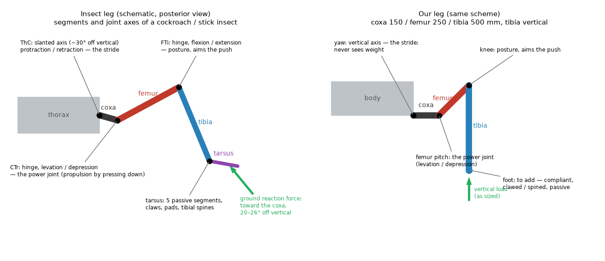
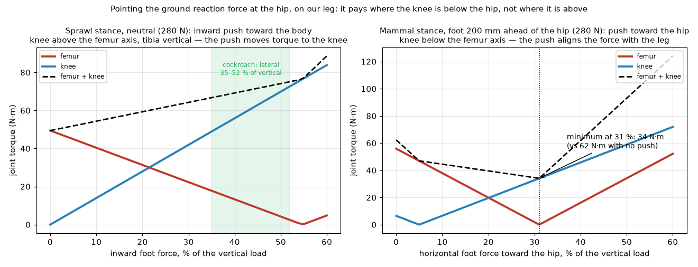

# 05 — What real hexapods do, and what of it transfers

A study of the animals the robot is named after: how an insect leg is built,
where its forces go, why it is shaped the way it is, and which of those
reasons survive the jump from a 2 g cockroach to a 49 kg machine. Numbers
are from the papers cited; the two figures are drawn from our own model.
The last section is the list of what to carry into requirements.

## 1. The insect leg, joint by joint

An insect leg has five segments — coxa, trochanter, femur, tibia, tarsus —
and three joints that matter for walking. Working outward from the body:

| Insect joint | Motion | Axis | What it does in walking | Our equivalent |
|---|---|---|---|---|
| Thorax–coxa (ThC) | protraction / retraction | slanted, ~30° off vertical in the stick insect; effectively one degree of freedom, in some insects a gimbal-like spherical joint | sweeps the stride; "steers" the push | **yaw** (vertical axis) |
| Coxa–trochanter (CTr) | levation / depression | horizontal hinge | **the power joint**: propulsion comes from pressing the leg down, not from swinging it back | **femur pitch** |
| Femur–tibia (FTi) | flexion / extension | horizontal hinge, parallel to CTr | posture; aims the push direction | **knee** |
| Tibia–tarsus and the tarsus | five passive segments, claws, adhesive pads; tibial spines | — | compliance, grip, terrain conformity, no motor at all | **nothing yet** |

The mapping is nearly one to one. Two things stand out. First, the stick
insect's joint torques show that propulsion is generated by *depression at
the CTr joint*, with the ThC and FTi joints holding the pushing direction:
"ThC and FTi joints serve the leg to maintain a particular pushing direction,
thus 'steering' the power provided by the CTr joint" ([Dallmann, Dürr &
Schmitz 2016](https://pmc.ncbi.nlm.nih.gov/articles/PMC4795010/)). That is
the same division of labour our sizing found: the femur pitch is the heavy
actuator, the yaw carries propulsion only, the knee holds posture. Second,
the insect's first axis is *slanted*, not vertical, so retracting the leg
also lifts it — a mechanical coupling that simplifies the step (one muscle
group does two things). We chose a vertical axis because a slanted one puts
a component of the weight on the first motor; the coupling is free in
software.

Segment proportions vary by lifestyle rather than following one rule: in
*Carausius morosus* the front legs are the longest and the middle legs the
shortest, while in *Aretaon* the hind legs are longest, and the study of
three stick insect species found relative limb length tracks how far the
animal explores in front of itself ([Theunissen et al.
2023](https://pmc.ncbi.nlm.nih.gov/articles/PMC10006035/)). In cockroaches
the front leg is the shortest and lifts off first at speed ([Ting, Blickhan
& Full 1994](https://polypedal.berkeley.edu/publications/043_Ting_DynamicandStaticStabilityinHexapedalRunners_JExpBiol_1994.pdf)).
The coxa of a 0.8 g stick insect is about 1.5 mm — short; the sprawl in
insects comes from the femur held out sideways, not from a long coxa. Our
150 mm coxa is a robot's answer to the same need for stance width, moved
onto a link the weight does not load.

## 2. Where the forces go: the cockroach's trick

Full, Blickhan and Ting measured the ground reaction force of each leg of a
running *Blaberus discoidalis* (2.1 g) on a miniature force platform
([Full, Blickhan & Ting 1991](https://neurolab.gatech.edu/wp/wp-content/uploads/ting/papers/Full%20Blickhan%20Ting%201991.pdf)):

| Leg | Vertical (mN) | Fore-aft (mN) | Lateral (mN) | Fore-aft / vertical | Lateral / vertical |
|---|---|---|---|---|---|
| Front | 10.4 | 4.9 | 5.1 | 46 % | 49 % |
| Middle | 9.8 | 4.0 | 5.1 | 41 % | 52 % |
| Hind | 11.9 | 4.9 | 3.2 | 41 % | 35 % |

Every leg carries about half the body weight at its peak, whatever its
size, and the horizontal components are enormous by mammal standards —
two to four times what a running bird or mammal produces relative to
vertical. The lateral forces point *toward the body*: the legs push against
each other, with the resultant force aimed at the coxa at 19–26° from
vertical. The authors' explanation is the design rule of this whole study:

> "the largest force component produced by each leg was in the vertical
> direction … The large forces imposed upon the legs for the support of
> weight create large moments about the joints, because the vertical forces
> are exerted at the most distal point of legs which radiate out from
> underneath the thorax … Moments become zero when the force vector is
> directed through the joint."

With muscle moment arms one tenth of the leg's (effective mechanical
advantage 0.10, [Full & Ahn 1995](https://polypedal.berkeley.edu/publications/044_Full_StaticForcesandMomentsGneratedintheInsectLeg_JExpBiol_1995.pdf)),
a purely vertical push would need muscle forces of 20–30 times body weight.
Pushing inward and backward as well points the force at the joints and
buys that back, at the cost of legs working against each other and a
friction requirement on the ground. The front legs brake, the hind legs
accelerate, the middle legs do both ([Full & Tu 1991](http://biomimetic.pbworks.com/f/MECHANICS+OF+A+RAPID+RUNNINGFull.pdf)).

**Does it transfer?** We computed it on our leg. In the sprawl stance the
knee sits *above* the femur axis and the tibia is vertical, so the vertical
load already passes through the knee and the yaw axis never sees it; an
inward push then only moves torque from the femur to the knee, and the sum
rises. In the mammal stance the knee is *below* the hip, and there the
trick works exactly as in the animal: with the foot 200 mm ahead of the hip,
a horizontal push toward the hip of about a third of the vertical load
roughly halves the femur-plus-knee torque.

So the sprawl geometry chosen in review already banked the cockroach's
benefit by other means (vertical first axis, vertical tibia), and the
principle "aim the ground reaction force at the hip" becomes the controller
rule for the mammal stance, where our sizing model's ±propulsion at every
foot position is pessimistic by roughly that factor.

## 3. Stability and gait

Cockroaches use the alternating tripod at almost all speeds, and at walking
speeds they are statically stable with margin: the per cent stability
margin is 60 % at 10 cm/s and falls to zero only above 50 cm/s (about 12
body lengths per second), where the animal is running dynamically on
momentum ([Ting, Blickhan & Full 1994](https://polypedal.berkeley.edu/publications/043_Ting_DynamicandStaticStabilityinHexapedalRunners_JExpBiol_1994.pdf)).
Three legs of an insect, two of a quadruped and one of a biped behave as
one spring-loaded leg during ground contact ([Full, Blickhan & Ting
1991](https://journals.biologists.com/jeb/article/158/1/369/6254/Leg-Design-In-Hexapedal-Runners)).

For us: six legs are the licence to walk everything statically — tripod at
speed, wave with a payload — and to leave dynamic balance out of the first
software entirely. The tripod's support triangle is the stability floor
the sizing document already uses.

## 4. Passive mechanics do the fast part

Cockroaches cross rough terrain at speed with no change in their neural
output; the mechanics of the legs, the tibial spines and the compliant tarsus
absorb the terrain, a principle called distributed mechanical feedback
([Spagna et al. 2007](https://dx.doi.org/10.1242/jeb.012385)). RHex is the
robotic proof: six compliant C-shaped legs, one motor each, an open-loop
clock-driven tripod, and it crosses terrain few robots can, at over one body
length per second ([Saranli, Buehler & Koditschek 2001](https://journals.sagepub.com/doi/10.1177/02783640122067570)).
HECTOR, the Bielefeld stick-insect robot, put a sensorized elastomer
coupling in every one of its 18 drives to get the same effect from a
jointed leg, at 12 kg with a 30 kg load capacity ([Bielefeld University
/ phys.org 2014](https://phys.org/news/2014-12-hector-robot-insect.html)).

For us: a passive compliant foot with claws or spines, an elastic element in
the tibia (already on the levers list as impact protection and a torque
sensor), and a controller that expects the mechanics to absorb the first
50 mm of every surprise.

## 5. Sensing: strain in the skeleton

Insects measure load not with a torque sensor at the joint but with
campaniform sensilla — strain sensors embedded in the cuticle near the
joints. They fire on the rate of change of force and are tuned to detect
unloading at the end of stance and when a foot slips ([Zill et al.
2022](https://www.ncbi.nlm.nih.gov/pmc/articles/PMC9529259/)).

For us: strain gauges bonded to the tibia and the coxa are the cheapest
possible foot-force estimate for a high-ratio joint, and the unloading rate
is a slip detector. Cheap in parts, expensive to add after the links are
made.

## 6. The scaling caveat, and what it says about the two stances

Nature's answer to size is posture. Across mammals, effective mechanical
advantage scales as body mass to the 0.25: small animals crouch, large ones
stand upright with the ground reaction force aligned along the limb, and
the trend runs out at about 300 kg with the joints straight ([Biewener
1989](https://www.science.org/doi/10.1126/science.2740914)). A cockroach
sits on the extrapolation of that line with an EMA of 0.10 and produces
extraordinary force for its mass because muscle force scales with area:
a wedging *Blaberus* pushes with four times its body weight and its hind-leg
extensors sum to over 50 times body weight ([Full & Ahn 1995](https://polypedal.berkeley.edu/publications/044_Full_StaticForcesandMomentsGneratedintheInsectLeg_JExpBiol_1995.pdf)).

A 49 kg animal does not sprawl. The reason we can is that the joint the
sprawl loads in an animal — the hip — is a vertical axis in our leg and
carries none of it, and that motors, unlike muscles, can be given whatever
ratio each joint needs. The costs are still real: the coxa and yaw bearing
carry the overturning moment as structure, and the femur arm is what the
sizing pays for. The mammal stance agreed in review is, in this light, the
posture nature would choose at our size: use it as the economical cruise
posture on easy ground, and the sprawl as the stability posture on hard
ground. That is the opposite emphasis from "mammal stance as the special
mode", and it is worth deciding deliberately.

## 7. Squeezing through: the body

Cockroaches traverse crevices a quarter of their standing height in under a
second by compressing their exoskeleton 40–60 % and splaying their legs,
and they keep moving at 20 body lengths per second while compressed
([Jayaram & Full 2016](https://www.pnas.org/doi/10.1073/pnas.1514591113)).
We have no compliant body, but the leg geometry allows the same posture: the
femur flat and the tibia folded gives a body height around the actuator
stack's, and the legs splayed out sideways still carry the load. A "flat"
posture belongs with the sprawl and mammal stances as the third
reconfiguration.

## 8. What the hexapod robots learned

| Robot | Leg | What it proved | What it cost |
|---|---|---|---|
| RHex | 1 DOF compliant C-leg, 6 motors | Rough terrain with open-loop gait; the mechanics do the work | No foot placement, no posture control |
| LAURON V (FZI) | 4 DOF, stick-insect proportions | A fourth joint near the body lets the leg orient itself to the ground | 24 actuators, more mass and control |
| HECTOR (Bielefeld) | 3 DOF, series-elastic elastomer couplings in all 18 drives, carbon exoskeleton | 12 kg carrying 30 kg; muscle-like compliance from jointed legs | Elastic drives are harder to control precisely |
| Weaver (CSIRO) | 5 DOF | Foot force from actuator torque, 50 % lower cost of transport on rough ground, 85 % on a 20° slope by posture adaptation | 30 actuators |
| CRAM (Berkeley) | soft body, splayed legs | Crevice traversal at half its height | A different robot |

The lesson across all five: the terrain is handled by mechanics and
posture first, sensing and planning second; and every added joint per leg
bought terrain ability at a cost in actuators that a hexapod feels six
times over.

## 9. What to carry into requirements

| Feature of the animal | Benefit | In our design |
|---|---|---|
| Three-joint leg with a steering first joint and a powerful second joint | Propulsion from one heavy actuator per leg, posture from lighter ones | **Have**: yaw–femur–knee with per-DOF ratings |
| Sprawled legs pushing against each other | Stability; joint moments minimised by force direction | **Partly**: sprawl kept, but on our geometry the inward push does not pay in the sprawl stance; make it the mammal-stance control rule |
| Front legs brake, hind legs propel, pairs differ in length and orientation | Specialisation without extra parts | **Have**: ±30° leg-plane yaw; identical hardware, specialised in software. Different coxa lengths per pair are a later option |
| Tripod gait with static stability at walking speed | No balance control needed | **Have**: gait plan; keep dynamic running out of scope |
| Compliant tarsus with claws, tibial spines | Passive terrain conformity, grip, simpler control | **Add**: passive compliant foot with claws/spines — a requirement |
| Series compliance in the leg | Impact protection, energy return, contact signal | **On the levers list**: elastic element in the tibia — make it a requirement |
| Strain sensing in the skeleton | Cheap load and slip detection | **Add**: strain gauges on tibia and coxa |
| Posture changes with size (upright when large) | Economy at our mass | **Reframe**: mammal stance as the cruise posture, sprawl as the terrain posture |
| Body compression to pass gaps | Access | **Add** as a third posture: legs flat and splayed, body at stack height |
| Slanted first axis coupling swing with lift | Fewer muscles per step | **Do not copy**: costs weight on the first motor; do the coupling in software |
