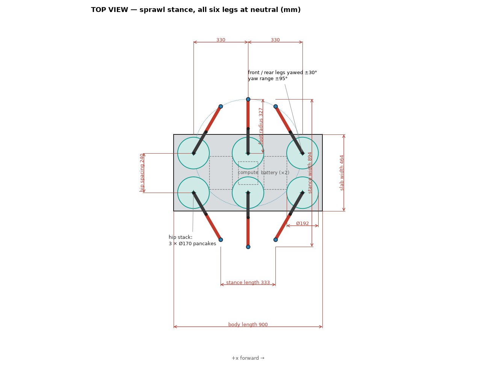
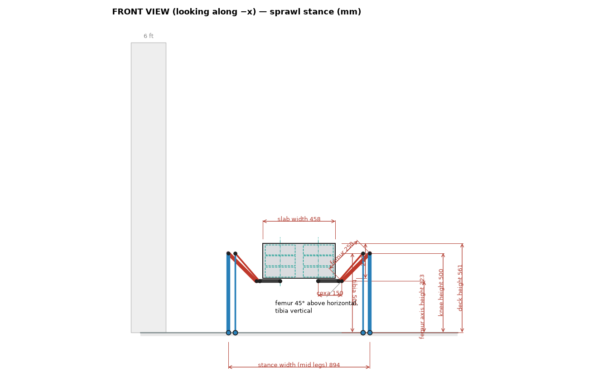
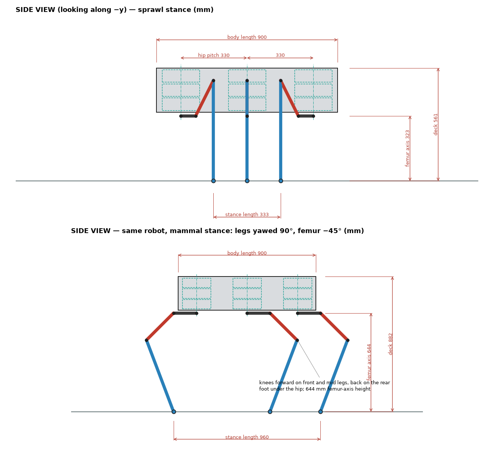
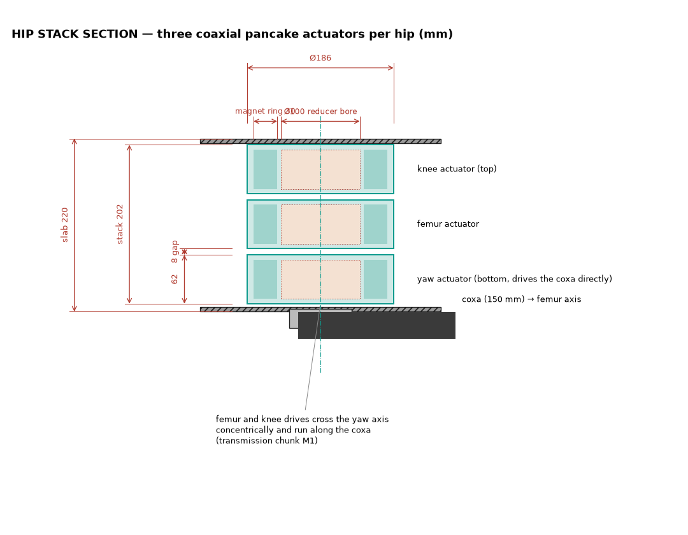

# 06 — The geometry, dimensioned

*Generated by `analysis/drawing.py` from the models. All dimensions in mm.*

The current rough geometry from four views. The body is a 900 × 458 × 220 mm slab
with six hip stacks under it on a 240 mm spacing, 330 mm apart along the
body. Each hip is three coaxial pancake actuators, Ø186 × 62 mm, on the yaw axis.
Each leg is coxa 150 / femur 250 / tibia 500 mm. The sprawl stance stands with
the femur axis 323 mm and the deck 561 mm above ground; the mammal
stance, same robot, 644 mm and 882 mm.

## Top view

## Front view, sprawl stance

## Side views, both stances

## The hip stack — the volume given to the motors

Each actuator has a Ø186 × 62 mm envelope including housing, bearings and
reducer. With the reducer in-plane the magnetically active annulus is
r = 55–85 mm (a 30 mm wide ring) and the reducer has a Ø100 mm bore; with
the reducer stacked axially the motor may use the whole disc but only part of
the height. That envelope is the input to the motor study in
[07-motor-options-in-envelope.md](07-motor-options-in-envelope.md).

| Quantity | Value |
|---|---|
| Actuator envelope | Ø186 × 62 mm, ≤ 5.5 kg |
| Hip stack | 3 actuators + 2 × 8 mm = 202 mm tall inside the 220 mm slab |
| Envelope volume per actuator | 1.68 L |
| Active annulus (in-plane reducer) | r 55–85 mm, ~30 mm of axial length available to magnetics |
| Yaw axis spacing / hip pitch | 240 mm across, 330 mm along |
| Coxa / femur / tibia | 150 / 250 / 500 mm |
| Femur axis height, sprawl / mammal | 323 / 644 mm |
| Stance width, sprawl / mammal | 894 / 240 mm |
