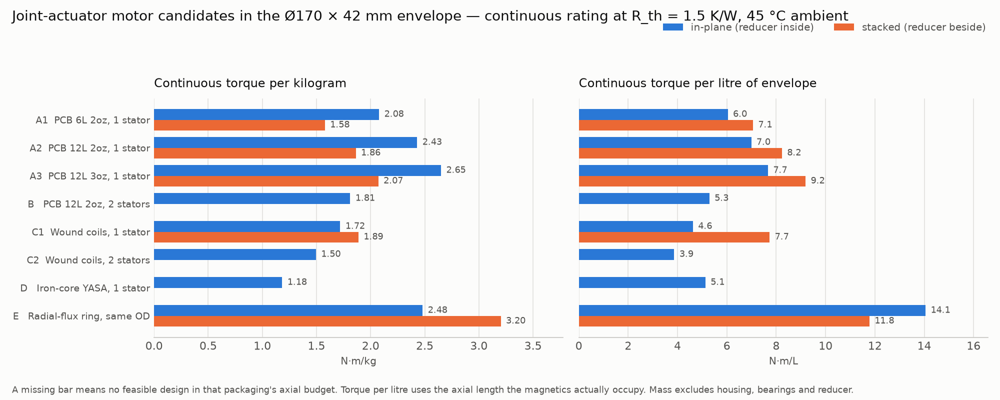

# 07 — Motor options inside the Ø170 × 42 mm envelope

An electromagnetic sizing study of the joint actuator's motor. It asks one
question: **inside the pancake the geometry already fixed, which motor topology
actually delivers the motor-shaft torque of
[01-sizing.md §6](01-sizing.md), and at what mass, cost and buildability?**
It replaces the order-of-magnitude σ table in
[04-motor-reduction-options.md](04-motor-reduction-options.md) §1 with numbers
derived from a magnetic circuit and a thermal balance.

All numbers are produced by [`analysis/motor_options.py`](../../analysis/motor_options.py)
(`/opt/hw-py/bin/python analysis/motor_options.py`). Nothing in the tables below
was typed by hand.

## 1. The envelope and the requirement

Ø170 × 42 mm total, three stacked coaxially per hip. Two packaging variants:

| Variant | Magnetically active annulus | Axial budget for the magnetics |
|---|---|---|
| **in-plane** — cycloid inside the motor | r = 50…85 mm (reducer occupies r < 50) | 30 mm |
| **stacked** — cycloid axially beside the motor | r = 20…85 mm | 18 mm |

At the motor shaft (joint torque ÷ ratio ÷ 0.88 reducer efficiency):

| Joint | Ratio | Continuous | Peak (2 s) | Minimum motor speed |
|---|---|---|---|---|
| yaw | 45:1 | 1.4 N·m | 1.5 N·m | 3450 rpm |
| femur | 55:1 | 2.8 N·m | 5.1 N·m | 2100 rpm |
| knee | 60:1 | 2.7 N·m | 5.7 N·m | 2300 rpm |

Bus 48 V; SVPWM linear range with 5 % modulation margin gives V_ph,max = 18.6 V rms.

## 2. Method and assumptions

**Torque.** Airgap shear stress, integrated over the active annulus:

```
sigma(r) = (k_w / sqrt(2)) · B_pk(r) · A_rms(r)      A_rms = fill · t_cu · J_rms
T        = n_stators · k_edge · 2*pi * INT sigma(r) · r^2 dr
```

`A_rms` is the rms linear current density — rms current per conductor times
conductors per metre of circumference — which for a copper window of axial
thickness `t_cu` filled to fraction `fill` at current density `J` is exactly
`fill·t_cu·J`. The √2 is the sinusoidal-commutation form factor.

**Field.** Double Halbach array, ironless stator between the rotors:

```
B_pk = 2 · Br · K_seg · k_3D · (1 - exp(-2*pi*h_m/lam)) · exp(-pi*g/lam),   lam = 2*pi*r/p
```

Iron-core and radial candidates instead use the 1-D circuit
`B = Br·h_m/(h_m + mu_r·g)` with a 0.855 Carter/leakage derate.

**Current density is not a free parameter.** It falls out of the thermal balance
`P_copper + P_eddy + P_core = (T_cu,max − T_amb)/R_th`, so every candidate is
compared at the same heat rejection. That gives the governing scaling of this
whole study:

> **T_cont ∝ B · √(P_allow · fill · t_cu)** — doubling the copper buys 1.41×
> the torque, not 2×, and halving R_th buys 1.41×.

**Every assumption, with its justification:**

| Quantity | Value | Basis |
|---|---|---|
| Stator→ambient thermal resistance | **1.5 K/W** (swept 1.0–2.0) | Anchored on a *verified* datasheet point: Kollmorgen TBM2G-11526, a 115 mm OD motor in an aluminium housing bolted to a 305 × 305 × 12 mm plate, is specified at R_th(winding→ambient) = 1.21 K/W (and 1.83 K/W for the 8 mm stack). Our stator is a 170 mm disc — 2.3× the surface — bonded to an aluminium housing that is structural body, so better than that plate; but it sits in an airgap with the heat leaving radially through the copper first, so worse than a fully potted housing. 1.5 K/W is the midpoint. |
| Ambient | 45 °C | 01-sizing.md environment spec |
| Copper limit | 120 °C (PCB), 150 °C (enamelled wire) | FR4/IPC long-term for the board; class-F wire. → 50 W and 70 W of allowed loss |
| Magnet | N45(SH), Br = 1.32 T at 20 °C, −0.12 %/K, body at 90 °C ⇒ **Br = 1.21 T** | Br and tempco are **from memory, not a fetched datasheet** — flagged. SH grade is chosen so the 2 s burst has demag margin |
| Halbach segmentation | 4 blocks per wavelength, K_seg = sin(π/4)/(π/4) = 0.900 | closed form |
| 3-D / build derate | k_3D = 0.90 | finite array, glue gaps, magnet tolerance — engineering estimate |
| Edge derate | k_edge = 1 − λ/(2π·L_active) | an ironless Halbach field decays over λ/2π at the annulus edges; this is the term that punishes a narrow annulus at low pole count. Iron candidates use 0.97 (flux is guided) |
| Winding factor | k_w = 0.933 | 12-slot/10-pole family, N_c = 1.2 × 2p |
| PCB copper | 6L/12L, 2 oz = 69.6 µm, 3 oz = 104 µm; boards 1.0/1.8/2.2 mm | stock fab stack-ups |
| PCB fill | w/(w + 0.15 mm) with w swept 0.125–2 mm | 0.15 mm space is a routine 12-layer rule; wide traces are split into sub-traces to control eddy loss |
| Wound-coil fill | 0.45 in the coil × 0.90 coil-to-coil packing, 5 mm coil | mid of the realistic 0.40–0.55 band |
| Airgap | stator thickness + 2 × 0.5 mm clearance | |
| Magnet thickness | min(remaining axial, 0.20 λ) | at 0.20 λ the field is 0.72 of the infinite-thickness value vs 0.79 at 0.25 λ: 9 % less field for 20 % less magnet |
| Eddy loss | strip: π²f²B²w²/(6ρ); round wire: π²f²B²d²/(8ρ) | classical; 70 µm copper vs a 1.9 mm skin depth at 1.2 kHz, so this is proximity loss, not skin effect. Evaluated at **3500 rpm** for every candidate, because one motor design has to serve the yaw joint's 3450 rpm |
| SMC core loss | 25 W/kg at 1 T, 400 Hz, scaled f^1.5·B² | **from memory** — candidate D's viability turns on it |
| Peak (2 s) | 3 × continuous current | Convention. For the ironless candidates neither demagnetisation (armature field is < 20 mT — there is no iron to concentrate it) nor the adiabatic copper rise binds below ~2.1–8× ; the table names which limit actually bit. Iron candidates are capped at 2.5× for saturation |
| Costs | magnets $0.22/g, 12L 2 oz board $45, wire $30/kg, machined carrier $30 | all **estimates**, small-batch (~100 off); labour excluded |

**Not modelled:** windage, bearing drag, rotor eddy loss (negligible — the
rotor is synchronous with the field), in-plane temperature gradients across the
stator, and inverter loss.

## 3. Results

| Candidate | Packaging | sigma cont (kPa) | T cont (N.m) | T peak 2 s (N.m) | peak set by | P_cu (W) | P_eddy (W) | f_e at 3500 rpm (Hz) | n max at T_cont (rpm) | axial used (mm) | magnet (g) | motor mass (g) | N.m/kg | N.m/L | parts $ | buildability |
|---|---|---|---|---|---|---|---|---|---|---|---|---|---|---|---|---|
| A1  PCB 6L 2oz, 1 stator | in-plane | 3.10 | 2.30 | 4.92 | adiabatic 2 s | 40 | 10 | 1108 | 4833 | 16.8 | 744 | 1109 | 2.08 | 6.0 | 242 | Easiest. Any 6-layer fab, magnets glued into a printed jig, no winding. Runs the highest current density of the set, so the bond to the housing is critical. |
| A1  PCB 6L 2oz, 1 stator | stacked | 2.79 | 2.67 | 6.62 | adiabatic 2 s | 43 | 7 | 758 | 4846 | 16.6 | 1237 | 1690 | 1.58 | 7.1 | 350 | Easiest. Any 6-layer fab, magnets glued into a printed jig, no winding. Runs the highest current density of the set, so the bond to the housing is critical. |
| A2  PCB 12L 2oz, 1 stator | in-plane | 3.76 | 2.79 | 7.68 | adiabatic 2 s | 42 | 8 | 1108 | 4855 | 17.6 | 744 | 1150 | 2.43 | 7.0 | 269 | Same process as A1, 12-layer 2 oz is a stock JLC/PCBWay option. Best effort/return of the PCB family. |
| A2  PCB 12L 2oz, 1 stator | stacked | 3.41 | 3.26 | 9.77 | 3x I_cont | 44 | 6 | 758 | 4870 | 17.4 | 1237 | 1749 | 1.86 | 8.2 | 377 | Same process as A1, 12-layer 2 oz is a stock JLC/PCBWay option. Best effort/return of the PCB family. |
| A3  PCB 12L 3oz, 1 stator | in-plane | 4.22 | 3.13 | 9.40 | 3x I_cont | 40 | 10 | 1108 | 4879 | 18.0 | 744 | 1183 | 2.65 | 7.7 | 289 | 12-layer 3 oz is a specialist stack-up (heavy copper on inner layers); longer lead time and ~1.5x the board cost, no new skill needed. |
| A3  PCB 12L 3oz, 1 stator | stacked | 3.89 | 3.72 | 11.16 | 3x I_cont | 42 | 8 | 758 | 4891 | 17.8 | 1237 | 1796 | 2.07 | 9.2 | 397 | 12-layer 3 oz is a specialist stack-up (heavy copper on inner layers); longer lead time and ~1.5x the board cost, no new skill needed. |
| B   PCB 12L 2oz, 2 stators | in-plane | 2.32 | 3.58 | 10.75 | 3x I_cont | 38 | 12 | 1283 | 4898 | 29.8 | 1331 | 1979 | 1.81 | 5.3 | 473 | Two identical boards and a third rotor. Doubles the assembly and halves the magnet thickness; the middle rotor needs magnets on both faces and a stiff, thin, non-magnetic carrier. |
| B   PCB 12L 2oz, 2 stators | stacked | — | — | — | no feasible design in this envelope | — | — | — | — | — | — | — | — | — | — | Two identical boards and a third rotor. Doubles the assembly and halves the magnet thickness; the middle rotor needs magnets on both faces and a stiff, thin, non-magnetic carrier. |
| C1  Wound coils, 1 stator | in-plane | 4.79 | 2.82 | 8.47 | 3x I_cont | 34 | 36 | 700 | 4886 | 26.9 | 955 | 1643 | 1.72 | 4.6 | 303 | CNC- or hand-wound flat coils potted in a printed carrier. ~2 h of labour per stator and a winding jig, but no fab lead time and the same rotors as A. This is the DIY axial-flux recipe. |
| C1  Wound coils, 1 stator | stacked | 3.39 | 3.16 | 9.48 | 3x I_cont | 48 | 22 | 700 | 4856 | 18.0 | 755 | 1673 | 1.89 | 7.7 | 263 | CNC- or hand-wound flat coils potted in a printed carrier. ~2 h of labour per stator and a winding jig, but no fab lead time and the same rotors as A. This is the DIY axial-flux recipe. |
| C2  Wound coils, 2 stators | in-plane | 2.01 | 2.63 | 7.90 | 3x I_cont | 46 | 24 | 817 | 4835 | 30.0 | 680 | 1761 | 1.50 | 3.9 | 316 | As C1 twice, in an axial budget that leaves 2 mm magnets. Not worth the labour. |
| C2  Wound coils, 2 stators | stacked | — | — | — | no feasible design in this envelope | — | — | — | — | — | — | — | — | — | — | As C1 twice, in an axial budget that leaves 2 mm magnets. Not worth the labour. |
| D   Iron-core YASA, 1 stator | in-plane | 4.46 | 3.49 | 8.73 | saturation | 29 | 22 | 408 | 4921 | 30.0 | 526 | 2952 | 1.18 | 5.1 | 514 | Not buildable in a small shop: needs SMC or wound-strip laminated tooth cores. Cogging and core loss as well. Contract-build only. |
| D   Iron-core YASA, 1 stator | stacked | — | — | — | no feasible design in this envelope | — | — | — | — | — | — | — | — | — | — | Not buildable in a small shop: needs SMC or wound-strip laminated tooth cores. Cogging and core loss as well. Contract-build only. |
| E   Radial-flux ring, same OD | in-plane | 12.41 | 9.57 | 23.92 | saturation | 52 | 0 | 817 | 4650 | 30.0 | 347 | 3858 | 2.48 | 14.1 | 350 | Nothing to build - buy a frameless torque motor. But it is an iron ring at 160 mm bore: heavy. |
| E   Radial-flux ring, same OD | stacked | 16.03 | 4.81 | 12.03 | saturation | 52 | 0 | 817 | 4650 | 18.0 | 135 | 1503 | 3.20 | 11.8 | 350 | Nothing to build - buy a frameless torque motor. But it is an iron ring at 160 mm bore: heavy. |

| Candidate | Packaging | pole pairs | coils | conductor w/d (mm) | magnet h (mm) | airgap (mm) | B_pk (T) | magnet blocks/rotor | J cont (A/mm2) | Kt (N.m/A_rms) | I cont (A_rms) | R_ph (mohm) | turns/phase | n no-load (rpm) |
|---|---|---|---|---|---|---|---|---|---|---|---|---|---|---|
| A1  PCB 6L 2oz, 1 stator | in-plane | 19 | 48 | 0.200 | 4.4 | 2.0 | 1.05 | 76 | 21.8 | 0.1067 | 21.6 | 28.8 | 13 | 5000 |
| A1  PCB 6L 2oz, 1 stator | stacked | 13 | 33 | 0.200 | 4.8 | 2.0 | 1.05 | 52 | 18.7 | 0.1067 | 25.0 | 22.9 | 4 | 5000 |
| A2  PCB 12L 2oz, 1 stator | in-plane | 19 | 48 | 0.150 | 4.4 | 2.8 | 0.94 | 76 | 16.9 | 0.1067 | 26.2 | 20.6 | 15 | 5000 |
| A2  PCB 12L 2oz, 1 stator | stacked | 13 | 33 | 0.150 | 4.8 | 2.8 | 0.93 | 52 | 14.4 | 0.1067 | 30.5 | 15.9 | 5 | 5000 |
| A3  PCB 12L 3oz, 1 stator | in-plane | 19 | 48 | 0.150 | 4.4 | 3.2 | 0.88 | 76 | 13.4 | 0.1067 | 29.4 | 15.4 | 16 | 5000 |
| A3  PCB 12L 3oz, 1 stator | stacked | 13 | 33 | 0.150 | 4.8 | 3.2 | 0.88 | 52 | 11.5 | 0.1067 | 34.9 | 11.6 | 5 | 5000 |
| B   PCB 12L 2oz, 2 stators | in-plane | 22 | 54 | 0.125 | 3.8 | 2.8 | 0.88 | 88 | 11.9 | 0.1067 | 33.6 | 11.3 | 7 | 5000 |
| C1  Wound coils, 1 stator | in-plane | 12 | 30 | 0.400 | 7.0 | 7.0 | 0.74 | 48 | 6.5 | 0.1067 | 26.5 | 16.0 | 29 | 5000 |
| C1  Wound coils, 1 stator | stacked | 12 | 30 | 0.400 | 3.0 | 7.0 | 0.40 | 48 | 6.5 | 0.1067 | 29.6 | 18.1 | 10 | 5000 |
| C2  Wound coils, 2 stators | in-plane | 14 | 36 | 0.400 | 2.2 | 6.0 | 0.39 | 56 | 6.0 | 0.1067 | 24.7 | 24.9 | 23 | 5000 |
| D   Iron-core YASA, 1 stator | in-plane | 7 | 18 | 0.500 | 3.0 | 0.0 | 0.83 | 14 | 5.9 | 0.1067 | 32.8 | 8.9 | 14 | 5000 |
| E   Radial-flux ring, same OD | in-plane | 14 | 48 | 0.600 | 3.0 | 0.0 | 0.87 | 28 | - | 0.1067 | 89.7 | 2.2 | - | 5000 |
| E   Radial-flux ring, same OD | stacked | 14 | 48 | 0.600 | 3.0 | 0.0 | 0.87 | 28 | - | 0.1067 | 45.1 | 8.6 | - | 5000 |



## 4. Which options meet which joint

| Candidate | Packaging | yaw (1.4/1.5 N.m, 3450 rpm) | femur (2.8/5.1 N.m, 2100 rpm) | knee (2.7/5.7 N.m, 2300 rpm) |
|---|---|---|---|---|
| A1  PCB 6L 2oz, 1 stator | in-plane | **yes** | no (cont 2.30, peak 4.92) | no (cont 2.30, peak 4.92) |
| A1  PCB 6L 2oz, 1 stator | stacked | **yes** | no (cont 2.67) | no (cont 2.67) |
| A2  PCB 12L 2oz, 1 stator | in-plane | **yes** | no (cont 2.79) | **yes** |
| A2  PCB 12L 2oz, 1 stator | stacked | **yes** | **yes** | **yes** |
| A3  PCB 12L 3oz, 1 stator | in-plane | **yes** | **yes** | **yes** |
| A3  PCB 12L 3oz, 1 stator | stacked | **yes** | **yes** | **yes** |
| B   PCB 12L 2oz, 2 stators | in-plane | **yes** | **yes** | **yes** |
| B   PCB 12L 2oz, 2 stators | stacked | — | — | — |
| C1  Wound coils, 1 stator | in-plane | **yes** | **yes** | **yes** |
| C1  Wound coils, 1 stator | stacked | **yes** | **yes** | **yes** |
| C2  Wound coils, 2 stators | in-plane | **yes** | no (cont 2.63) | no (cont 2.63) |
| C2  Wound coils, 2 stators | stacked | — | — | — |
| D   Iron-core YASA, 1 stator | in-plane | **yes** | **yes** | **yes** |
| D   Iron-core YASA, 1 stator | stacked | — | — | — |
| E   Radial-flux ring, same OD | in-plane | **yes** | **yes** | **yes** |
| E   Radial-flux ring, same OD | stacked | **yes** | **yes** | **yes** |

Reading it:

* **Every serious candidate clears the yaw joint.** Yaw is not the problem; it
  never was.
* **The femur (2.8 N·m continuous, 5.1 N·m peak) is the binding case.** A 6-layer
  PCB misses it in both packagings. A 12-layer 2 oz board misses it by 0.01 N·m
  in-plane and clears it stacked. 12-layer **3 oz clears every joint in both
  packagings**, and so does a single wound-coil stator.
* **Two stators are not the answer.** Candidate B gains 28 % torque over A2
  in-plane for 72 % more mass and $200 more, because splitting the same axial
  budget over three rotors halves the magnet thickness. C2 is worse still. The
  "two stators for the femur and knee" of 01-sizing §7 does not survive contact
  with the axial budget.
* **The stacked packaging beats in-plane on torque** (the annulus runs to
  r = 20 mm) but for the PCB options it costs 66 % more magnet mass to do it (the annulus is far
  wider), and it forbids the
  dual-stator options entirely.
* **Nothing meets the 1.1 kg mass target of 01-sizing §6** — the best is
  1.15 kg for A2 in-plane, excluding housing, bearings and reducer. That budget
  needs revisiting.

## 5. Calibration against real motors

| Motor | Source | Size | Mass | Continuous torque | Implied N.m/kg | Implied sigma |
|---|---|---|---|---|---|---|
| Kollmorgen TBM2G-11526 (frameless, slotted radial) | **verified** - TBM2G Selection Guide PDF, 115 Series parameter page | 115 mm OD x 26 mm stack | 1.43 kg | 6.03 N.m at stall, 130 K rise, on a 305 x 305 x 12 mm Al plate (R_th 1.21 K/W) | 4.2 | 18.4 kPa (r_g taken as 0.39 x OD) |
| Kollmorgen TBM2G-11508 | **verified**, same source | 115 mm OD x 8 mm stack | 0.644 kg | 1.90 N.m, R_th 1.83 K/W | 3.0 | ~18 kPa |
| T-Motor U15 II KV80 (radial outrunner) | **partly verified** - vendor store page, not a datasheet | 147.5 x 64 mm | 1.74 kg | 143 A / 8580 W "180 s" rating -> ~14.9 N.m from Kt = 8.3/Kv (propeller-cooled burst, NOT a still-air continuous rating) | ~8.6 (with forced air) | ~22 kPa |
| CubeMars AK80-64 (motor + 64:1 planetary) | **partly verified** - vendor page | 98 x 61.9 mm | 0.85 kg | 48 N.m rated / 120 N.m peak at the joint | 56 at the joint | n/a (geared) |
| MyActuator RMD-X8-Pro (9:1) | **partly verified** - vendor pages | pancake, ~110 mm | 0.71-1.2 kg | 13 N.m nominal / 25 N.m peak | ~18 at the joint | n/a (geared) |

The two Kollmorgen rows are the only fully verified numbers here; they were read
out of the TBM2G Selection Guide PDF. Everything else in this section is a
vendor store page, not a datasheet, and is marked accordingly. The T-Motor
"143 A continuous" is a 180-second propeller-cooled rating and must not be read
as a still-air continuous figure.

The calibration matters because **this study disagrees with the current plan by
about 2×**. 01-sizing §7 assumes σ = 1.5 kPa continuous for a PCB stator; this
model gets 3.1–4.2 kPa. The difference is entirely in two inputs: the assumed
airgap field (0.6 T there, 0.88–1.05 T here, from a magnetic circuit with an
optimised pole count and the magnets close in), and the assumed current density
(5–6 A/mm² there, 11–22 A/mm² here, from the thermal balance rather than a
wire-gauge rule of thumb). The Kollmorgen anchor at 18 kPa for a *slotted iron*
machine with a large heatsink and a 130 K rise makes 3–4 kPa for a
thin-copper ironless machine at a 75 K rise plausible, but **this is the number
to earn on a dyno before anything is committed.**

## 6. Sensitivity

| Case | R_th 1.0 | R_th 1.5 (nominal) | R_th 2.0 | fill x0.8 | fill x1.2 |
|---|---|---|---|---|---|
| C1 wound, in-plane | 4.12 | 2.82 | 2.04 | 2.81 | 2.77 |
| A3 PCB 12L 3oz, in-plane | 4.00 | 3.13 | 2.64 | 2.87 | 3.37 |
| C1 wound, stacked | 4.18 | 3.16 | 2.57 | 2.95 | 3.32 |
| A3 PCB 12L 3oz, stacked | 4.72 | 3.72 | 3.13 | 3.39 | 4.00 |

**The answer is most sensitive to, in order:**

1. **The current density the thermal path really allows.** The model runs the
   PCB candidates at J = 11–22 A/mm², three to four times the wire rule of
   thumb. That is legitimate only because the copper is thin, is thermally
   short-circuited radially to the rim (≈0.08 K/W through 0.84 mm of copper over
   a 534 mm circumference), and the rim is well bonded to the housing. If the
   bond is poor, or if the three motors in a hip heat each other, this collapses
   first — and it takes the whole concept with it.
2. **R_th.** T_cont goes as √(1/R_th): 1.0 K/W gives +28 %, 2.0 K/W gives −16 %.
   At R_th = 2.0 the *only* candidates left for the femur are A3 stacked and the
   radial ring. Note that three motors per hip at 40–50 W each is 150 W per hip
   and ~900 W for the robot — the body has to actually reject that.
3. **Achievable copper fill.** T_cont goes as √(fill), so ±20 % of fill is only
   ∓6…+8 % of torque — a *weak* lever, and for the wound-coil candidate in-plane
   it is flat to zero, because more copper there means more eddy loss (36 W of
   the 70 W budget) and the two cancel. **This is the study's most useful
   negative result: chasing copper fill is not worth the effort; chasing the
   thermal path is.**

Also material but second-order: the SMC loss figure (candidate D exists or does
not depending on it), and the magnet Br, which enters linearly.

**Levers not varied**, and which should be before any of this is called final:
liquid or forced-air cooling of the stator rim; a copper or aluminium heat
spreader bonded into the stator; magnet grades above N45; a larger OD (the
whole study is bounded by 170 mm); and the reducer ratio itself, which trades
motor torque against motor speed one-for-one.

## 7. Recommendation

**Design these two in detail:**

1. **A3 — 12-layer 3 oz PCB stator, one stator, two Halbach rotors, in-plane
   reducer.** 3.13 N·m continuous, 9.40 N·m peak, 1.18 kg, 2.65 N·m/kg — the
   best torque-per-kilogram of the whole set, the only PCB option that clears
   all three joints in both packagings, ~$289 in parts, and buildable with no
   skill the shop does not have: a fab order and glued magnets. It uses 18 of
   its 30 mm axial budget, which is 12 mm handed back to the cycloid.
2. **C1 — wound flat-coil stator, one stator, in the same rotors and housing.**
   2.82 N·m in-plane / 3.16 N·m stacked, clears every joint, and it is the
   *upgrade path*: the same rotors, the same bolt circle, the same airgap. Design
   the stator carrier as a separate part now and the swap costs a part, not a
   redesign. Its 5 mm coil opens the airgap to 7 mm and it loses half its
   thermal budget to eddy loss at 700 Hz, so **use 0.4 mm wire or litz, not
   0.8 mm** — that choice is worth more than the fill factor.

**Not recommended:** two stators (B, C2) — they cost mass and money for torque
the axial budget then takes back. Iron-core (D) — 2.95 kg and unbuildable here.
The radial-flux ring (E) is the honest ceiling at 9.6 N·m in-plane but weighs
3.9 kg; it is the same family as the Kollmorgen frameless, and it is the reason
to keep an off-the-shelf actuator as the fallback for the first leg.

**Two consequences for the plan:** the 1.1 kg per-actuator mass budget in
01-sizing §6 cannot be met by any candidate and needs renegotiating; and the
two-stator femur/knee configuration in 01-sizing §7 should be dropped in favour
of one 3 oz stator per joint.
