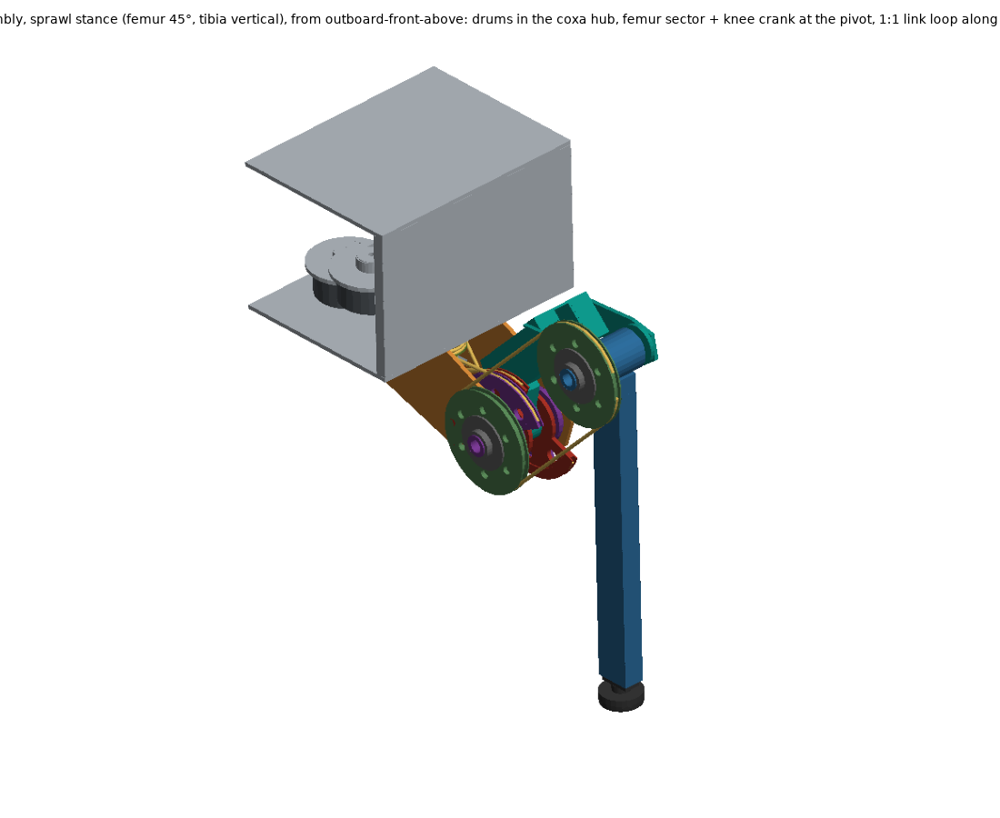
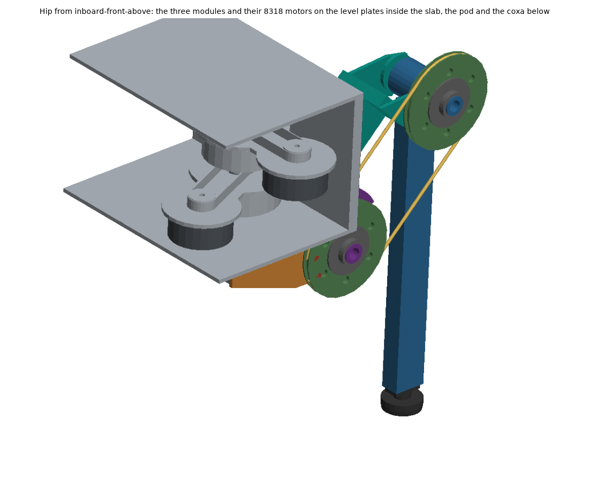
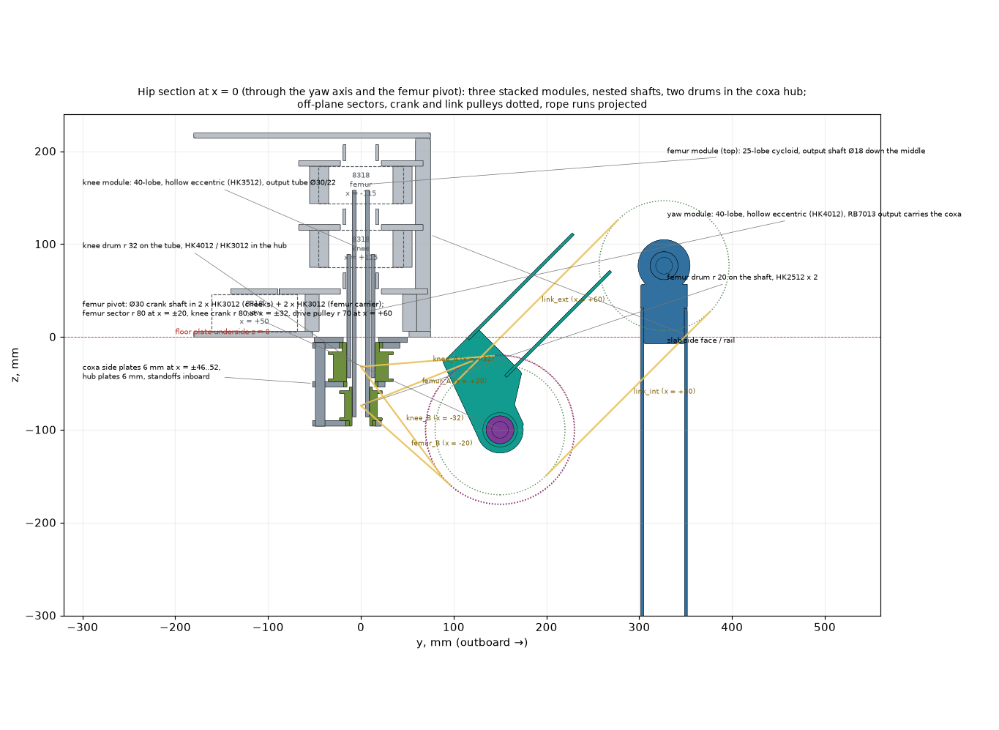
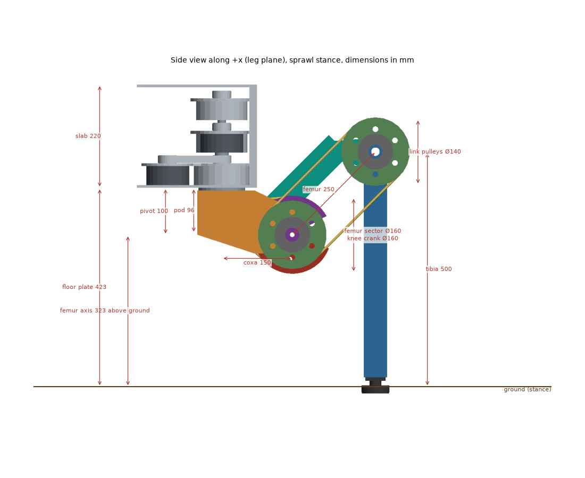
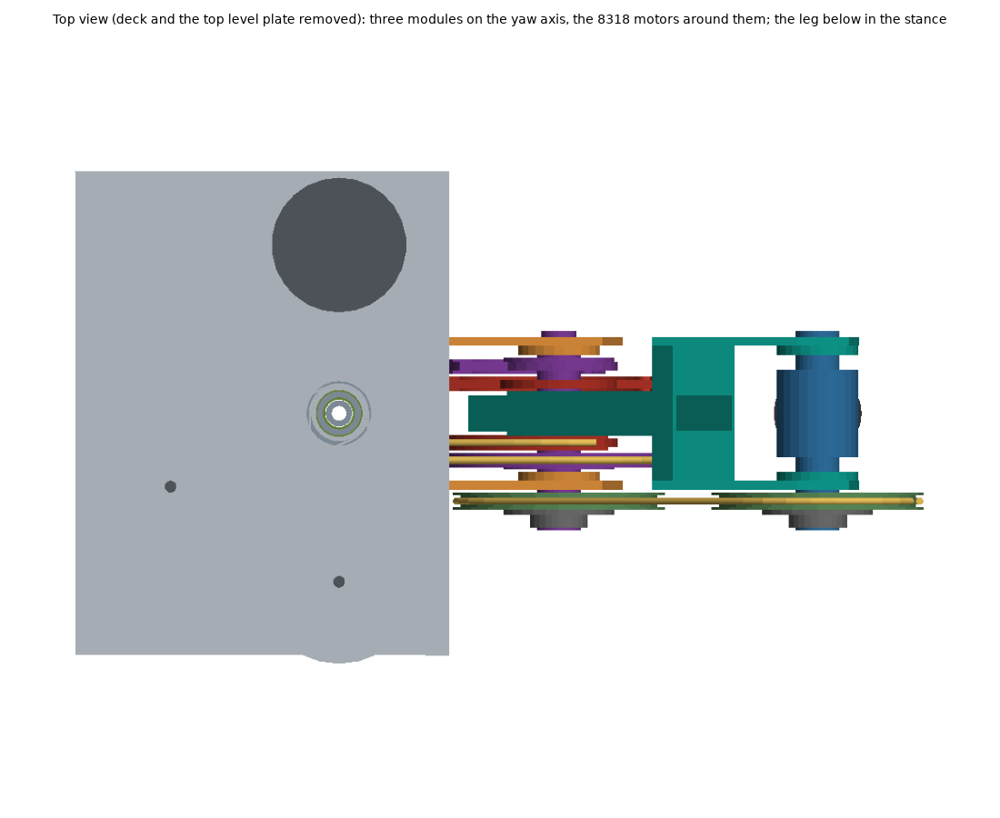
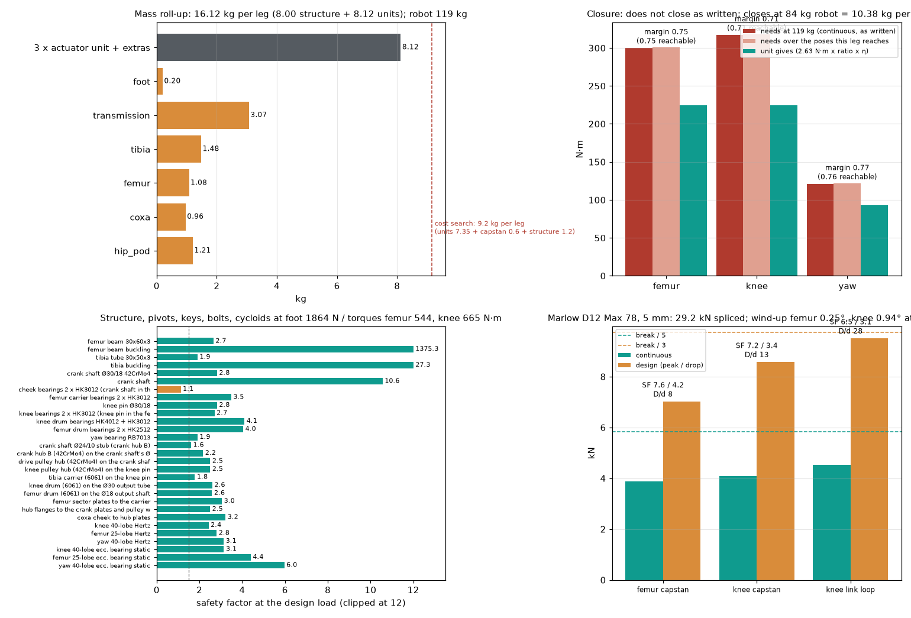

# 09 — The leg assembly on the off-the-shelf outrunner units

*Built by [`cad/leg/leg.py`](../../cad/leg/leg.py) (build123d; STEP/STL under
`build/cad/leg/`, numbers in [`cad/leg/leg.json`](../../cad/leg/leg.json)),
swept by [`cad/leg/leg_rom.py`](../../cad/leg/leg_rom.py), loaded by
[`analysis/leg_loads.py`](../../analysis/leg_loads.py)
([`hw/leg/leg_loads.json`](../../hw/leg/leg_loads.json)) and costed by
[`analysis/bom_leg.py`](../../analysis/bom_leg.py)
([`bom-leg.csv`](bom-leg.csv)). Round 14 (two interrupted sessions) built the
CAD, the renders and the loads; round 14b ran the range-of-motion sweep, fixed
the keys, wrote the BOM and this note. Every number below is a model number.*

## 0. What the reviewer needs to know first

1. **The capstan rope drive, as drawn, cannot be wound.** The drums sit on the
   vertical yaw axis and the sectors on the horizontal femur pivot, so a straight
   run from drum to sector leaves the drum at **4.7° (knee A), 22° (femur A),
   42° (femur B) and 53° (knee B)** to the drum's plane of rotation. A grooved
   capstan drum tolerates about 1.5°; beyond that the rope climbs the groove
   wall and rides over the flange. The "zero fleet angle" in the round-14
   docstring is true only of the *x*-plane (the runs do stay at x = ±r_drum). This
   is inherited from the round-8 concept in `analysis/capstan.py`, which drew the
   drum and the sector coplanar. On top of that the femur drum is 8 mm too short
   for its three dead wraps, 1.6 working turns and their 9 mm of walk (34 mm
   needed in a 26 mm groove), and the knee drum is at its limit (26.4 in 26). The
   options are in §8; none is modelled. Everything else in this note is about a
   leg whose rope drive has to change.
2. **The leg does not close.** 16.1 kg per leg (8.0 kg of structure and
   transmission, 8.1 kg of units) against the 9.2 kg the round-10 cost search
   assumed; the robot is 119 kg instead of 77, and the joints have **0.71 (knee),
   0.75 (femur), 0.77 (yaw)** of the continuous torque they need. It closes at an
   84 kg robot, i.e. 10.4 kg per leg. Level walking at dyn 1.2 closes at 1.09.
3. **The tightest things that are not the rope drive:** the two HK3012 cheek
   bearings that carry the crank shaft in the coxa (static SF 1.15 with the
   four rope pulls and the foot load summed as scalars), the knee pulley's
   link-loop rope at SF 3.1 on the design (stumble) load, the tibia tube at SF
   1.9, and — from the sweep — see §6.

## 1. Architecture

The leg is the round-10 to -12 outcome: an off-the-shelf 8318 outrunner per
joint, a cycloid module, and a rope second stage, on the 150 / 250 / 500 mm
coxa / femur / tibia of [06-geometry.md](06-geometry.md).

**Motors and modules in the body slab.** The three cycloid modules stack
coaxially on the yaw axis inside the 220 mm slab: yaw at the bottom (40-lobe,
hollow eccentric on an HK4012, RB7013 crossed-roller output carrying the coxa),
knee in the middle (40-lobe, hollow eccentric on an HK3512), femur on top
(25-lobe). Each module is driven by its 8318 beside it through a 1:1 HTD 5M
belt on the module's cover plate, which is also the motor's heat-sink plate.
The belt is what lets the eccentric sleeves be hollow.

**Nested shafts.** The femur module's output is a Ø18/10 42CrMo4 shaft that
runs down the middle of the knee and yaw modules; the knee module's output is a
Ø30/22 tube around it. Both end in the coxa hub below the floor plate.

**Two drums in the coxa hub.** The knee drum (r 32) on the tube and the femur
drum (r 20) on the shaft are journaled in three 6 mm hub plates that hang from
the yaw flange and turn with the coxa, so the rope pull is a load internal to
the coxa and the through-shafts carry torque only. Ratios 40 × 2.5 (knee) and
25 × 4 (femur) = 100:1; yaw 40:1.

**Off-plane sectors at the femur pivot.** The femur sector (r 80, two plates
at x = ±15..25) is bolted to the femur carrier; the knee crank (r 80, two
plates at x = ±27..37) is free on the same Ø30 crank shaft. Each capstan rope
runs from its drum in the plane x = ±r_drum to its own plate, so the two
capstans interleave axially without crossing.

**Knee crank + parallelogram link.** The crank drives the tibia through a 1:1
rope loop (two r 70 pulleys on the crank shaft and the knee pin, both on the
+x side outside the cheeks). Because the loop is a parallelogram, the knee
motor sets the tibia's *absolute* angle τ, not the knee angle: θ_knee = τ −
φ_femur − 180°. The round-1 routing (knee sector at the knee, rope over an
idler at the pivot) was impossible over the femur range and is gone.

**Coupling and its compensation** (`leg.json` `transmission.coupling`, finite
differences on the rope lengths):

| | dL/dφ_femur | dL/dτ_tibia | loop length variation over the range |
|---|---|---|---|
| femur rope A / B | −80 / +80 mm/rad | 0 / 0 | 0.0 mm |
| knee rope A / B | 0 / 0 | −80 / +80 mm/rad | 0.0 mm |
| link loop ext / int | 0 / 0 | 0 / 0 | 0.0 mm |

The femur rope sees only φ, the knee rope only τ, and the link loop sees
neither — no cross-coupling between the two capstans, and a knee flex with the
femur fixed costs the knee motor the full rate. Yaw does couple in: the drums
are on the yaw axis and the sectors on the coxa, so a yaw rotation ψ winds both
drums by ψ. The controller commands φ = (δ_femur − ψ)/4 and τ = (δ_knee −
ψ)/2.5 (`leg.json` `coupling.formula`); the motor rate budget is 100·φ̇ + 25·ψ̇
for the femur and 100·τ̇ + 40·ψ̇ for the knee.

## 2. Masses

`leg.json` `masses_g`; densities on the solids, catalogue or estimated masses
where marked (`assigned_masses`).

| Group | kg | What is in it |
|---|---|---|
| Hip pod | 1.21 | yaw flange, three hub plates, standoffs, the two through-shafts, drum bearings |
| Coxa | 0.96 | two 6 mm side plates, bosses, four HK3012 |
| Femur | 1.08 | carrier, 30×60×3 beam, knee cheeks, spacers, bosses, two HK3012 |
| Tibia | 1.48 | carrier, knee pin, 30×50×3 tube |
| Transmission | 3.07 | drums, four sector plates, crank shaft and hub, two link pulleys and their steel hubs, tensioners, ropes |
| Foot | 0.20 | plug, contact sensor, rubber pad |
| **Structure and transmission** | **8.00** | |
| Three units as costed | 7.35 | 2.45 kg each: 0.65 kg motor + 1.25 reducer + 0.55 housing (`cost_search.py`) |
| Unit extras | 0.77 | belt drive ×3 (0.42), hollow eccentrics and bearings (0.27), RB7013 vs RB5013 (0.08) |
| **Leg** | **16.12** | |

The round-14 note quoted 15.72 kg; its `leg.json` had been written by an older
`leg.py` (the femur shaft was still solid, 487 g). Regenerated from the
committed code the leg was 15.57 kg, and the steel hubs of §4 add 0.55 kg.

## 3. Closure

The cost search (08 §9.12) closed the 1 × 8318 option at a **77 kg robot with
9.15 kg per leg** — three 2.45 kg units, 0.6 kg of capstan and a 1.2 kg
structure allowance. The leg as built is 16.12 kg, 7.0 kg over, and at six legs
the robot is **118.7 kg** (fixed mass 22.0 kg without legs, `closure.json`).

| Joint | gives, N·m (2.63 N·m × ratio × η) | needs at 118.7 kg | margin | peak margin | needs over the poses this leg reaches |
|---|---|---|---|---|---|
| femur | 225 | 300 | **0.75** | 1.24 | 301 → 0.75 |
| knee | 225 | 317 | **0.71** | 1.01 | 318 → 0.71 |
| yaw | 93 | 121 | **0.77** | 2.16 | 121 → 0.76 |

The leg **closes at an 84.2 kg robot = 10.4 kg per leg**. Levers
(`leg_loads.json` `closure.levers`): two 8318 per unit at 80:1 does not help
(1.03 / 1.08 / 0.64 at 132 kg — the knee's 2.5:1 crank stage is the loser);
level walking at dyn 1.2 closes at 9.0 / 1.37 / 1.09. The 5.7 kg of
excess is not in one place: the transmission is 3.1 kg (four r 80 plates, two
r 70 pulleys, two Ø30 shafts), the pod and coxa 2.2 kg. Halving the
transmission would still leave a 110 kg robot.

## 4. Load margins

Design load: the stumble case (two legs, dyn 3.0) at 126.7 kg with payload,
**1864 N on the foot**, joint torques femur 544 / knee 665 / yaw 182 N·m (the
continuous ×1.5 drop or the peak per kg, whichever is worse). Materials are
handbook values (6061-T6 240 MPa, 42CrMo4 QT 700 MPa, 8.8 bolts 800 MPa);
bearings are from the sheets in `docs/reference`.

| Check | SF | note |
|---|---|---|
| femur beam 30×60×3, in-plane bending + axial + lateral | 2.7 | 636 N·m incl. the 65 mm beam offset |
| tibia tube 30×50×3, root bending | 1.9 | 665 N·m |
| crank shaft Ø30/18 torsion / bending at the cheek | 2.8 / 10.6 | |
| crank shaft Ø24/10 stub torsion (plate B's hub) | 1.6 | new in 14b |
| knee pin Ø30/18 torsion | 2.8 | |
| cheek bearings 2 × HK3012 (crank shaft in the coxa), static | **1.15** | 30 kN: two rope resultants + link loop + foot, summed as scalars |
| femur carrier bearings 2 × HK3012 | 3.5 | |
| knee bearings 2 × HK3012 | 2.7 | |
| knee drum HK4012 + HK3012 / femur drum 2 × HK2512 | 4.1 / 4.0 | |
| yaw bearing RB7013, static moment | 1.9 | 598 N·m of 1163 |
| cycloids, Hertz at the peak | 2.4 / 2.8 / 3.1 | knee / femur / yaw, allowable 1400 MPa |
| eccentric bearings, static | 3.1 / 4.4 / 6.0 | HK3512 / HK2512 / HK4012 |
| bolt groups: sector plates, hub-flange dowels, coxa cheeks | 3.0 / 2.5 / 3.2 | governed by plate bearing |

**The keys (round 14b).** Round 14 keyed the two r 70 link pulleys to their
Ø30 shafts with one 8×7 key 12 mm long in an aluminium hub: SF 0.9 in shear and
**0.23 in hub bearing**; the crank plates' keys were at 0.77 in hub bearing and
the tibia carrier's at 1.16. No torque path into aluminium survives 665 N·m on
a Ø30 shaft through a key, so the fix is a steel hub everywhere and the
aluminium part dowelled to a flange:

| Joint | before (14) | now (14b) | SF shear / hub bearing / shaft seat |
|---|---|---|---|
| crank plate A on the crank shaft | 8×7×20 key in 6061, hub bearing 0.77 | flange integral with the shaft (turned from Ø80 bar), 4 × Ø8 dowels at r 36 | dowels 5.2 / plate bearing 2.5 |
| crank plate B | as above | 42CrMo4 hub, bore 24 on a Ø24 stub, 2 × 8×7 keys × 26; the hub OD is the left journal | 3.1 / 2.2 / 2.6 |
| drive pulley on the crank shaft | 8×7×12 key in 6061, 0.9 / 0.23 | 42CrMo4 hub, 2 × 10×8 keys × 24, flange dowelled to a 6 mm web | 4.4 / 2.5 / 3.8 |
| knee pulley on the knee pin | as above | as above | 4.4 / 2.5 / 3.8 |
| tibia carrier on the knee pin | 2 × 8×7 × 30 in 6061, 1.16 | 2 × 10×8 × 50 in 6061 | 9.2 / 1.8 / 7.9 |
| knee drum on the Ø30 tube / femur drum on the Ø18 shaft | not checked | 2 × 8×7 × 30 / 2 × 6×6 × 30 in 6061 | 2.6 / 2.6 |

DIN 6885 seat depths (t1 / t2) are used, not h/2. Cost: +0.55 kg per leg of
steel hubs and the longer shafts (+3.3 kg on the robot), and the crank shaft
becomes a turned-from-bar part with an integral flange (~$75 at 20). The
lighter alternative — a DIN 5480 spline in the aluminium parts — is SF 1.6–2.3
on bearing and brings fretting; kept as an option.

## 5. Ropes

Marlow D12 Max 78, 5 mm, 29.2 kN minimum spliced (datasheet). Tension = joint
torque / (0.97 × r).

| Rope | continuous / design, kN | SF | D/d | pretension | wind-up at continuous |
|---|---|---|---|---|---|
| femur capstan (r 20 → r 80) | 3.9 / 7.0 | 7.6 / 4.2 | 8 | 1.05 kN | 0.25° |
| knee capstan (r 32 → r 80) | 4.1 / 8.6 | 7.2 / 3.4 | 12.8 | 1.28 kN | 0.29° |
| knee link loop (r 70 ↔ r 70) | 4.5 / 9.5 | 6.5 / 3.1 | 28 | 1.42 kN | 0.66°; knee total 0.94° |

Rope lengths from the geometry: femur 1.04 m, knee 1.25 m, link loops 0.43 m
each; 3.5 m per leg with the splices.

## 6. Range of motion and clearances

<<ROM>>

## 7. Bill of materials

[`bom-leg.csv`](bom-leg.csv), 49 lines in the columns of `bom-actuator.csv`;
quantities per leg, prices at 20 legs and at 100. The unit lines are the cost
search's 1 × 8318 unit ($423 / $284; `price_before` is the round-9 PCB unit at
$605) with its own capstan block deducted, plus the three deltas the leg
introduces (belt drive, hollow eccentrics, RB7013). Every leg-specific line is
an estimate against the shop rates the actuator BOM used; none is a quote, and
nine lines are "partly" verified (bearing ratings and the rope from their
sheets, prices not).

| Block | lines | $ per leg at 20 | at 100 | largest lines (at 20) |
|---|---|---|---|---|
| Units (as costed, deltas) | 5 | 1241 | 837 | actuator unit 1269, unit delta: belt drive 66, unit delta: hollow eccentric sleeve + bearings 60 |
| Hip pod | 12 | 190 | 122 | knee output tube 30, femur output shaft 28, knee drum 28 |
| Coxa | 4 | 66 | 42 | coxa side plate 32, coxa bearing boss 16, crank shaft bearing hk3012 9 |
| Femur | 6 | 129 | 81 | femur carrier 60, knee spacer block 20, knee cheek 18 |
| Transmission | 12 | 467 | 295 | link pulley 90, crank shaft 75, femur sector plate 60 |
| Tibia and foot | 5 | 99 | 63 | tibia carrier 55, foot plug 12, foot contact sensor 12 |
| Fasteners and consumables | 5 | 19 | 12 | socket cap screw m6 6, adhesive 6, washers, nuts, circlips 4 |
| **One leg** | 49 | **2212** | **1453** | units 1241 / 837, leg-specific 971 / 615 |
| **Six legs** | | **13270** | **8717** | |

The units are 56 % of the leg at 20 and 58 % at 100; the transmission (four sector plates, two pulleys and their steel hubs, the crank shaft) is the largest leg-specific block at $467 / $295. Against the cost search's $423 per unit × 3 = $1269 per leg of actuators (which carried no leg structure at all), the leg costs $2212 / $1453.

## 8. Open items

1. **Rope drive geometry** (§0). Options, none modelled: (a) an idler per run in
   the run's x-plane so the rope leaves each drum horizontally — four idlers of r
   ≥ 20 in the coxa hub, but a fixed idler 40–75 mm from a drum whose band walks 5–9
   mm still sees 4–13° of fleet, so it needs (b) a level-wind drum (spline to
   the shaft, follower in a helical track in the hub, the drum translating one
   pitch per turn) or a much shorter band; (c) turn the drum axes horizontal
   with a 1:1 bevel pair or a quarter-turn belt from each through-shaft, which
   puts the drums parallel to the sectors and removes the problem at ~0.5 kg and
   ~$60 per joint; (d) move the capstan stage off the yaw axis altogether
   (drum at the femur pivot, the cycloid output brought there by a shaft in the
   coxa). This is a review decision, not a detail.
2. **Femur drum height**: 40 mm instead of 32 for the band and its walk, which
   moves the bottom hub plate and the pod bottom down by 8 mm; the knee drum
   needs 27.
3. **Cheek bearings** at SF 1.15 with scalar-summed loads: resolve the four
   pulls by direction (they do not all point the same way) before accepting or
   growing to an HK3016 pair.
4. **Closure** (§3): the transmission mass and the 2.5:1 knee stage. Either
   the requirement moves (level walking closes) or the leg loses 5.7 kg, and
   the rope-drive rework of item 1 will not make it lighter.
5. **Needle rollers on 30 HRC journals**: the crank shaft, knee pin and crank
   hub B are 42CrMo4 QT; drawn-cup needle bearings want ~58 HRC. Harden the
   journals (induction) or derate the ratings.
6. **Not modelled**: fasteners, cable routing, rope keepers on the sectors,
   the foot sensor's wiring down the tibia, hard stops at the joint limits,
   the RB7013 preload, and the body slab beyond one hip.

## 9. What is computed and what is estimated

| Computed from the model | Estimated or assumed |
|---|---|
| geometry, rope runs, contact angles, grooves, coupling, fleet angles, drum bands | the 8318's 2.63 N·m continuous (1.2 K/W heat-sink path, unmeasured) and 3× peak |
| part masses from the solids (structure, sectors, shafts, hubs, pulleys) | unit masses (cost search roll-up), bearings (catalogue), belts, tensioners, sensor |
| clearances (exact OCCT distances on the CAD, 245 poses) | the cost-search unit price and every leg price in the BOM |
| stresses, bearing statics, key and dowel checks, rope SFs (closed form) | material allowables (handbook), η cycloid 0.90 / capstan 0.97 / belt 0.98 |
| closure at the leg's own mass, workspace coverage (leg3d IK) | the load cases' definition (01-sizing), the 1.5 drop factor |
