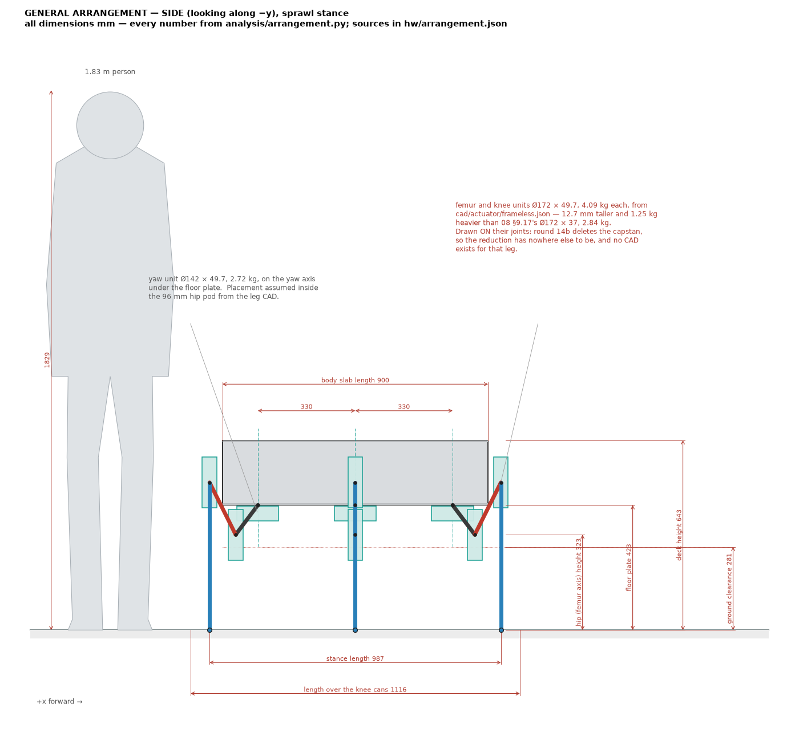
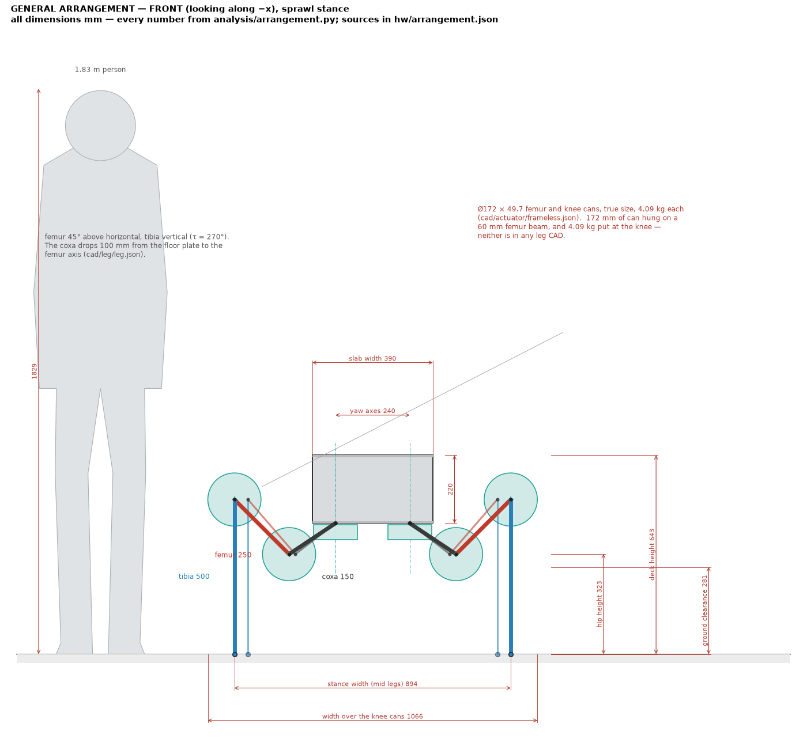
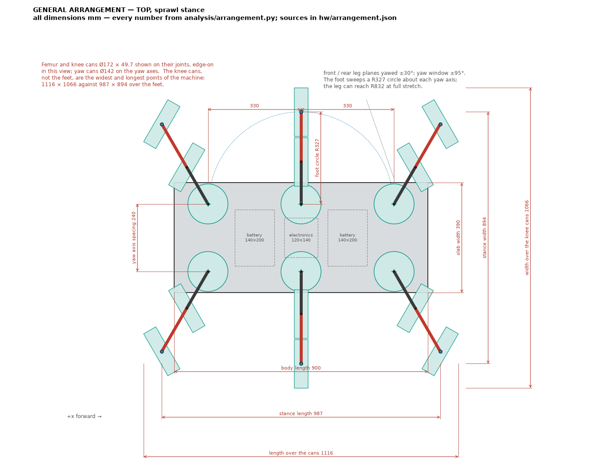
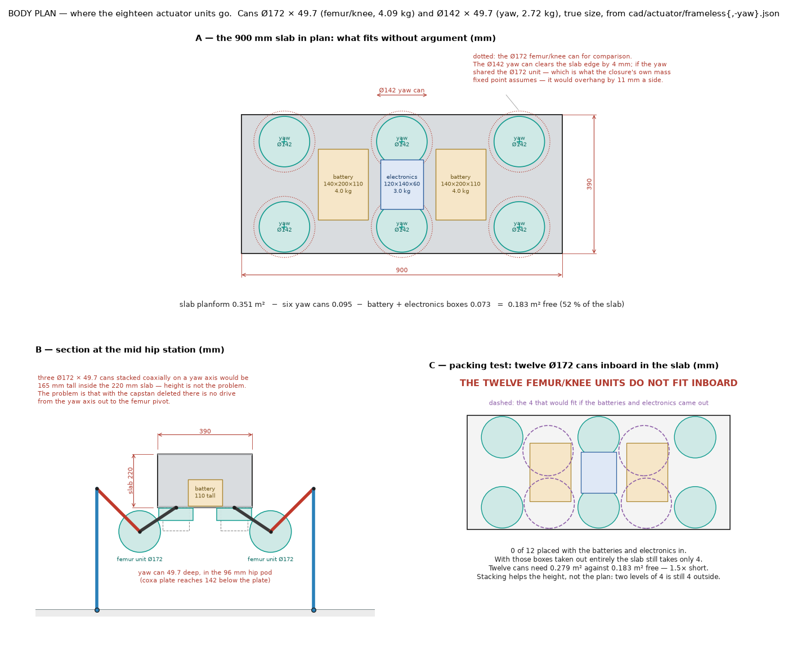
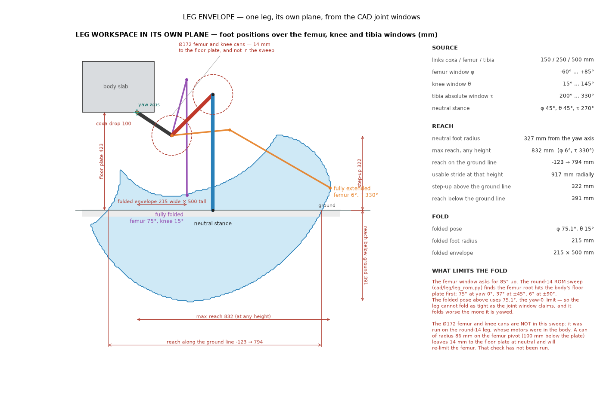
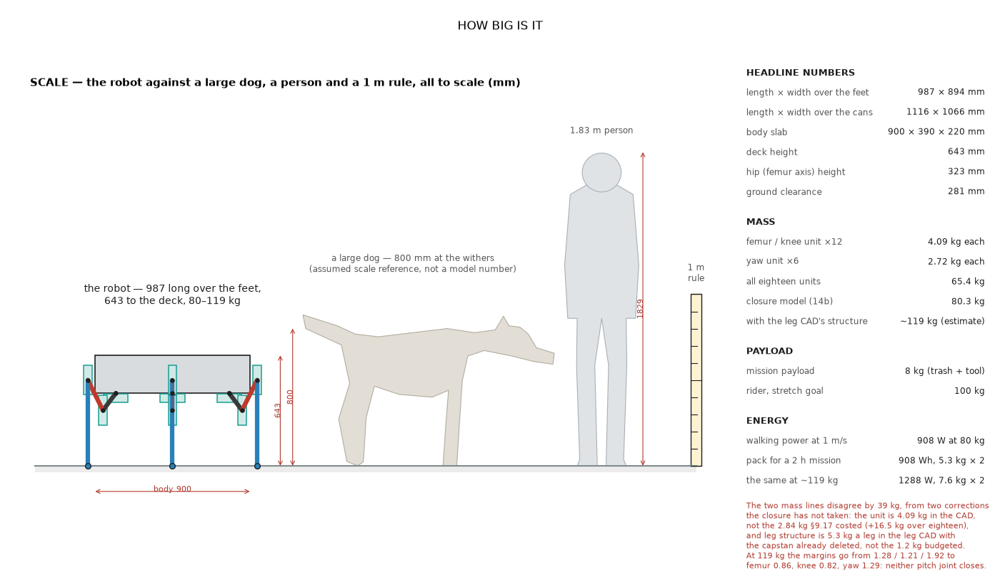

# 10 — General arrangement

*Generated by [`analysis/arrangement.py`](../../analysis/arrangement.py) from
the models. Numbers in [`hw/arrangement.json`](../../hw/arrangement.json).
All dimensions mm unless stated.*

The actuator drawn here is the built unit from
[`cad/actuator/frameless.json`](../../cad/actuator/frameless.json):
**Ø172 × 49.7 mm, 4.09 kg** for a femur or knee, Ø142 × 49.7 mm,
2.72 kg for a yaw. [08 §9.17](08-actuator-design.md) quotes Ø172 × 37 mm and
2.84 kg for the same unit — the same diameter, **12.7 mm taller and
1.25 kg heavier**, because §9.17's height and mass left out the reducer's
own axial stack. Every number below uses the CAD.

## 0. What the reviewer needs to know first

1. **The twelve femur/knee units do NOT fit inboard in the body.** Ø172 cans need
   0.279 m² of planform against the 0.183 m² the 900 × 390 mm slab has
   left once the six yaw cans, the two batteries and the electronics box are
   in — short by **1.5×**. A greedy pack places **0 of 12** on one level.
   Take the batteries and the electronics out of the body entirely and the
   slab still holds only **4**. Stacking does not rescue it: two levels of
   4 is 4 units still outside. The constraint is planform, not height.
2. **They should not be in the body anyway.** Round 14b
   ([08 §9.17](08-actuator-design.md)) deletes the capstan because the rope
   drive cannot be wound, and the capstan was the only thing carrying the
   femur and knee drives from the body out to the joints. The drawings
   therefore put the femur and knee cans **on their own joints**, which is
   where a cycloid-inside-the-motor unit has to be. **No CAD exists for that
   leg**; [09](09-leg-assembly.md) is the body-mounted, capstan-driven leg.
3. **A Ø172 can on the femur pivot leaves 14 mm to the floor plate** and is not in
   the round-14 range-of-motion sweep. That sweep already limits the femur to
   75° at yaw 0 and 6° at yaw ±90 against an 85° window; the can will
   make it worse, and the check has not been run.
4. **Mass, twice over.** The 14b closure stands at 80.3 kg on two numbers the
   CAD has since contradicted: 2.84 kg a unit (the CAD says 4.09) and 1.2 kg of
   leg structure per leg (the leg CAD says 8.0, 5.3 once the deleted
   capstan comes out). Eighteen units are **65.4 kg**, not 48.8. Put both
   corrections in and the robot is near **119 kg**, and the joint margins go
   from femur 1.28 / knee 1.21 / yaw 1.92 to **femur 0.86, knee 0.82,
   yaw 1.29**. **The design as drawn does not close.** That is arithmetic on
   `frameless_motor.json`'s own torque coefficients, not a re-solved fixed
   point — the study has to be re-run.
5. **The widest and longest points of the machine are the knee cans, not the
   feet** — 1116 × 1066 mm against 987 × 894 over the feet. A Ø172 disc on
   a knee reaches 86 mm outboard of the foot under it, so the machine's
   footprint, its door width and its leg-to-leg collision limits are all set
   by an actuator housing rather than by the stance.

## 1. The machine, dimensioned

A 987 × 894 mm footprint over the feet, 643 mm to the top deck,
standing on a 900 × 390 × 220 mm slab 423 mm off the ground. The
lowest fixed structure is the coxa plate at 281 mm. Feet sit on a
R327 circle about each yaw axis.

**The widest and longest points of the machine are the knee cans, not the
feet**: 1116 × 1066 mm over the cans against 987 × 894 over the feet. A
Ø172 disc centred on a knee reaches 86 mm past the foot it stands on.

## 2. Principal dimensions

| Quantity | Value | Where it comes from |
|---|---|---|
| Length × width over the feet | 987 × 894 mm | stance, hip grid |
| Length × width over the cans | 1116 × 1066 mm | can envelope on the joints |
| Highest can (knee) above ground | 586 mm | vs 643 mm deck |
| Body slab | 900 × 390 × 220 mm | `hexapod_model.BODY`, `cad/leg/leg.json` |
| Deck height | 643 mm | floor plate 423 + slab 220 |
| Hip (femur axis) height | 323 mm | `cad/leg/leg.json` pivots |
| Ground clearance (coxa plate) | 281 mm | `cad/leg/leg.json` pivots |
| Stance width / length | 894 / 987 mm | computed |
| Foot circle about a yaw axis | R327 mm | computed |
| Yaw axis spacing / hip pitch | 240 / 330 mm | `hexapod_model.BODY` |
| Coxa / femur / tibia | 150 / 250 / 500 mm | `cad/leg/leg.json` |
| Femur / knee actuator can | Ø172 × 49.7 mm, 4.09 kg | `cad/actuator/frameless.json` |
| Yaw actuator can | Ø142 × 49.7 mm, 2.72 kg | `cad/actuator/frameless-yaw.json` |
| The same in 08 §9.17 | Ø172 × 37 mm, 2.84 kg | motor + 6 mm case; no reducer stack |

## 2b. Masses

| Item | Mass | Where it comes from |
|---|---|---|
| Femur / knee unit × 12 | 4.09 kg each, 49.1 kg | `cad/actuator/frameless.json` `total_g` |
| Yaw unit × 6 | 2.72 kg each, 16.3 kg | `cad/actuator/frameless-yaw.json` `total_g` |
| All eighteen units | **65.4 kg** | against 48.8 kg on §9.17's 2.84 / 2.46 kg units |
| Everything else in the closure | 29.2 kg | body 6, legs 7.2, batteries 8, electronics 3, deck 2, margin 3 |
| **Robot, 14b closure** | **80.3 kg** | fixed point in `frameless_motor.json` (all 18 units identical) |
| Robot, sized yaw unit | 94.6 kg | the same with the Ø130 yaw motor |
| Leg structure, round-14 CAD | 8.00 kg per leg | `cad/leg/leg.json` `leg_structure_g` |
| less the deleted capstan drive | −3.07 kg per leg | `group_mass_g.transmission` |
| **Robot on the leg CAD's structure** | **~119 kg (estimate)** | against 1.2 kg per leg in the budget |
| Mission payload | 8 kg | `hexapod_model.MASS` |
| Rider (stretch goal) | 100 kg | `hexapod_model.MASS` |

Joint margins move with that mass: femur 1.28 / knee 1.21 / yaw 1.92 at
80.3 kg become femur 0.86 / knee 0.82 / yaw 1.29 at 119 kg.

## 3. Where the eighteen units go

The six yaw cans sit on the yaw axes under the floor plate, inside the
96 mm hip pod, and clear the slab edge by 4 mm. If the yaw shared the
Ø172 femur/knee unit — which is what the closure's own mass fixed point
assumes — it would overhang the slab by 11 mm a side.

The twelve femur/knee cans are the problem. Height is not it: three cans
coaxial on a yaw axis are 165 mm inside a 220 mm slab. Planform is:

| | mm² |
|---|---|
| Slab planform | 351,000 |
| less six yaw cans | −95,021 |
| less two batteries and the electronics box | −72,800 |
| **free** | **183,179** (52 %) |
| twelve Ø172 cans need | 278,823 |
| **shortfall** | **1.5×** |

## 4. What one leg can reach

Swept over the femur window -60…+85°, the knee window
15…145° and the tibia's absolute window 200…330°:

| | |
|---|---|
| Neutral foot radius | 327 mm from the yaw axis |
| Max reach, any height | 832 mm (femur 6°, τ 330°) |
| Reach along the ground line | -123 → 794 mm |
| Step-up above the ground line | 322 mm |
| Reach below the ground line | 391 mm |
| Folded pose | femur 75.1°, knee 15° |
| Folded envelope | 215 × 500 mm, foot at R215 |

The folded pose uses 75.1° of femur, not the 85° the window allows,
because the round-14 sweep found the femur root hits the floor plate there.

## 5. How big it is

## 6. Computed, assumed, and not known

**Computed from the models:** every length in §2 and §4; the packing areas
and the greedy pack; the unit can sizes from the motor in
`hw/stator/frameless_motor.json` plus the half-section's housing allowance;
the mass roll-ups; the walking power and pack size from `hexapod_model.ENERGY`.

**Assumed, and marked as such on the figures:** the yaw can's placement inside
the hip pod (the pod envelope is from the CAD, the position in it is not); the
femur and knee cans sitting on their joints (a consequence of deleting the
capstan, not a designed mounting); the battery and electronics envelopes,
which are the concept boxes from `concepts/hexapod_skeleton.py`; the large dog
at 800 mm at the withers, which is a scale reference and not a model number.

**Soft numbers.** The can diameter: Ø172 is the half-section's motor + 6 mm
radial; the same file's sweep comment sizes the motor against a Ø192 can
carried over from the PCB unit — 20 mm more on the diameter. If every unit
uses the Ø192 can, the units on the yaw axes overhang the slab by
21 mm a side, the machine is 20 mm wider over the knees, and the packing
gets worse, not better. Which of the two is the real can has not been settled.

**Not known:** the mounting of a femur or knee unit on its own joint; whether
the femur can still lift with a Ø172 can on its pivot; the mass of the leg
that results; the top-deck payload interface.

## 7. Open items

1. Decide where the femur and knee reductions live now the capstan is gone —
   on the joints (drawn here, unbuilt) or a new stage from the body.
2. Re-run the range-of-motion sweep with the cans on the joints.
3. Re-solve the closure on the CAD unit mass (4.09 kg, not 2.84) and the leg CAD's
   structure (5.3 kg a leg, not 1.2). At ~119 kg the femur is 0.86 and the
   knee 0.82; the battery grows from 10.7 kg to 15.1 kg to hold the same
   2 h, which makes it worse again.
4. Carry the 49.7 mm can height into 08 §9.17, which still says 37 mm.
5. Fix the actuator can diameter at Ø172 or Ø192 and re-cut the packing.
6. Nothing here is reviewed. This note has had no human review.
