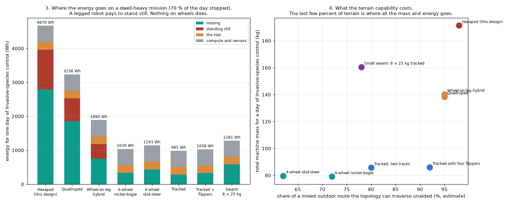

# 11 — Platform topology: is a walking hexapod the right machine?

*Generated by [`analysis/platform_topology.py`](../../analysis/platform_topology.py); numbers in
[`hw/platform_topology.json`](../../hw/platform_topology.json). This study was asked for at round 15,
after fourteen rounds of actuator design. It should have been the first thing in the repository.*

## The question

The vision stage opened with a hexapod and never justified it. The brief, stated properly, is:
**a rugged multipurpose outdoor platform for long-duration, long-distance missions that navigate and
manipulate** — cutting and moving plants, surveying, inspecting, treating invasive species. Nothing in
that sentence asks for legs. This is the trade study that tests whether they earn their place.

## The short answer

**No. On the missions as stated, a tracked platform beats the hexapod on every axis that the brief
names, and loses only on terrain reach and ground disturbance.** The hexapod uses about five times the
energy per kilometre, twice the machine mass, and nine times the actuators, to buy the last 18 % of
terrain — and it cannot complete a working day on any of the four missions.

## Why: three numbers

**1. Cost of transport.** This project's own gait model says 908 W to walk at 1 m/s at
124 kg, which is a cost of transport of **0.74**. A tracked platform on the same
ground is **0.20** — built from rolling resistance and driveline efficiency, both stated in the
script and both swept. That is a factor of four to five, and it applies to every metre travelled.

**2. A legged robot pays to stand still.** Holding a static stance costs this design **136 W**
of copper loss in twelve pitch joints — computed from the actuator study's own torque and its own
continuous point, not estimated. A tracked or wheeled platform holds position on its brakes and burns
nothing. Three of the four missions spend more than half the working day stopped, so this is not a
footnote: on invasive-species control the hexapod burns about a quarter of its energy standing.

**3. The battery cannot catch up.** Endurance is a fixed point — the battery that buys range is mass
that costs energy to carry. On the 8 kg of battery this design already carries:

| Mission | Hexapod | Tracked, two tracks | Ratio |
|---|---|---|---|
| Survey / patrol transect | 1.1 h, 4.0 km | 7.6 h, 27.9 km | 6.9× |
| Inspection round | 2.3 h, 3.0 km | 12.2 h, 15.8 km | 5.2× |
| Invasive species control | 3.1 h, 1.6 km | 11.9 h, 6.4 km | 3.9× |
| Cutting and moving vegetation | 1.3 h, 0.5 km | 1.8 h, 0.6 km | 1.4× |

**The hexapod does not reach a working day on any mission. The tracked platform reaches one on all four.**

## The whole comparison

Eight topologies, each solved to its own mass fixed point for one day of invasive-species control —
the mission that most resembles the stated tasks:

| Topology | Drive actuators | CoT, soft ground | Standing | Day mission (kg) | Energy (Wh/day) | Hours on 8 kg |
|---|---|---|---|---|---|---|
| Hexapod (this design) | 18 | 0.89 | 209 W | 191 | 4670 | 3.1 |
| Quadruped | 12 | 0.82 | 121 W | 139 | 3236 | 4.3 |
| Wheel-on-leg hybrid | 16 | 0.33 | 77 W | 140 | 1890 | 6.6 |
| 6-wheel rocker-bogie | 6 | 0.26 | 0 W | 79 | 1039 | 11.4 |
| 4-wheel skid-steer | 4 | 0.34 | 0 W | 80 | 1143 | 10.6 |
| Tracked, two tracks | 2 | 0.20 | 0 W | 86 | 985 | 11.9 |
| Tracked with four flippers | 6 | 0.23 | 0 W | 86 | 1028 | 11.5 |
| Small swarm: 8 × 25 kg tracked | 16 | 0.22 | 0 W | 161 | 1281 | 9.7 |

## What legs actually buy, honestly

Two things, and they are real:

1. **Terrain reach.** Legs cross what wheels cannot: gaps wider than a wheel, steps taller than a wheel
   radius, deadfall, and steep broken ground. The estimate here is 98 % of a mixed outdoor route against
   80 % for tracks. **The question is what that last 18 % is worth**, and the study says: about twice the
   machine mass and five times the energy, forever, on every mission.
2. **Ground disturbance.** Six small footprints and no shear is the gentlest contact of anything here —
   genuinely valuable on sensitive ground, wetland margins, root zones and archaeology. Tracks have low
   *pressure* but shear the surface in every turn. If the mission is conservation work on fragile ground,
   this is the one argument that survives contact with the energy numbers.

Neither is on the list of stated tasks. Cutting plants, surveying, inspecting and treating weeds are
dwell-heavy, force-heavy and distance-heavy — exactly where legs are worst.

## What I would build instead

**A tracked platform with four flippers, carrying a serious arm.** It scores 3 or 4 on every column of
the trade: lowest energy, a full working day on one pack, the highest payload fraction, the stiffest base
to cut and push against, the lowest ground pressure, and six drive actuators instead of eighteen. The
flippers buy back most of the terrain the plain tracked machine loses, for four more actuators — and
they are also the mechanism that rights the robot if it rolls, which nothing in the hexapod design does.

Two variants worth costing before committing:

- **Wheel-on-leg hybrid** if the terrain survey comes back genuinely broken. It rolls at a third of the
  hexapod's energy and walks when it must, at the cost of sixteen actuators and a hard controls problem.
- **A small swarm of light tracked machines** if the work is coverage rather than force. Eight 25 kg
  units cover ground eight times faster than one, the ground pressure is the lowest of anything here, and
  one failure is not mission loss. It is the wrong answer for cutting and carrying heavy material.

## What is computed and what is judged

Computed: the hexapod's cost of transport and standing power, from this project's own gait and actuator
models. The energy fixed point for every topology. The mass, endurance and payload feasibility.

Estimated, and stated in the script so they can be attacked: the rolling resistance coefficients
(track/firm dirt 0.08, grass/pasture 0.11, soft soil/leaf litter 0.22, sand/mud 0.32), the driveline
efficiency (0.85), the track internal loss (0.06), the pack energy density
(170 Wh/kg), the tool powers, and the structure mass of every platform except the legged
one — which is this project's own measured robot. The last five columns of the trade matrix are stated
judgements, not calculations.

The terrain percentages are the weakest numbers here. **They should be replaced by a survey of the actual
ground the robot will work on** before this decision is final: if that survey comes back as 20 % of the
route being impassable to tracks, the answer changes.

## Open items

1. **What is the real terrain?** Everything turns on it, and nobody has measured it.
2. **What is the real duty cycle?** The dwell fractions here are reasoned from the task list, not observed.
3. **Does the arm dominate the design?** For manipulation-heavy work the arm and its reach may set the
   platform, not the other way round. That study has not been done.
4. **Is one big machine right at all?** The swarm column is the least explored and the most different.
