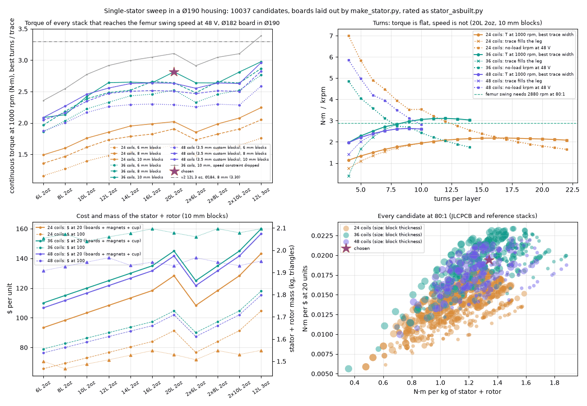
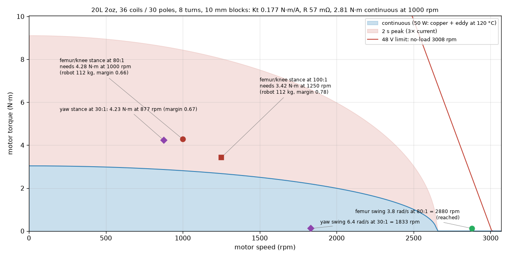
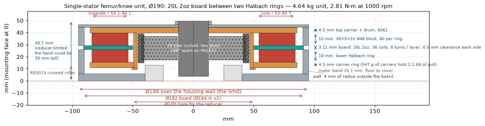
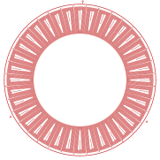

# The optimised single-stator motor at Ø190 — round 13

Generated by `analysis/actuator_design.py` from `hw/stator/single_stator_opt.json`
(`analysis/single_stator_opt.py`); the same text is §9.15 of `08-actuator-design.md`.
The board is `hw/stator/variants/1s-opt/stator.kicad_pcb`.

### 9.15 Round 13: optimised single-stator motor at Ø190 — `analysis/single_stator_opt.py`

Asked: the best single-stator PCB motor for the unit with a hard limit of
**190 mm over the housing wall**. The wall is 4 mm of radius outside
the board (§9.3), so the board is Ø182 and every rim radius of layout v2 —
the coils' outer edge, the terminal vias, the M arcs, the three phase rings, the
pads and the edge — moves inward together by 0.9 mm (`make_stator.py --od 182`);
the magnet rings move with the coils. The clamp, the bolt circle and the wall
section of the CAD are unchanged, which is why the wall was kept rather than thinned:
the Ø4.4 bolt holes at r 93.2 would break out of a 3 mm wall.

The sweep lays out every board with the generator (coil count, turns, trace
width; 10037 candidates after the stack, magnet, and ratio options) and rates each
one the way `stator_asbuilt.py` rates the canonical board: the same 50 W
thermal budget (120 °C copper, 45 °C ambient, 1.5 K/W), the same
element-by-element resistance, the same eddy loss, and Kt from every radial
leg in the field. Two things are new. The rotor field is the 2-D block model of
§9.2 run at each pole count and gap (it reproduces `rotor_field.py` exactly on
the same inputs — table at the end — and shows that `rotor_field.json` was
written at the v1 coil span and reads 3 % high for v2), and Kt is the closed
form of the numeric average (0.2371 against 0.2371 N·m/A on the canonical
board with the same field ratio forced). The levers:

* **layers × copper**: 6, 8, 10, 12, 14, 16, 20 layers at 2 oz (JLCPCB), bonded
  pairs of 6, 8 and 10-layer boards, and 12 L 3 oz as the non-JLCPCB reference.
  Below 12 layers the generator now gives the phase rings one or two layers
  instead of three (`set_layers`), and the rating charges for it.
* **coils / poles**: 24/20, 36/30, 48/40. At 48/40 a 5 mm block no longer
  fits the Halbach segment at the ring's inner radius, so those rotors need
  3.5 mm custom blocks; at 24/20 the 5 mm block fills under half the segment and an
  8 mm custom block is tried as well.
* **turns per layer** from 4 to what the leg fits, and **trace width** at
  100 / 70 / 50 / 35 % of the leg fill — the lever that lets a fast board keep
  its eddy loss down.
* **magnets** 30 × 5 × 6 / 8 / 10 mm N48; the rotor pull sizes the carrier
  plates (same 0.06 mm deflection as the CAD's 4.5 mm plate under 2.3 kN).
* **r_in** 53 → 52, the **leg gap** 0.6 → 0.4 and the **clearance**
  0.35 / 0.5 / 0.7 mm, as sensitivities on the chosen board.

The one lever that decides the outcome is not in that list: **the 48 V bus.**
The femur swing needs 3.8 rad/s at the joint, 2880 rpm at 80:1
(3600 at 100:1), and a board whose back-EMF allows that at 48 V has to have
few turns — and few turns with the trace filling the leg means wide traces and
an eddy loss that eats the thermal budget at 250 Hz. Every prior round tabled
this as "2.9 rad/s (need 3.8)" and moved on. Here it is the constraint:

| Stack | t (mm) | Coils / poles | Turns × trace (mm) | Blocks (mm) | B (T) | Kt (N·m/A) | R (mΩ) | I (A) | Eddy (W) | T at 1000 rpm (N·m) | No-load rpm (✗ = under the 2880 swing) | Stator + rotor (kg) | $ at 20 / 100 | Knee margin at 80:1 |
|---|---|---|---|---|---|---|---|---|---|---|---|---|---|---|
| 6L 2oz | 0.87 | 36 / 30 | 6 × 0.57 | 10 | 1.16 | 0.172 | 95 | 12.1 | 8 | **2.09** | 3101 | 2.06 | 110 / 79 | 0.49 |
| 8L 2oz | 1.19 | 36 / 30 | 7 × 0.47 | 8 | 1.04 | 0.178 | 99 | 12.3 | 6 | **2.18** | 2993 | 1.75 | 105 / 75 | 0.54 |
| 10L 2oz | 1.51 | 36 / 30 | 6 × 0.40 | 10 | 1.08 | 0.176 | 79 | 13.7 | 5 | **2.42** | 3025 | 2.04 | 120 / 86 | 0.57 |
| 12L 2oz | 1.83 | 36 / 30 | 7 × 0.47 | 10 | 1.04 | 0.180 | 64 | 14.7 | 8 | **2.64** | 2971 | 2.07 | 125 / 90 | 0.62 |
| 14L 2oz | 2.15 | 36 / 30 | 7 × 0.47 | 10 | 1.01 | 0.173 | 58 | 15.3 | 9 | **2.65** | 3074 | 2.09 | 130 / 94 | 0.62 |
| 16L 2oz | 2.47 | 36 / 30 | 8 × 0.39 | 8 | 0.90 | 0.176 | 65 | 15.1 | 6 | **2.66** | 3030 | 1.78 | 125 / 89 | 0.66 |
| 20L 2oz | 3.11 | 36 / 30 | 8 × 0.39 | 10 | 0.90 | 0.177 | 57 | 15.9 | 7 | **2.81** | 3008 | 2.10 | 145 / 105 | 0.66 |
| 2x6L 2oz | 1.84 | 36 / 30 | 7 × 0.47 | 10 | 1.04 | 0.179 | 64 | 14.7 | 8 | **2.64** | 2974 | 2.07 | 125 / 90 | 0.62 |
| 2x8L 2oz | 2.48 | 36 / 30 | 8 × 0.39 | 8 | 0.90 | 0.176 | 65 | 15.1 | 6 | **2.66** | 3034 | 1.78 | 125 / 89 | 0.66 |
| 2x10L 2oz | 3.12 | 36 / 30 | 8 × 0.39 | 10 | 0.90 | 0.177 | 57 | 15.9 | 7 | **2.81** | 3012 | 2.10 | 145 / 105 | 0.66 |
| 12L 3oz | 2.25 | 36 / 30 | 7 × 0.47 | 10 | 0.99 | 0.172 | 43 | 17.3 | 11 | **2.98** | 3107 | 2.11 | 160 / 118 | 0.69 |

*Best of each stack that reaches the femur swing speed at 48 V (2 oz OTS blocks; the 12 L 3 oz row is the non-JLCPCB reference), all at r 53–83.7. Knee margin at the robot mass the unit implies (§9.7's fixed point).*

The same stacks with the speed constraint dropped — what the board can do if
the femur swing is slowed or the bus raised:

| Stack | t (mm) | Coils / poles | Turns × trace (mm) | Blocks (mm) | B (T) | Kt (N·m/A) | R (mΩ) | I (A) | Eddy (W) | T at 1000 rpm (N·m) | No-load rpm (✗ = under the 2880 swing) | Stator + rotor (kg) | $ at 20 / 100 | Knee margin at 80:1 |
|---|---|---|---|---|---|---|---|---|---|---|---|---|---|---|
| 6L 2oz | 0.87 | 36 / 30 | 10 × 0.28 | 10 | 1.16 | 0.279 | 226 | 8.4 | 2 | **2.36** | 1912 ✗ | 2.05 | 110 / 79 | 0.55 |
| 8L 2oz | 1.19 | 36 / 30 | 10 × 0.28 | 10 | 1.12 | 0.270 | 179 | 9.4 | 2 | **2.55** | 1979 ✗ | 2.07 | 115 / 83 | 0.60 |
| 10L 2oz | 1.51 | 36 / 30 | 10 × 0.28 | 10 | 1.08 | 0.260 | 140 | 10.6 | 2 | **2.77** | 2047 ✗ | 2.04 | 120 / 86 | 0.65 |
| 12L 2oz | 1.83 | 36 / 30 | 10 × 0.28 | 10 | 1.04 | 0.252 | 118 | 11.6 | 3 | **2.92** | 2118 ✗ | 2.06 | 125 / 90 | 0.69 |
| 14L 2oz | 2.15 | 36 / 30 | 11 × 0.24 | 10 | 1.01 | 0.267 | 127 | 11.2 | 2 | **3.00** | 1999 ✗ | 2.08 | 130 / 94 | 0.70 |
| 16L 2oz | 2.47 | 36 / 30 | 11 × 0.24 | 10 | 0.97 | 0.258 | 114 | 11.8 | 2 | **3.05** | 2068 ✗ | 2.10 | 135 / 97 | 0.71 |
| 20L 2oz | 3.11 | 36 / 30 | 12 × 0.21 | 10 | 0.90 | 0.261 | 114 | 11.9 | 2 | **3.11** | 2044 ✗ | 2.08 | 145 / 105 | 0.73 |
| 2x6L 2oz | 1.84 | 36 / 30 | 10 × 0.28 | 10 | 1.04 | 0.251 | 118 | 11.6 | 3 | **2.91** | 2121 ✗ | 2.06 | 125 / 90 | 0.68 |
| 2x8L 2oz | 2.48 | 36 / 30 | 11 × 0.24 | 10 | 0.97 | 0.258 | 114 | 11.8 | 2 | **3.05** | 2070 ✗ | 2.10 | 135 / 97 | 0.71 |
| 2x10L 2oz | 3.12 | 36 / 30 | 12 × 0.21 | 10 | 0.90 | 0.261 | 114 | 11.9 | 2 | **3.10** | 2046 ✗ | 2.08 | 145 / 105 | 0.73 |
| 12L 3oz | 2.25 | 36 / 30 | 11 × 0.24 | 10 | 0.99 | 0.264 | 96 | 12.8 | 2 | **3.39** | 2020 ✗ | 2.10 | 160 / 118 | 0.79 |

**Chosen: 20L 2oz, 36 coils / 30 poles, 8 turns × 0.39 mm, 30 × 5 × 10 mm blocks**,
r 53–83.7, board 3.11 mm, magnet gap 4.11 mm — the most continuous torque at
1000 rpm of any JLCPCB single board that reaches 2880 rpm at 48 V. Kt 0.177 N·m/A rms,
R 57 mΩ at 120 °C, B 0.90 T, no-load 3008 rpm, 2097 g of stator + rotor
(board 200, magnets 1350, carriers 547 at 4.5 mm), 4.64 kg femur unit, 49.7 mm tall
(the reducer sets the height; the band is 33.1 mm), boards + magnets + cup
$145 at 20 units / $105 at 100 (board $50 / $37 from the reviewer's JLCPCB quote
scaled by layer count, magnets $50 / $40). The board is generated by `make_stator.py --coils 36
--pp 15 --turns 8 --trace 0.39 --layers 20 --oz 2 --od 182` into `hw/stator/variants/1s-opt`;
DRC with kicad-cli 10.0.6 at error severity: **0 violations**, 0 unconnected (`hw/stator/variants/1s-opt/drc.json`).

| Speed (rpm) | f_e (Hz) | Eddy (W) | Copper (W) | I (A rms) | T continuous (N·m) | T peak, 2 s (N·m) | Speed at I_cont, 48 V (rpm) |
|---|---|---|---|---|---|---|---|
| 1000 | 250 | 7.1 | 42.9 | 15.9 | 2.81 | 8.44 | 2863 |
| 1250 | 312 | 11.1 | 38.9 | 15.1 | 2.68 | 8.04 | 2870 |
| 1600 | 400 | 18.2 | 31.8 | 13.7 | 2.42 | 7.27 | 2883 |
| 2500 | 625 | 44.5 | 5.5 | 5.7 | 1.01 | 3.03 | 2956 |

**The alternatives the sweep ranks above it on one axis each.** The most
torque of any board in the Ø190 housing is the 12L 3oz reference with 15 turns and
10 mm blocks, 3.55 N·m — no-load 1455 rpm, so it cannot swing the femur at 48 V,
and it is not a JLCPCB board. The most torque JLCPCB can build is 20L 2oz, 17 turns,
10 mm blocks: 3.35 N·m at 1373 rpm no-load. Best per dollar (speed-feasible):
10L 2oz, 8 turns, 6 mm, 2.22 N·m for $100; best per kilogram: 20L 2oz, 10 turns,
6 mm, 2.52 N·m from 1.47 kg. Trace width matters more than turns: on
the chosen stack the torque is flat in turns while the no-load speed is not
(the sweep figure's second panel), so the fast board is the few-turn,
narrow-trace one.

**Closure.** At §9.7's fixed point (29.2 kg + 12 femur/knee + 6 yaw units) the
chosen unit implies a **112 kg robot**, which needs 283 / 299 / 114 N·m
continuous at femur / knee / yaw. Through 80:1 at 0.87 the unit gives
**197 N·m** — knee margin **0.66**, yaw 0.67: it **does not close**, and would
support a 74 kg robot as written. At 100:1 (25 lobes, rated at 1250 rpm) the
motor gives 2.68 N·m and the joint 234, margin 0.78, with the swing now needing
3600 rpm (not reached). The ratio that would close the requirement as written at this
mass is about 122:1 (more, since the stance speed rises with the ratio and the
torque falls) — 4379 rpm at the swing, 1.5× what this board reaches at 48 V.
The best knee margin any JLCPCB single board reaches, speed ignored, is
0.90 (20L 2oz, 12 turns, 10 mm blocks at 100:1, no-load 2044 rpm against 3600 needed).
This is §9.7's conclusion again with the sweep behind it: **a single PCB
stator does not close the requirement as written at any board in this
housing**, and the speed requirement makes it worse, not better. Which
definitions of "continuous" the chosen unit does close, at the fixed point
plus the 8 kg payload:

| Continuous load case | Femur/knee / yaw needed (N·m) | Margin fk / yaw at 80:1 | Closes at 80:1 | at 100:1 |
|---|---|---|---|---|
| as defined: dyn 1.5, 30° slope, 1 m/s², stride ±200 | 301 / 115 | 0.65 / 0.66 | no | no |
| dyn 1.5, 30° slope, 1 m/s², stride ±150 | 306 / 111 | 0.64 / 0.68 | no | no |
| dyn 1.2, 20° slope, 0.5 m/s², stride ±200 | 230 / 75 | 0.86 / 1.01 | no | yes |
| dyn 1.2, 15° slope, 0.5 m/s², stride ±150 | 224 / 57 | 0.88 / 1.33 | no | yes |
| level: dyn 1.2, 0°, 0.5 m/s², stride ±200 | 196 / 10 | 1.00 / 7.81 | yes | yes |
| static tripod stance, level | 160 / 0 | 1.23 / — | yes | yes |

What it would take: the two-stator unit (A-cost, §9.7) or the OTS outrunner
(§9.12) for the requirement as written. A single PCB stator closes only the
level walking case, and this board does so at 80:1 with no margin at all
(1.00). The torque-optimal JLCPCB board (20L 2oz, 17 turns, 10 mm blocks, 3.35 N·m,
knee margin 0.77 at 80:1) needs a ~104 V bus for the femur swing, or a swing
requirement of 1.8 rad/s instead of 3.8.

**Sensitivities on the chosen board** (continuous torque at 1000 rpm):

| Lever | T (N·m) | vs chosen |
|---|---|---|
| clearance 0.35 mm | 2.89 | +2.7% |
| clearance 0.5 mm | 2.81 | +0.0% |
| clearance 0.7 mm | 2.72 | -3.5% |
| r_in 53, leg gap 0.6 | 2.81 | +0.0% |
| r_in 52, leg gap 0.6 | 2.88 | +2.2% |
| r_in 53, leg gap 0.4 | 2.85 | +1.4% |
| r_in 52, leg gap 0.4 | 2.91 | +3.5% |

**Cross-checks.** The closed form T = k_w · N_coils · N_turns · B · I · L · r_mean
with k_w = 0.933, B = 0.90 T, L = 30.7 mm, r_mean = 68.3 mm gives
Kt = 0.240 N·m/A, **+36%** against the leg-by-leg integral's 0.177. The
discrepancy is the spiral: the inner turns of a concentrated spiral coil span a
fraction of the pole, so their pitch factor is small (sin(p·α) per turn:
0.95, 0.90, 0.84, 0.78, 0.70, 0.61, 0.51, 0.40); with each turn's own pitch factor the closed form gives 0.187
(+5%). `stator_asbuilt.py` run on the written variant board gives Kt 0.1773
(sweep 0.1773) and 2.815 N·m at 1000 rpm (sweep 2.815). The block field
against `rotor_field.json` (P = 15, gap 3.2 mm; the JSON was written at r_m 66.6,
this at v2's 68.8):

| Blocks | B₁ here / JSON (T) | ratio to model here / JSON | pull here / JSON (N) |
|---|---|---|---|
| rect 30x5x6 N48 | 0.815 / 0.843 | 0.813 / 0.836 | 1749 / 1807 |
| rect 30x5x8 N48 | 0.923 / 0.951 | 0.815 / 0.838 | 2242 / 2300 |
| rect 30x5x10 N48 | 0.994 / 1.021 | 0.817 / 0.840 | 2598 / 2650 |

**Open items from this round.**

1. The femur swing speed (3.8 rad/s) is a requirement without a parent in the
   .sdoc set and has been tabled as unmet since round 8; it needs one, and a
   decision. This board reaches it with 4% to spare and gives up
   16% of torque for that; a higher bus or a slower swing buys the torque back.
2. `rotor_field.json` should be re-run at the v2 span; every rating since
   round 9 is ~3 % optimistic on field.
3. The thermal budget is the sizing's 1.5 K/W for every stack; §9.4's built
   path (0.8 K/W) would raise every torque here by the same 1.37, and a
   1.2 mm board conducts better through its faces than the 2.2 mm one.
4. The unit mass here is a roll-up (the round-9 femur parts less one stator
   stage), not a CAD run; `cad/actuator/actuator.py femur --stators=1` with
   this board's geometry is the check.
5. Custom-width blocks (48/40 poles) and the 3 oz reference are priced by
   volume and by an estimate; neither is a quote.
6. A 20-layer 2 oz board is scaled from the 6-layer quote; JLCPCB's copper
   options at that layer count are not confirmed. The 16-layer board is
   2.66 N·m for $125 and the fallback if 20 layers cannot be had.

