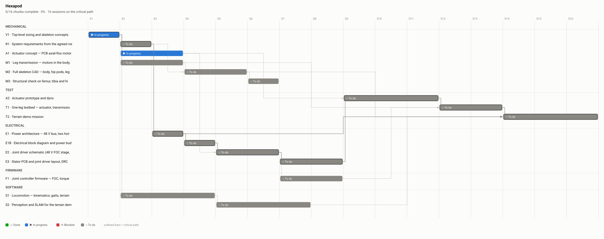

# Plan — Hexapod

What work exists, what each piece is, and what has to happen first.
**Statuses are deliberately not in this file** — see the chart in the README for those. This is the scope, and it is what the plan review signs off.

16 chunks · 16 sessions on the critical path · disciplines: mechanical, electrical, firmware, software, test

## The work

### mechanical

#### V1 — Top-level sizing and skeleton concepts  *(critical path)*

Size and shape of the robot, mass budget, load cases, joint torques and speeds, and the actuator requirement that falls out of them. Two stance concepts rendered as skeletons with the eighteen actuators in the body.

* **Needs first:** nothing
* **Estimate:** 1 session
* **Produces:** `analysis/hexapod_model.py`, `docs/design/01-sizing.md`, `concepts/`, `docs/design/vision.md`, `docs/design/vision/`
* **Human review:** `vision` must be signed off before this chunk can be done

#### R1 — System requirements from the agreed vision  *(critical path)*

VIS- intent decomposed into testable SYS- requirements with numbers and units: terrain, payload, rider, endurance, environment, size.

* **Needs first:** V1
* **Estimate:** 1 session
* **Produces:** `requirements/00-vision.sdoc`, `requirements/10-system.sdoc`, `docs/design/requirements-map.svg`
* **Human review:** `requirements` must be signed off before this chunk can be done

#### A1 — Actuator concept — PCB axial-flux motor with in-plane cycloid

Electromagnetic sizing of the PCB stator (layers, copper, pole count, eddy losses), Halbach rotor, and the in-plane cycloid (lobe count, pin loads, efficiency) against the requirement in 01-sizing.md. Decide single vs two stators, ratio, and whether to buy for the first leg.

* **Needs first:** V1
* **Estimate:** 2 sessions
* **Produces:** `docs/design/08-actuator-design.md`, `hw/stator/`, `cad/actuator/`, `docs/design/bom-actuator.csv`
* **Human review:** `actuator` must be signed off before this chunk can be done

#### M1 — Leg transmission — motors in the body, power to the joints

How three coaxial hip pancakes drive yaw, femur and knee: concentric shafts, cables/capstans or linkages. Losses, reflected inertia, sealing, and whether the coaxial stack survives contact.

* **Needs first:** V1
* **Estimate:** 2 sessions
* **Produces:** `docs/design/adr-0002-transmission.md`, `cad/leg/`

#### M2 — Full skeleton CAD — body, hip pods, legs, battery bays

* **Needs first:** R1, M1
* **Estimate:** 2 sessions
* **Produces:** `cad/hexapod.py`, `docs/design/cad/`
* **Human review:** `cad` must be signed off before this chunk can be done

#### M3 — Structural check on femur, tibia and hip pod

* **Needs first:** M2
* **Estimate:** 1 session
* **Produces:** `sim/structural/`

### test

#### A2 — Actuator prototype and dyno  *(critical path)*

Build one actuator (stator PCB, rotors, cycloid, housing), run it on a dyno for torque constant, continuous thermal torque and efficiency.

* **Needs first:** A1, E3
* **Estimate:** 3 sessions
* **Produces:** `docs/design/actuator-dyno.md`

#### T1 — One-leg testbed — actuator, transmission and controller together  *(critical path)*

* **Needs first:** A2, M1, F1
* **Estimate:** 2 sessions
* **Produces:** `docs/design/leg-testbed.md`

#### T2 — Terrain demo mission  *(critical path)*

* **Needs first:** T1, M2, S2, E1
* **Estimate:** 3 sessions
* **Produces:** `docs/design/terrain-demo.md`

### electrical

#### E1 — Power architecture — 48 V bus, two hot-swap packs, charging  *(critical path)*

* **Needs first:** R1
* **Estimate:** 1 session
* **Produces:** `docs/design/adr-0003-power.md`

#### E1B — Electrical block diagram and power budget  *(critical path)*

* **Needs first:** E1
* **Estimate:** 1 session
* **Produces:** `hw/block-diagram.yaml`, `docs/design/block-diagram.svg`
* **Human review:** `architecture` must be signed off before this chunk can be done

#### E2 — Joint driver schematic (48 V FOC stage, encoder, CAN-FD)  *(critical path)*

* **Needs first:** E1B, A1
* **Estimate:** 2 sessions
* **Produces:** `hw/driver/driver.kicad_sch`, `docs/design/schematic.pdf`
* **Human review:** `schematic` must be signed off before this chunk can be done

#### E3 — Stator PCB and joint driver layout, DRC, fabrication outputs  *(critical path)*

* **Needs first:** E2
* **Estimate:** 2 sessions
* **Produces:** `hw/stator/stator.kicad_pcb`, `hw/driver/driver.kicad_pcb`
* **Human review:** `layout` must be signed off before this chunk can be done

### firmware

#### F1 — Joint controller firmware — FOC, torque estimate, CAN protocol

* **Needs first:** E2
* **Estimate:** 2 sessions
* **Produces:** `fw/`

### software

#### S1 — Locomotion — kinematics, gaits, terrain adaptation

* **Needs first:** V1
* **Estimate:** 3 sessions
* **Produces:** `sw/locomotion/`

#### S2 — Perception and SLAM for the terrain demo

* **Needs first:** S1
* **Estimate:** 3 sessions
* **Produces:** `sw/perception/`

## What we are asking you

1. **Is this all the work?** Test, documentation and manufacturing are the ones that get left out.
2. **Is the order right?** You may know a constraint we do not — a part already on the shelf, a lead time, a review that has to pass.
3. **Is any chunk the wrong size?** One chunk is about one working session; a chunk that is really three should be split now.

---

Generated by `plan-render` from `plan.yaml`. Edit the plan, not this file.
