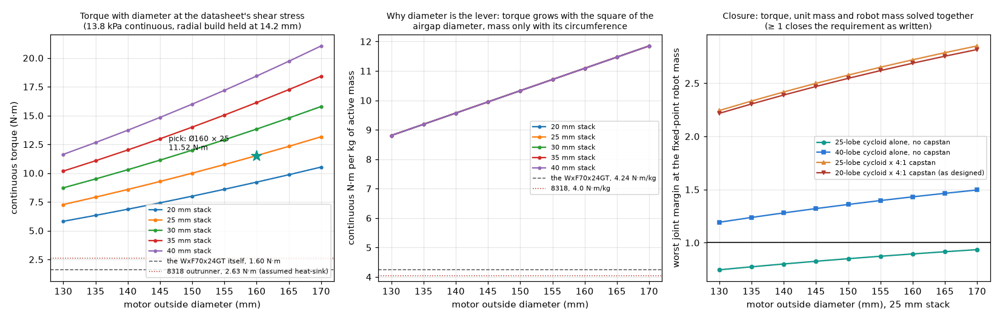
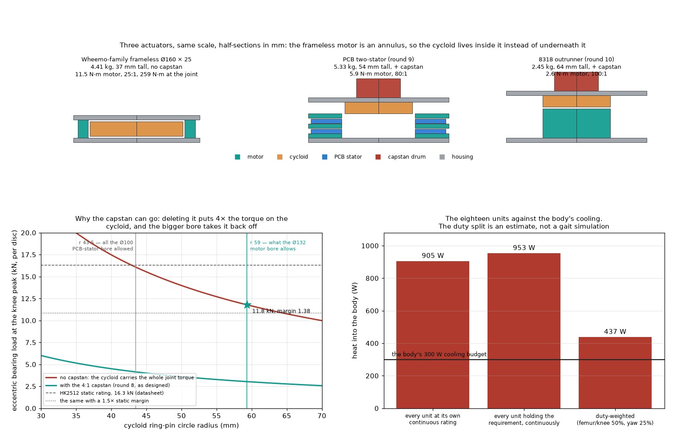

# Review — Actuator, round 14b: the Wheemo frameless motor as the basis

`actuator` · requested 2026-09-03 · branch `claude/hexapod-robot-design-mt516g`

Rounds 9-11 on the review's 'exhaust all cost routes': the stator laid out again with the coils under the whole magnet span (+14 % torque, so the cheap 2 oz boards match the 3 oz one and the magnets drop to 6 mm: unit 5.33 kg, 54 mm, $597 / $396 at 20 / 100), the base as four laser-cut and tube parts, an N-S rotor on steel tried and rejected (+0.7 kg per unit for the same field). Then the design space searched as a whole (motor family, stator count, reduction, quantity, requirement) at the robot mass each option implies: the cost floor for the requirement as written is not the PCB machine but one off-the-shelf 8318-class outrunner through the 25-lobe cycloid and the 4:1 capstan, ~$420 / $280 per unit on a 77 kg robot, subject to one bench measurement of the motor's heat-sunk continuous current. The market search ranks seven OTS motors the same way: the 8318 100KV (~$50) and the Turnigy 9235-100KV ($75, published resistance) are the picks; premium drone motors and hub motors are excluded with numbers.

## What you are agreeing to

**frameless-scaling.png**



**frameless-unit.png**



| File | Opens in |
|---|---|
| [docs/design/08-actuator-design.md](https://github.com/Harwasch/Hexapod/blob/claude/hexapod-robot-design-mt516g/docs/design/08-actuator-design.md) | renders on GitHub |
| [docs/reference/wheemo-WxF70x24GT.pdf](https://github.com/Harwasch/Hexapod/blob/claude/hexapod-robot-design-mt516g/docs/reference/wheemo-WxF70x24GT.pdf) | GitHub's PDF viewer |

## What we need decided

1. Motor family: adopt the Wheemo frameless kit scaled to Ø160 x 25 mm (11.5 N·m, 1039 g) as the basis for all eighteen joints? It is the first option that closes the requirement as written (80 kg robot, worst margin 1.21) and it deletes the capstan stage entirely — the stage the leg study found could not be wound.
2. The frameless kit has no price on its datasheet, and that decides whether this is also a cost-down: it undercuts the $423 outrunner unit only below $128 a kit. Can you get a quote from Wheemo for the Ø160 x 25 size, or should I design around a price band?
3. The datasheet does not say at what winding temperature the 96.7 mΩ phase resistance is quoted. If it is a 20 °C value, every torque in this round falls 15 %. Ask Wheemo, or accept the 1.18 design margin that already covers it?
4. The leg (round 14) weighs 16.1 kg against the 9.2 kg the cost search assumed, so on the outrunner units the robot does not close at 119 kg. The frameless unit changes the actuator, not the leg structure. Rebuild the leg on the frameless unit next, or fix the leg structure first?

## Decision

**Not yet reviewed — this is waiting on you.**

Answer in the Claude session that sent you this link. There is nothing to run and nothing to sign here.

Say which option you want **and why**: the reason is worth more than the choice, and it is what gets re-read later when a number has to move. If something is wrong, say what would be right.

<details><summary>How the answer gets recorded</summary>

The agent writes your decision, in your words, into [`docs/review/reviews.yaml`](https://github.com/Harwasch/Hexapod/blob/claude/hexapod-robot-design-mt516g/docs/review/reviews.yaml):

```bash
review-gate sign actuator --approve --by <name> --note "..."
review-gate sign actuator --changes "what to change"
```

Until that happens, any chunk of work depending on this review cannot be marked done.

</details>

---

<sub>Generated by `review-gate`. The sign-off record is [`docs/review/reviews.yaml`](https://github.com/Harwasch/Hexapod/blob/claude/hexapod-robot-design-mt516g/docs/review/reviews.yaml).</sub>
