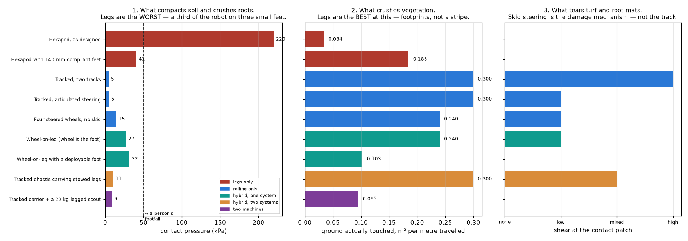
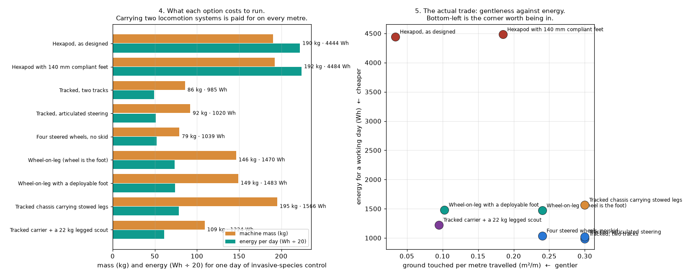

# Review — Platform topology and ground impact: which damage mechanism actually matters?

`platform` · requested 2026-09-07 · branch `claude/hexapod-robot-design-mt516g`

## What you are agreeing to

**hybrid-ground-impact.png**



**hybrid-tradeoff.png**



| File | Opens in |
|---|---|
| [docs/design/11-platform-topology.md](https://github.com/Harwasch/Hexapod/blob/claude/hexapod-robot-design-mt516g/docs/design/11-platform-topology.md) | renders on GitHub |
| [docs/design/12-hybrid-mobility.md](https://github.com/Harwasch/Hexapod/blob/claude/hexapod-robot-design-mt516g/docs/design/12-hybrid-mobility.md) | renders on GitHub |

## What we need decided

1. Which damage mechanism actually matters on your ground? Compaction and rutting (tracks are already the best at 5 kPa; the hexapod is the WORST at 220 kPa), crushing the vegetation itself (only a legged contact wins, by 10x), or shear that tears turf (caused by skid steering, and removable with an articulated pivot)? This one answer picks the platform and I cannot compute it.
2. Is there a clean transit route to each work site? If yes, the strongest option is a tracked carrier with a 22 kg legged scout: 109 kg, 1224 Wh/day, and only 9 kPa on the sensitive ground. It resolves the conflict instead of compromising, because the carrier never enters the sensitive zone and the scout never carries a day's transit battery.
3. If it has to be one machine, wheel-on-leg with a deployable foot is the answer to your question as asked: it rolls for transit and locks the wheels to walk on a broad pad where the ground is sensitive. It costs 149 kg and 1483 Wh against the carrier-plus-scout's 109 kg and 1224 Wh, for a harder controls problem and 16 drive actuators. Worth it, or is two machines acceptable?
4. Foot area has never been deliberately chosen. Whatever ends up walking, 140 mm compliant feet cost about 300 g a leg and drop contact pressure five-fold (220 to 41 kPa) at the cost of touching more ground. Should gentleness on contact be a written requirement with a number, rather than an aspiration?

## Decision

**Not yet reviewed — this is waiting on you.**

Answer in the Claude session that sent you this link. There is nothing to run and nothing to sign here.

Say which option you want **and why**: the reason is worth more than the choice, and it is what gets re-read later when a number has to move. If something is wrong, say what would be right.

<details><summary>How the answer gets recorded</summary>

The agent writes your decision, in your words, into [`docs/review/reviews.yaml`](https://github.com/Harwasch/Hexapod/blob/claude/hexapod-robot-design-mt516g/docs/review/reviews.yaml):

```bash
review-gate sign platform --approve --by <name> --note "..."
review-gate sign platform --changes "what to change"
```

Until that happens, any chunk of work depending on this review cannot be marked done.

</details>

---

<sub>Generated by `review-gate`. The sign-off record is [`docs/review/reviews.yaml`](https://github.com/Harwasch/Hexapod/blob/claude/hexapod-robot-design-mt516g/docs/review/reviews.yaml).</sub>
