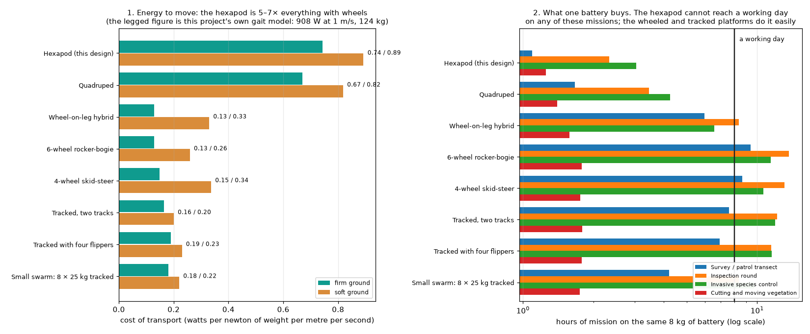
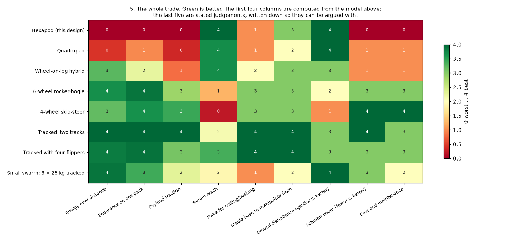

# Review — Platform topology: is a walking hexapod the right machine for these missions?

`platform` · requested 2026-09-07 · branch `claude/hexapod-robot-design-mt516g`

## What you are agreeing to

**topology-energy.png**



**topology-matrix.png**



| File | Opens in |
|---|---|
| [docs/design/11-platform-topology.md](https://github.com/Harwasch/Hexapod/blob/claude/hexapod-robot-design-mt516g/docs/design/11-platform-topology.md) | renders on GitHub |

## What we need decided

1. The study says no: on the stated missions a tracked platform with flippers beats the hexapod on energy (5x), mass (2x), payload fraction, base stiffness for cutting, actuator count (6 vs 18) and cost, and the hexapod cannot finish a working day on any of the four missions. Do you accept that finding and change platform, or is there a mission constraint I have not been told about that makes legs necessary?
2. Everything turns on the terrain: legs buy the last 18 percent of a mixed route. What ground does this robot actually have to cross? If more than about a fifth of the route is impassable to tracks, the answer flips.
3. Is the gentlest possible ground contact a real requirement (conservation work on fragile ground, root zones, wetland margins)? That is the one argument for legs that survives the energy numbers, and it is not on the task list you gave me.
4. For coverage work like invasive species, is one large machine the right unit at all, or eight small tracked ones? The swarm column is the least explored and the most different from what has been built.

## Decision

**Not yet reviewed — this is waiting on you.**

Answer in the Claude session that sent you this link. There is nothing to run and nothing to sign here.

Say which option you want **and why**: the reason is worth more than the choice, and it is what gets re-read later when a number has to move. If something is wrong, say what would be right.

<details><summary>How the answer gets recorded</summary>

The agent writes your decision, in your words, into [`docs/review/reviews.yaml`](https://github.com/Harwasch/Hexapod/blob/claude/hexapod-robot-design-mt516g/docs/review/reviews.yaml):

```bash
review-gate sign platform --approve --by <name> --note "..."
review-gate sign platform --changes "what to change"
```

Until that happens, any chunk of work depending on this review cannot be marked done.

</details>

---

<sub>Generated by `review-gate`. The sign-off record is [`docs/review/reviews.yaml`](https://github.com/Harwasch/Hexapod/blob/claude/hexapod-robot-design-mt516g/docs/review/reviews.yaml).</sub>
