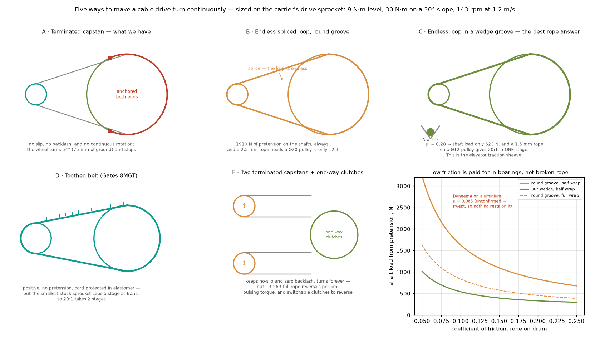
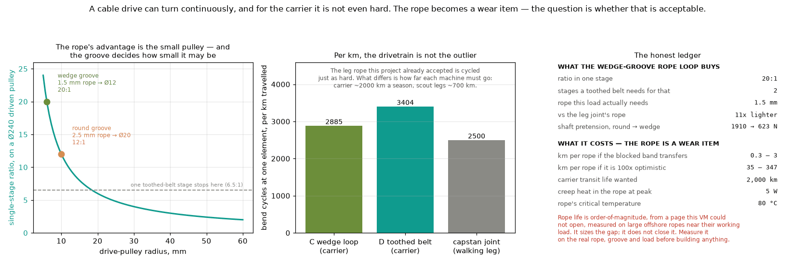
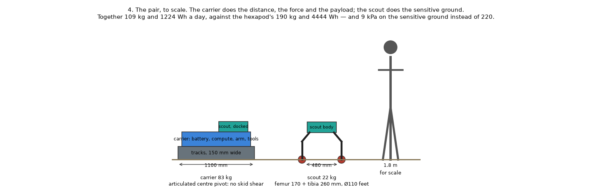
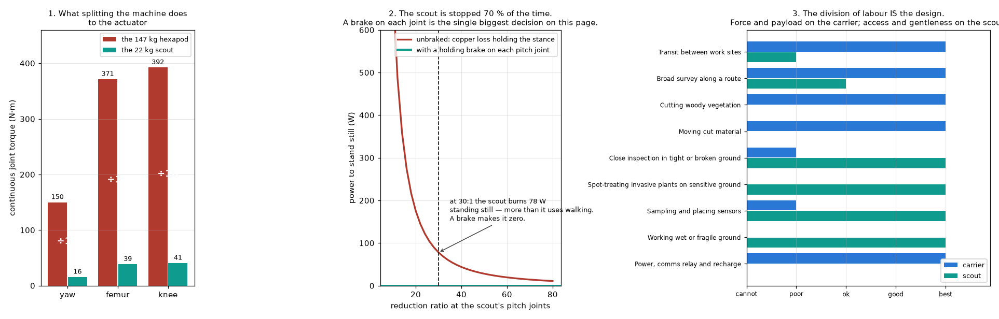

# Review — Rounds 17-18: the two-machine split, and whether a rope can drive a wheel

`platform` · requested 2026-09-08 · branch `claude/hexapod-robot-design-mt516g`

Round 17 sized the carrier-plus-scout pair: 109 kg against the hexapod's 190, 1224 Wh a day against 4444, 9 kPa on sensitive ground against 220, and scout joint torques about a tenth of the hexapod's. Round 18 answers the question that came back on it -- a joint capstan needs the rope anchored at both ends, so can a cable drive turn a wheel? Yes: termination buys no-slip and zero backlash and a wheel needs neither. A 36 degree wedge groove raises effective friction to 0.28, which cuts shaft pretension from 1910 to 623 N, lets a 1.5 mm rope carry it, lets a Ø12 pulley drive it, and gives 20:1 in one stage where a toothed belt stops at 6.5:1. The cost is that the rope becomes a wear item at 2885 bend cycles per km -- and the same sum says the walking leg's rope, accepted in round 8, is cycled just as hard and its life was never computed.

## What you are agreeing to

**cable-drive-architectures.png**



**cable-drive-tradeoff.png**



**marsupial-scale.png**



**marsupial-system.png**



| File | Opens in |
|---|---|
| [docs/design/13-marsupial-system.md](https://github.com/Harwasch/Hexapod/blob/claude/hexapod-robot-design-mt516g/docs/design/13-marsupial-system.md) | renders on GitHub |
| [docs/design/14-continuous-cable-drive.md](https://github.com/Harwasch/Hexapod/blob/claude/hexapod-robot-design-mt516g/docs/design/14-continuous-cable-drive.md) | renders on GitHub |

## For context

Sources and working files. Not part of the agreement — these change as work goes on, and changing them does not invalidate your sign-off.

| File | Opens in |
|---|---|
| [analysis/cable_drive_continuous.py](https://github.com/Harwasch/Hexapod/blob/claude/hexapod-robot-design-mt516g/analysis/cable_drive_continuous.py) | plain text on GitHub |
| [analysis/marsupial.py](https://github.com/Harwasch/Hexapod/blob/claude/hexapod-robot-design-mt516g/analysis/marsupial.py) | plain text on GitHub |

## What we need decided

1. Still open from round 17: do you accept the split into two machines, or must one machine still do both?
2. Still open from round 17: the scout's 22 kg is the number everything follows from, and it was picked as roughly what one person can lift into a vehicle. Right anchor, or should the scout be sized by its task?
3. On the drivetrain: is a rope you replace on a schedule acceptable, the way a track or a chain is? If yes the wedge-groove loop gives 20:1 in one stage from a sealed hull. If no, it is a two-stage toothed belt and the question is closed.
4. Round 8's capstan rope has the same bend-cycle exposure and its life was never computed. Should I go back and put a number on it, or is the marsupial split about to retire that actuator anyway?
5. Nobody has ever written down a gradeability requirement. I assumed 30 degrees for the carrier and it sets the peak drive torque. What should it actually be?

## Decision

**Not yet reviewed — this is waiting on you.**

Answer in the Claude session that sent you this link. There is nothing to run and nothing to sign here.

Say which option you want **and why**: the reason is worth more than the choice, and it is what gets re-read later when a number has to move. If something is wrong, say what would be right.

<details><summary>How the answer gets recorded</summary>

The agent writes your decision, in your words, into [`docs/review/reviews.yaml`](https://github.com/Harwasch/Hexapod/blob/claude/hexapod-robot-design-mt516g/docs/review/reviews.yaml):

```bash
review-gate sign platform --approve --by <name> --note "..."
review-gate sign platform --changes "what to change"
```

Until that happens, any chunk of work depending on this review cannot be marked done.

</details>

---

<sub>Generated by `review-gate`. The sign-off record is [`docs/review/reviews.yaml`](https://github.com/Harwasch/Hexapod/blob/claude/hexapod-robot-design-mt516g/docs/review/reviews.yaml).</sub>
