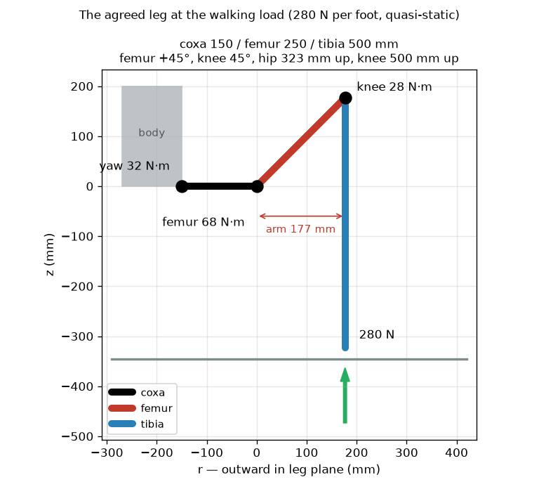
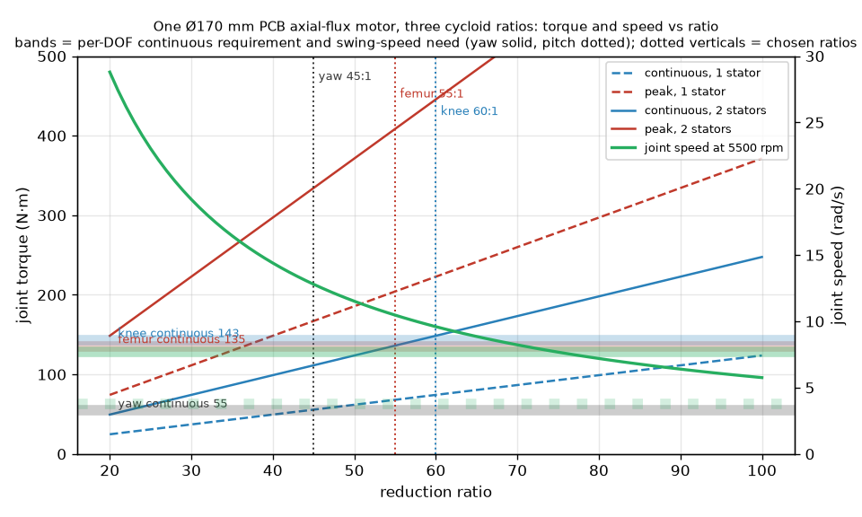
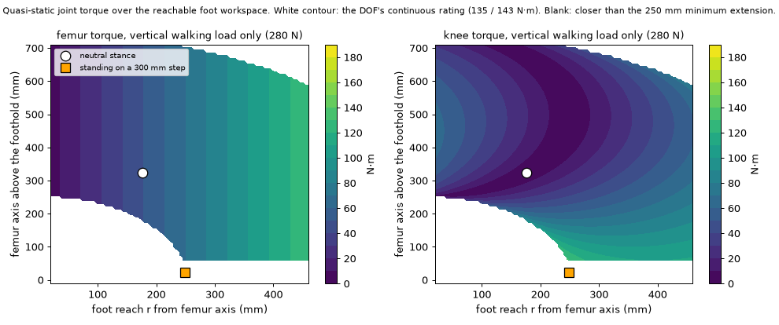

# Review — Sizing with the 2.0x tibia, ratings over both stances (round 4)

`sizing` · requested 2026-09-02 · branch `claude/hexapod-robot-design-mt516g`

Each DOF rated over its working volume in both the sprawl and the mammal stance: yaw 55 / 58, femur 135 / 245, knee 143 / 300 N.m continuous / peak. The mammal stance sets the femur and knee continuous ratings (the pitch joints push there); the sprawl stance alone would need 115 / 122. Plan: one PCB stator design, one stator at 45:1 for yaw, two stators at 55:1 for the femur and 60:1 for the knee. Yaw range +/-95 deg.

## What you are agreeing to

**leg-stance.png**



**ratio-trade.png**



**torque-map.png**



| File | Opens in |
|---|---|
| [docs/design/01-sizing.md](https://github.com/Harwasch/Hexapod/blob/claude/hexapod-robot-design-mt516g/docs/design/01-sizing.md) | renders on GitHub |

## For context

Sources and working files. Not part of the agreement — these change as work goes on, and changing them does not invalidate your sign-off.

| File | Opens in |
|---|---|
| [analysis/hexapod_model.py](https://github.com/Harwasch/Hexapod/blob/claude/hexapod-robot-design-mt516g/analysis/hexapod_model.py) | plain text on GitHub |
| [analysis/leg3d.py](https://github.com/Harwasch/Hexapod/blob/claude/hexapod-robot-design-mt516g/analysis/leg3d.py) | plain text on GitHub |
| [analysis/sizing.py](https://github.com/Harwasch/Hexapod/blob/claude/hexapod-robot-design-mt516g/analysis/sizing.py) | plain text on GitHub |
| [analysis/topology.py](https://github.com/Harwasch/Hexapod/blob/claude/hexapod-robot-design-mt516g/analysis/topology.py) | plain text on GitHub |

## What we need decided

1. Is the 15-20 % femur and knee premium for the mammal stance acceptable, or should that stance be limited (slower, smaller workspace) to keep the sprawl ratings?
2. Are the dynamic factors (1.5x walking, 3x stumble) and the 30 degree slope the right conservatism for the terrain demo?

## Decision

**Not yet reviewed — this is waiting on you.**

Answer in the Claude session that sent you this link. There is nothing to run and nothing to sign here.

Say which option you want **and why**: the reason is worth more than the choice, and it is what gets re-read later when a number has to move. If something is wrong, say what would be right.

<details><summary>How the answer gets recorded</summary>

The agent writes your decision, in your words, into [`docs/review/reviews.yaml`](https://github.com/Harwasch/Hexapod/blob/claude/hexapod-robot-design-mt516g/docs/review/reviews.yaml):

```bash
review-gate sign sizing --approve --by <name> --note "..."
review-gate sign sizing --changes "what to change"
```

Until that happens, any chunk of work depending on this review cannot be marked done.

</details>

---

<sub>Generated by `review-gate`. The sign-off record is [`docs/review/reviews.yaml`](https://github.com/Harwasch/Hexapod/blob/claude/hexapod-robot-design-mt516g/docs/review/reviews.yaml).</sub>
