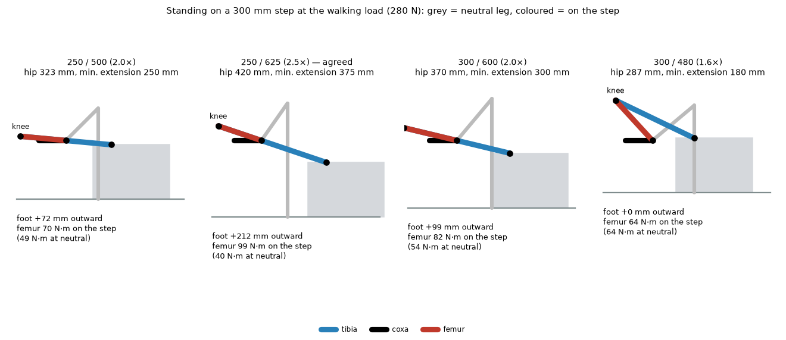
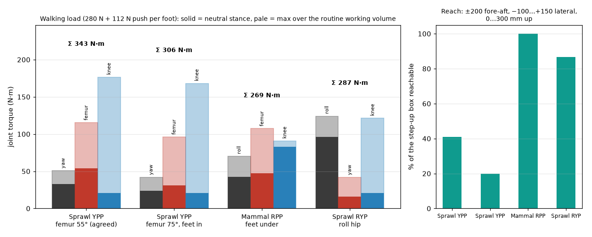

# Review — Leg topology trade and early architecture levers

`topology` · requested 2026-09-02 · branch `claude/hexapod-robot-design-mt516g`

Four leg topologies under the same walking load over the same working volumes: the agreed sprawl yaw-pitch-pitch, the same leg with feet in, the mammal roll-pitch-pitch, and the sprawl with a roll hip (the first axis rotated 90 degrees). A vertical first axis never sees weight; a roll hip sees weight times the foot's lateral offset and is the worst of both worlds. The sprawl wins on stance, roll margin and foot placement; the mammal wins on fold-ability and coaxial hip motors. Plus what a 300 mm step costs each leg proportion, and the architecture levers (mass, one motor three ratios, gravity compensation, series elasticity, driver per hip pod).

## What you are agreeing to

**step-up.png**



**torques.png**



| File | Opens in |
|---|---|
| [docs/design/02-leg-topology.md](https://github.com/Harwasch/Hexapod/blob/claude/hexapod-robot-design-mt516g/docs/design/02-leg-topology.md) | renders on GitHub |
| [docs/design/03-architecture-levers.md](https://github.com/Harwasch/Hexapod/blob/claude/hexapod-robot-design-mt516g/docs/design/03-architecture-levers.md) | renders on GitHub |

## For context

Sources and working files. Not part of the agreement — these change as work goes on, and changing them does not invalidate your sign-off.

| File | Opens in |
|---|---|
| [analysis/hexapod_model.py](https://github.com/Harwasch/Hexapod/blob/claude/hexapod-robot-design-mt516g/analysis/hexapod_model.py) | plain text on GitHub |
| [analysis/leg3d.py](https://github.com/Harwasch/Hexapod/blob/claude/hexapod-robot-design-mt516g/analysis/leg3d.py) | plain text on GitHub |
| [analysis/sizing.py](https://github.com/Harwasch/Hexapod/blob/claude/hexapod-robot-design-mt516g/analysis/sizing.py) | plain text on GitHub |
| [analysis/topology.py](https://github.com/Harwasch/Hexapod/blob/claude/hexapod-robot-design-mt516g/analysis/topology.py) | plain text on GitHub |

## What we need decided

1. Does the topology trade answer the 'motor axis rotated 90 degrees' question to your satisfaction, and is the sprawl yaw-pitch-pitch leg confirmed?
2. Which of the architecture levers in 03-architecture-levers.md do you want carried into requirements now: gravity-compensation springs, series elasticity in the tibia, one driver board per hip pod, five-bar knee drive?

## Decision

**Not yet reviewed — this is waiting on you.**

Answer in the Claude session that sent you this link. There is nothing to run and nothing to sign here.

Say which option you want **and why**: the reason is worth more than the choice, and it is what gets re-read later when a number has to move. If something is wrong, say what would be right.

<details><summary>How the answer gets recorded</summary>

The agent writes your decision, in your words, into [`docs/review/reviews.yaml`](https://github.com/Harwasch/Hexapod/blob/claude/hexapod-robot-design-mt516g/docs/review/reviews.yaml):

```bash
review-gate sign topology --approve --by <name> --note "..."
review-gate sign topology --changes "what to change"
```

Until that happens, any chunk of work depending on this review cannot be marked done.

</details>

---

<sub>Generated by `review-gate`. The sign-off record is [`docs/review/reviews.yaml`](https://github.com/Harwasch/Hexapod/blob/claude/hexapod-robot-design-mt516g/docs/review/reviews.yaml).</sub>
