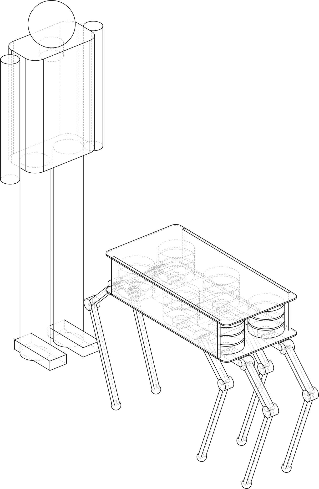
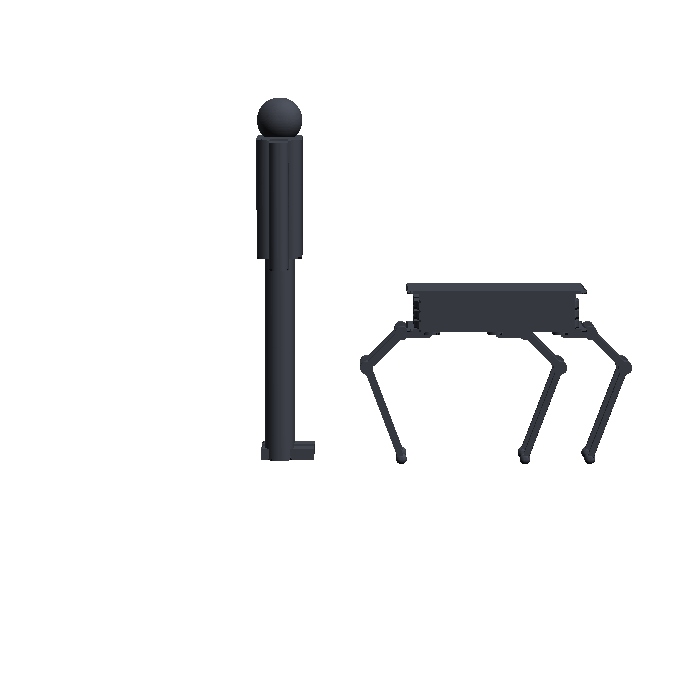
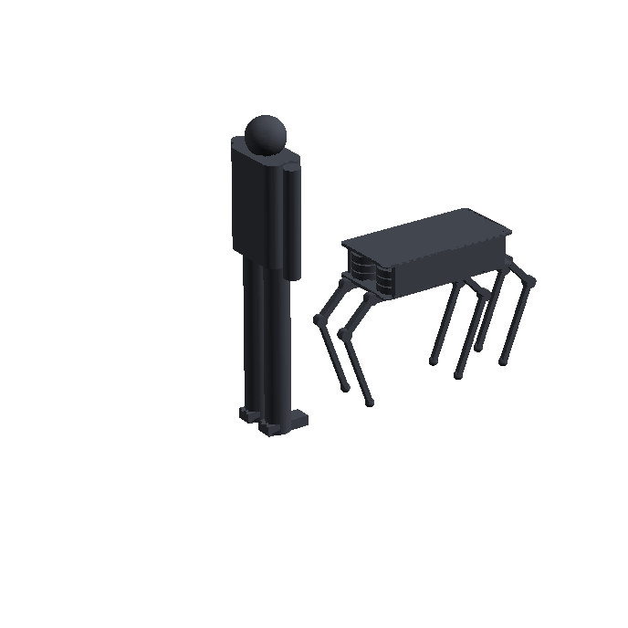
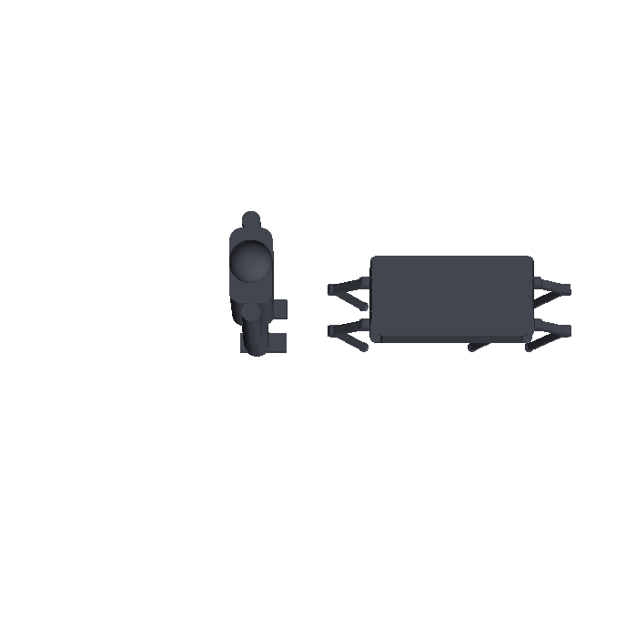

# Review — Confirmed sprawl leg (2.0x tibia) and its mammal stance (round 4)

`vision` · requested 2026-09-02 · branch `claude/hexapod-robot-design-mt516g`

A: the confirmed sprawl leg, coxa 150 / femur 250 / tibia 500 mm, femur up at 45 deg, tibia vertical, hips 0.32 m up, 0.89 m stance. B: the same robot with every leg yawed 90 deg into its mammal stance, hips 0.64 m up, 0.24 m stance. One design, two postures, both rendered with a 6 ft figure and in the 3-D viewer.

## What you are agreeing to

**iso.svg**


**view-front.png**


**view-hero.png**


**view-top.png**


**iso.svg**



**view-front.png**



**view-hero.png**



**view-top.png**



| File | Opens in |
|---|---|
| [docs/design/vision.md](https://github.com/Harwasch/Hexapod/blob/claude/hexapod-robot-design-mt516g/docs/design/vision.md) | renders on GitHub |
| [docs/design/vision/manifest.json](https://github.com/Harwasch/Hexapod/blob/claude/hexapod-robot-design-mt516g/docs/design/vision/manifest.json) | plain text on GitHub |

## For context

Sources and working files. Not part of the agreement — these change as work goes on, and changing them does not invalidate your sign-off.

| File | Opens in |
|---|---|
| [analysis/hexapod_model.py](https://github.com/Harwasch/Hexapod/blob/claude/hexapod-robot-design-mt516g/analysis/hexapod_model.py) | plain text on GitHub |
| [analysis/leg3d.py](https://github.com/Harwasch/Hexapod/blob/claude/hexapod-robot-design-mt516g/analysis/leg3d.py) | plain text on GitHub |
| [analysis/sizing.py](https://github.com/Harwasch/Hexapod/blob/claude/hexapod-robot-design-mt516g/analysis/sizing.py) | plain text on GitHub |
| [analysis/topology.py](https://github.com/Harwasch/Hexapod/blob/claude/hexapod-robot-design-mt516g/analysis/topology.py) | plain text on GitHub |
| [concepts/concept_a_sprawl.py](https://github.com/Harwasch/Hexapod/blob/claude/hexapod-robot-design-mt516g/concepts/concept_a_sprawl.py) | plain text on GitHub |
| [concepts/concept_b_mammal_mode.py](https://github.com/Harwasch/Hexapod/blob/claude/hexapod-robot-design-mt516g/concepts/concept_b_mammal_mode.py) | plain text on GitHub |
| [concepts/hexapod_skeleton.py](https://github.com/Harwasch/Hexapod/blob/claude/hexapod-robot-design-mt516g/concepts/hexapod_skeleton.py) | plain text on GitHub |

## What we need decided

1. Concept B is the same robot reconfigured, not a different one: hips 0.64 m up, 0.24 m stance, 5 deg roll margin. Is that the mammal stance you had in mind, or should it keep some sprawl (yaw 60 deg, say)?
2. The tibia is now 500 mm (2.0x): hips 0.32 m up in the sprawl stance. Enough clearance for the terrain demo, given the tall stance is available?

## Decision

**Not yet reviewed — this is waiting on you.**

Answer in the Claude session that sent you this link. There is nothing to run and nothing to sign here.

Say which option you want **and why**: the reason is worth more than the choice, and it is what gets re-read later when a number has to move. If something is wrong, say what would be right.

<details><summary>How the answer gets recorded</summary>

The agent writes your decision, in your words, into [`docs/review/reviews.yaml`](https://github.com/Harwasch/Hexapod/blob/claude/hexapod-robot-design-mt516g/docs/review/reviews.yaml):

```bash
review-gate sign vision --approve --by <name> --note "..."
review-gate sign vision --changes "what to change"
```

Until that happens, any chunk of work depending on this review cannot be marked done.

</details>

---

<sub>Generated by `review-gate`. The sign-off record is [`docs/review/reviews.yaml`](https://github.com/Harwasch/Hexapod/blob/claude/hexapod-robot-design-mt516g/docs/review/reviews.yaml).</sub>
