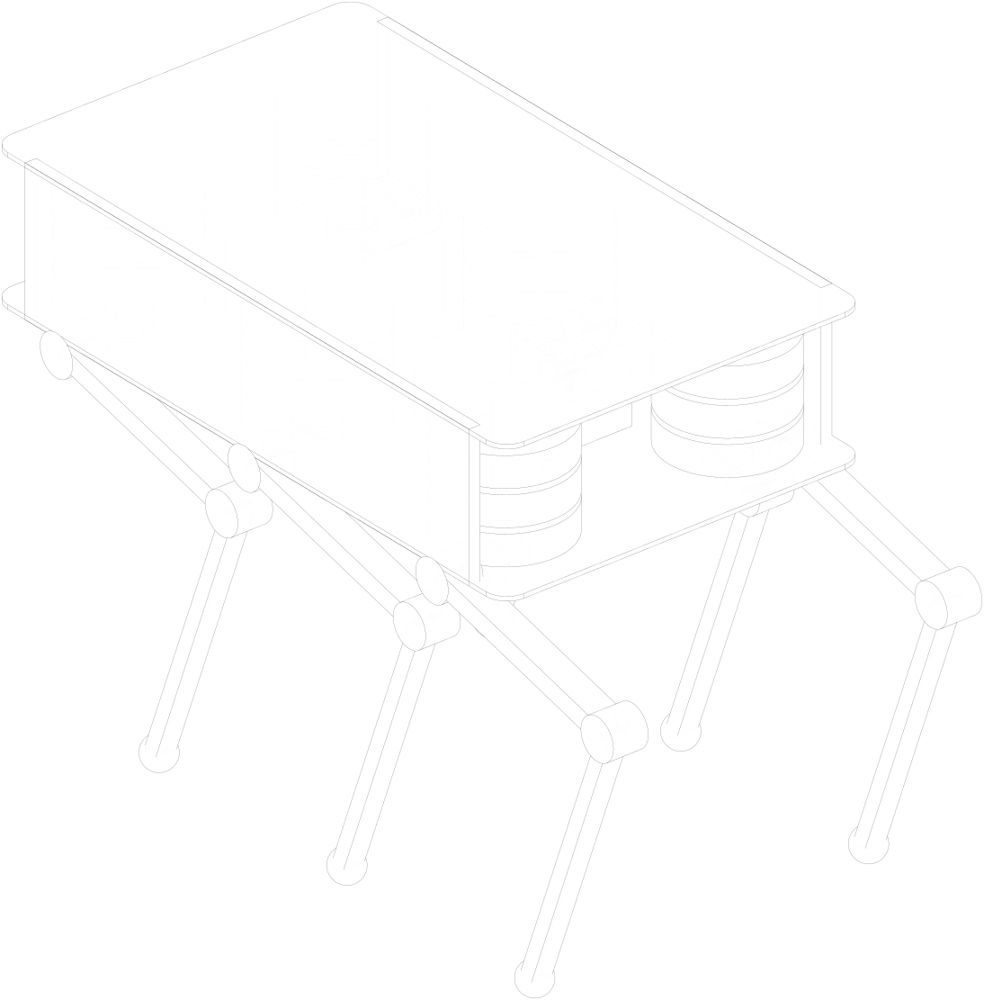
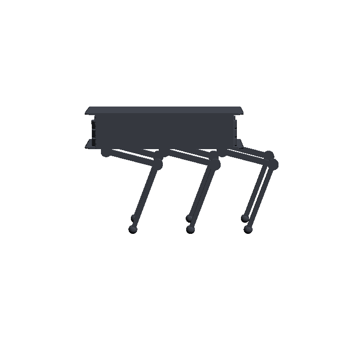
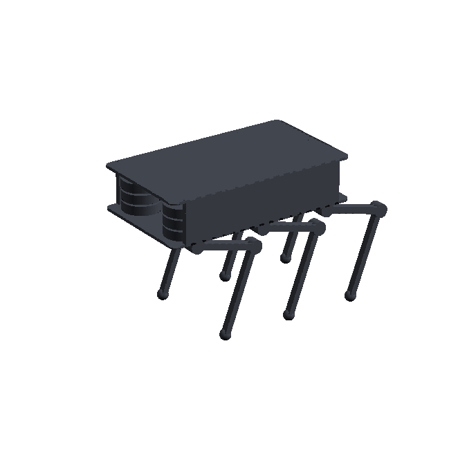

# Review — Top-level sizing and skeleton concepts

`vision` · requested 2026-09-01 · branch `claude/hexapod-robot-design-mt516g`

Two skeleton concepts of the same 49 kg robot with eighteen pancake actuators in the body: A sprawl (radial leg planes, wide, stable, yaw joints propel) and B under-body (sagittal leg planes, narrow, taller, pitch joints propel). docs/design/01-sizing.md derives the actuator requirement (92 N·m continuous, 151 N·m 10-min, 179 N·m peak, 9 rad/s, Ø170 × 42 mm, ≤ 1.1 kg) from the mass budget, load cases and gaits.

## What you are agreeing to

**leg-stance.png**


**ratio-trade.png**


**torque-map.png**


**iso.svg**


**view-front.png**


**view-hero.png**


**view-top.png**


**iso.svg**



**view-front.png**



**view-hero.png**



**view-top.png**


| File | Opens in |
|---|---|
| [docs/design/01-sizing.md](https://github.com/Harwasch/Hexapod/blob/claude/hexapod-robot-design-mt516g/docs/design/01-sizing.md) | renders on GitHub |
| [docs/design/vision.md](https://github.com/Harwasch/Hexapod/blob/claude/hexapod-robot-design-mt516g/docs/design/vision.md) | renders on GitHub |
| [docs/design/vision/manifest.json](https://github.com/Harwasch/Hexapod/blob/claude/hexapod-robot-design-mt516g/docs/design/vision/manifest.json) | plain text on GitHub |

## For context

Sources and working files. Not part of the agreement — these change as work goes on, and changing them does not invalidate your sign-off.

| File | Opens in |
|---|---|
| [analysis/hexapod_model.py](https://github.com/Harwasch/Hexapod/blob/claude/hexapod-robot-design-mt516g/analysis/hexapod_model.py) | plain text on GitHub |
| [analysis/sizing.py](https://github.com/Harwasch/Hexapod/blob/claude/hexapod-robot-design-mt516g/analysis/sizing.py) | plain text on GitHub |
| [concepts/concept_a_sprawl.py](https://github.com/Harwasch/Hexapod/blob/claude/hexapod-robot-design-mt516g/concepts/concept_a_sprawl.py) | plain text on GitHub |
| [concepts/concept_b_underbody.py](https://github.com/Harwasch/Hexapod/blob/claude/hexapod-robot-design-mt516g/concepts/concept_b_underbody.py) | plain text on GitHub |
| [concepts/hexapod_skeleton.py](https://github.com/Harwasch/Hexapod/blob/claude/hexapod-robot-design-mt516g/concepts/hexapod_skeleton.py) | plain text on GitHub |

## What we need decided

1. Which stance, A (sprawl) or B (under-body), and what made you pick it?
2. Does the rider case stay as a design driver, or is it a stretch goal we size for later?
3. Is a 0.9 x 0.52 x 0.2 m body slab, with the hip stacks setting the width, the right size?

## Decision

**Not yet reviewed — this is waiting on you.**

Answer in the Claude session that sent you this link. There is nothing to run and nothing to sign here.

Say which option you want **and why**: the reason is worth more than the choice, and it is what gets re-read later when a number has to move. If something is wrong, say what would be right.

<details><summary>How the answer gets recorded</summary>

The agent writes your decision, in your words, into [`docs/review/reviews.yaml`](https://github.com/Harwasch/Hexapod/blob/claude/hexapod-robot-design-mt516g/docs/review/reviews.yaml):

```bash
review-gate sign vision --approve --by <name> --note "..."
review-gate sign vision --changes "what to change"
```

Until that happens, any chunk of work depending on this review cannot be marked done.

</details>

---

<sub>Generated by `review-gate`. The sign-off record is [`docs/review/reviews.yaml`](https://github.com/Harwasch/Hexapod/blob/claude/hexapod-robot-design-mt516g/docs/review/reviews.yaml).</sub>
