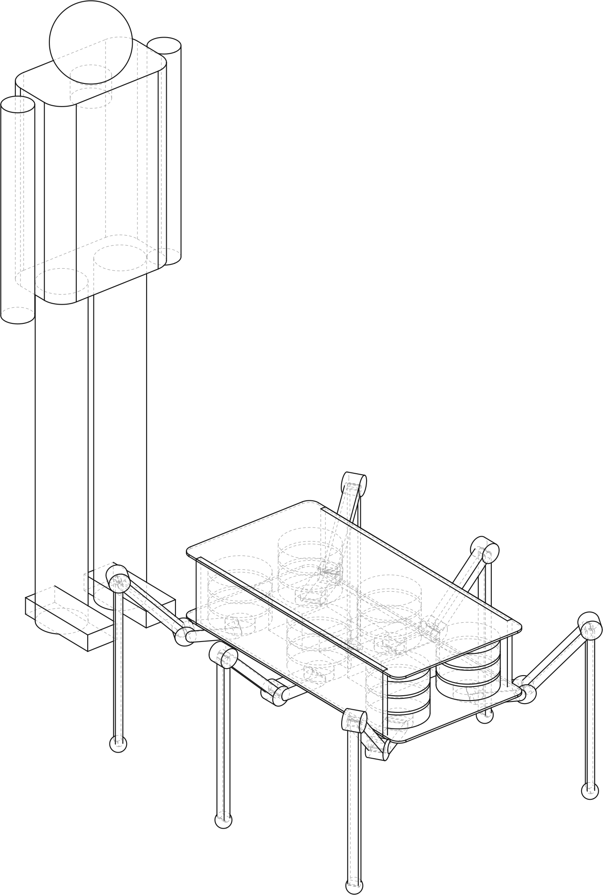
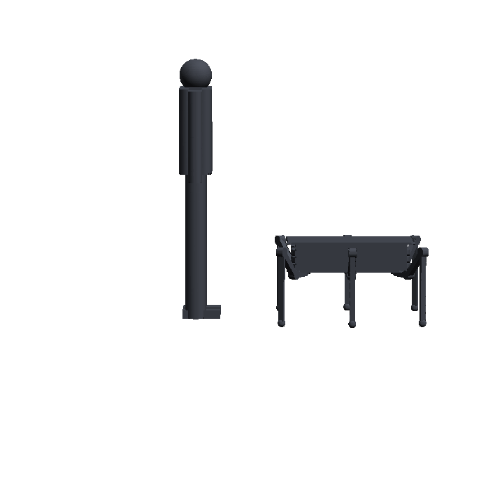
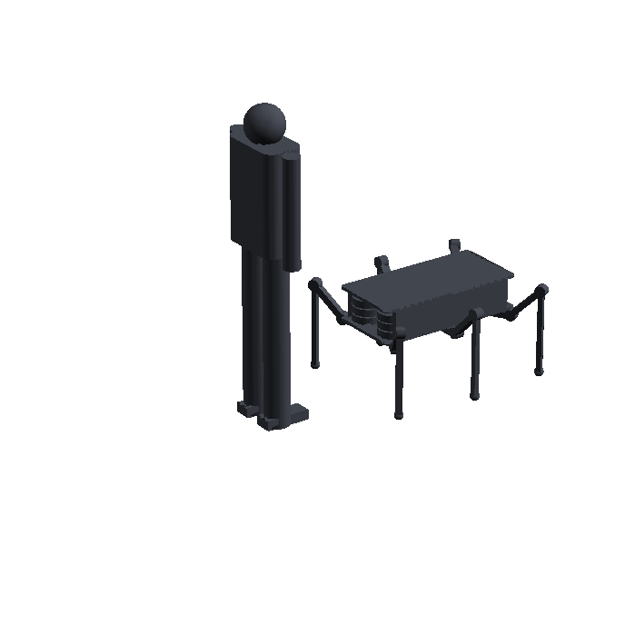
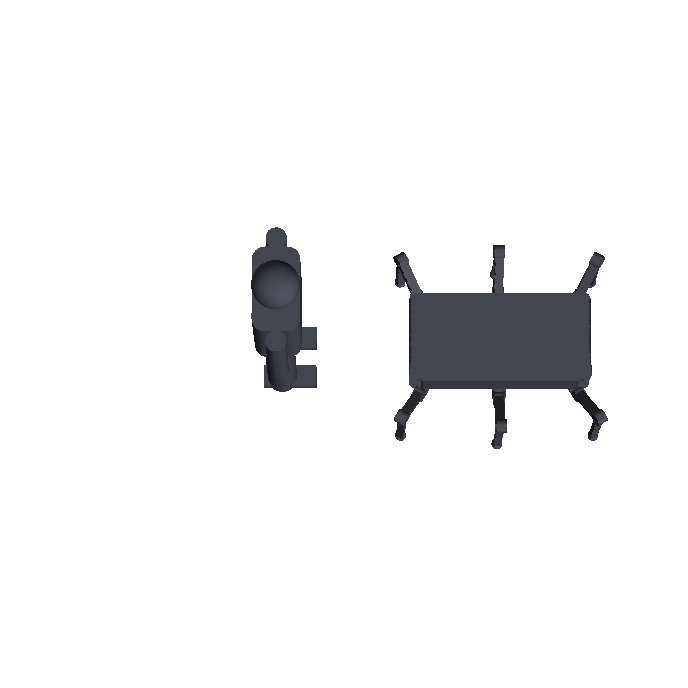
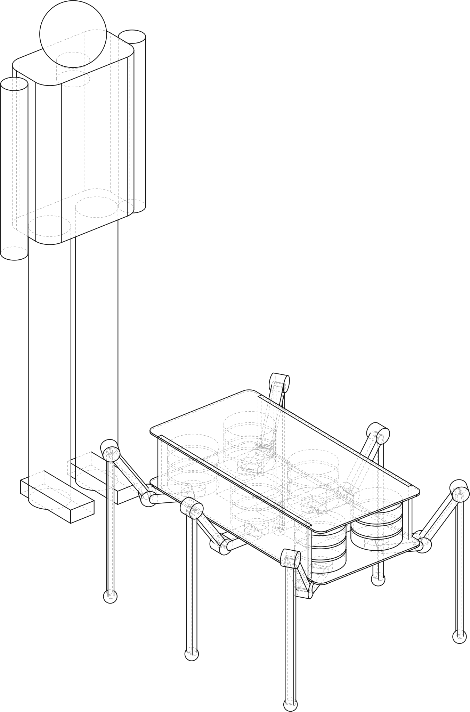
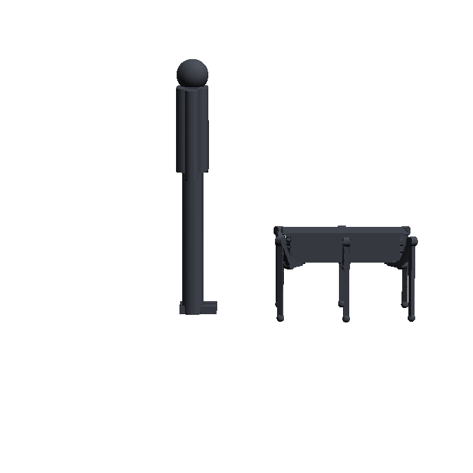
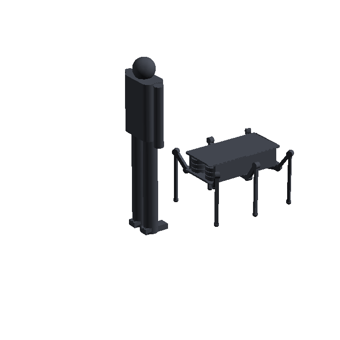
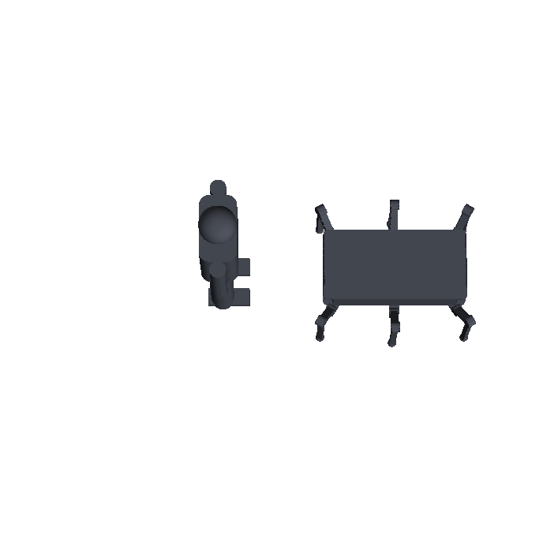

# Review — Leg proportion and skeleton concepts (round 2)

`vision` · requested 2026-09-02 · branch `claude/hexapod-robot-design-mt516g`

Same 49 kg robot with eighteen pancake actuators in the body, reworked to the review decision: hips under the body, a 150 mm coxa carrying each leg out, femur up and out, tibia vertical. A: tibia 2.0x femur (250/500 mm, femur 45 deg, hips 0.32 m up, femur arm 177 mm). B: tibia 2.5x femur (220/550 mm, femur 55 deg, hips 0.37 m up, femur arm 126 mm, 20 % less femur torque). A 6 ft figure stands beside the robot in every render.

## What you are agreeing to

**iso.svg**



**view-front.png**



**view-hero.png**



**view-top.png**



**iso.svg**



**view-front.png**



**view-hero.png**



**view-top.png**



| File | Opens in |
|---|---|
| [docs/design/vision.md](https://github.com/Harwasch/Hexapod/blob/claude/hexapod-robot-design-mt516g/docs/design/vision.md) | renders on GitHub |
| [docs/design/vision/manifest.json](https://github.com/Harwasch/Hexapod/blob/claude/hexapod-robot-design-mt516g/docs/design/vision/manifest.json) | plain text on GitHub |

## For context

Sources and working files. Not part of the agreement — these change as work goes on, and changing them does not invalidate your sign-off.

| File | Opens in |
|---|---|
| [analysis/hexapod_model.py](https://github.com/Harwasch/Hexapod/blob/claude/hexapod-robot-design-mt516g/analysis/hexapod_model.py) | plain text on GitHub |
| [analysis/sizing.py](https://github.com/Harwasch/Hexapod/blob/claude/hexapod-robot-design-mt516g/analysis/sizing.py) | plain text on GitHub |
| [concepts/concept_a_tibia2x.py](https://github.com/Harwasch/Hexapod/blob/claude/hexapod-robot-design-mt516g/concepts/concept_a_tibia2x.py) | plain text on GitHub |
| [concepts/concept_b_tibia2p5x.py](https://github.com/Harwasch/Hexapod/blob/claude/hexapod-robot-design-mt516g/concepts/concept_b_tibia2p5x.py) | plain text on GitHub |
| [concepts/hexapod_skeleton.py](https://github.com/Harwasch/Hexapod/blob/claude/hexapod-robot-design-mt516g/concepts/hexapod_skeleton.py) | plain text on GitHub |

## What we need decided

1. Which leg proportion, A (tibia 2.0x femur, squatter) or B (tibia 2.5x femur, taller, 20 % less femur torque), and what made you pick it?
2. Does the rider case stay as a design driver, or is it a stretch goal we size for later?
3. Hips under the body on a 240 mm spacing with a 150 mm coxa: is that the right split between body width and coxa length?

## Decision

**Not yet reviewed — this is waiting on you.**

Answer in the Claude session that sent you this link. There is nothing to run and nothing to sign here.

Say which option you want **and why**: the reason is worth more than the choice, and it is what gets re-read later when a number has to move. If something is wrong, say what would be right.

<details><summary>How the answer gets recorded</summary>

The agent writes your decision, in your words, into [`docs/review/reviews.yaml`](https://github.com/Harwasch/Hexapod/blob/claude/hexapod-robot-design-mt516g/docs/review/reviews.yaml):

```bash
review-gate sign vision --approve --by <name> --note "..."
review-gate sign vision --changes "what to change"
```

Until that happens, any chunk of work depending on this review cannot be marked done.

</details>

---

<sub>Generated by `review-gate`. The sign-off record is [`docs/review/reviews.yaml`](https://github.com/Harwasch/Hexapod/blob/claude/hexapod-robot-design-mt516g/docs/review/reviews.yaml).</sub>
